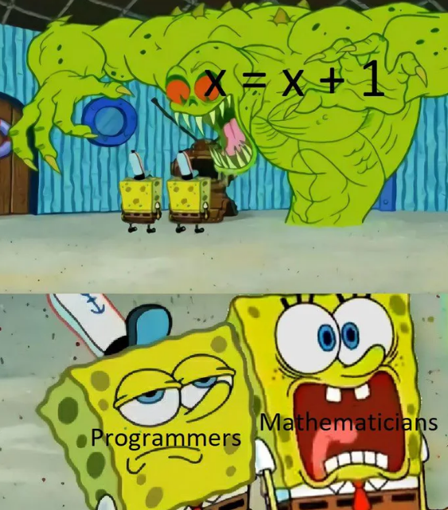

# 1.1 Variables

## A. Pourquoi des variables ?

### A.1 Introduction
Considérons la phrase *«nous allons stocker le prix du spectacle dans une variable  ```a```, qui vaudra donc au départ 32.»*

Il y a plusieurs commentaires à faire sur une telle annonce :

- Dans le problème que l'on cherche à modéliser, le prix du spectacle est une donnée importante, qui va peut-être évoluer (ou pas !).
- Pour la manipuler plus simplement, on va la désigner par un nom, le **nom de la variable** (ici, le nom ```a``` est particulièrement mal choisi, voir D. Bonnes pratiques de nommage)
- Comme en mathématiques, le nom de cette variable va désigner une valeur qui peut changer (*varier*) au cours du temps (encore une fois : ou pas).
- Cette valeur est fixée *au départ* à 32. On dira en informatique qu'elle est *initialisée* à 32.
- Si cette valeur ne change pas, on dira qu'elle est constante. Cela peut paraître inutile de donner un nom à quelque chose qui ne change pas, mais cela est très utile de définir les constantes au début d'un programme. 

### A.2 On code !
La phrase précédente donnera donc lieu à la ligne Python suivante :

```python
>>> a = 32
```
!!! warning "Attention"
    Le symbole ```=``` ici utilisé n'a **rien à voir** avec le symbole = utilisé en mathématique. On dit qu'on a **affecté** à ```a``` la valeur 32, et il faut se représenter mentalement cette action par l'écriture ```a ← 32```.

!!! note "Comparaison de la syntaxe dans différents langages"

    === "Python"

        ```python
        a = 32
        ```

    === "C"

        ```c
        int a = 32;
        ```

    === "PHP"

        ```PHP
        $a = 32;
        ```


    === "Java"

        ```java
        int a = 32;
        ```

    === "Javascript"

        ```javascript
        var a = 32;
        ```
    === "Rust"

        ```rust
        let a = 32;
        ```
    === "Go"

        ```go
        a := 32
        ```
 
Une fois la valeur 32 stockée dans la variable ```a```, on peut alors utiliser cette variable :

```python
>>> a
32
>>> a + 5
37
>>> b
Traceback (most recent call last):
  File "<pyshell>", line 1, in <module>
NameError: name 'b' is not defined
```

Remarquez bien l'erreur lorsqu'on a fait appel à une variable ```b``` qui n'avait jamais été définie, comme le dit explicitement le message ```NameError: name 'b' is not defined``` 

## B. Le fonctionnement interne
### B.1 Explication simplifiée
En première intention, il est possible d'expliquer le fonctionnement interne de l'affectation des variables par la *métaphore des tiroirs* :


Écrire  l'instruction :
```python
>>> a = 2
```

va provoquer chez l'ordinateur le comportement suivant :

- Est-ce que je possède **déjà** un tiroir appelé ```a``` ? 
    - si oui, je me positionne devant.
    - si non, je crée un tiroir appelé ```a```.
    - J'ouvre le tiroir et j'y dépose la valeur numérique 2. Si le tiroir contenait déjà une valeur, celle-ci disparaît (on dit qu'elle est **écrasée**).

{: .center}

Cette explication est suffisante pour aborder la notion de variable : c'est un mot (ou une lettre) qui va désigner une valeur. 


!!! warning "Partie difficile (optionnelle)"
    *La métaphore du tiroir est malheureusement un peu trop simplificatrice.*

    ### B.2 Une réalité bien plus complexe...
    #### B.2.1 La commande ```id()``` : l'adresse du tiroir ?
    Python possède une fonction qui renvoie l'adresse mémoire de la variable donnée en argument. 

    ```python
    >>> b = 7
    >>> id(b)
    9788800
    ```

    Faites le test avec votre propre IDE Python (vous n'obtiendrez pas forcément la même valeur d'adresse mémoire)

    #### B.2.2 Cela se complique.
    Sans refermer notre IDE, écrasons la valeur de ```b``` avec une nouvelle valeur :
    ```python
    >>> b = 12
    ```
    et redemandons l'adresse de ```b``` :
    ```python
    >>> id(b)
    9788960
    ```

    Très mauvaise nouvelle : l'adresse de la variable ```b``` a changé. Ceci invalide notre métaphore du «tiroir», une place unique qui serait réservée pour y stocker les valeurs successives d'une variable. 

    La modification de la valeur de ```b``` ne s'est pas faite «en place», la variable ```b``` s'est déplacée : que s'est-il donc passé ?

    #### B.2.3 Tentative d'explication

    L'affectation 
    ```python
    >>> b = 9
    ```
    ne provoque pas la réservation définitive d'un espace-mémoire pour la variable ```b```, mais la création d'un lien vers un espace-mémoire qui contient la valeur 9. Ce lien consiste en l'adresse-mémoire de cette valeur 9. 

    Cette adresse-mémoire vaut (sur ma configuration personnelle) ```9788864```.
    ```python
    >>> id(b)
    9788864
    ```

    {: .center}


    Comme le présente le ruban ci-dessus, Python pré-positionne les entiers (de -5 à 256) sur des petites adresses-mémoires, car il considère que ces entiers servent souvent, et doivent donc être rapidement accessibles.

    Si on créé une nouvelle variable ```tokyo``` aussi égale à 9, elle va aussi *pointer* vers la même adresse-mémoire :


    ```python
    >>> tokyo = 9
    >>> id(tokyo)
    9788864
    ```
    Les variables ```tokyo``` et ```b``` renvoient vers la même adresse-mémoire.

    Affectons maintenant à ```tokyo``` la valeur 2020 et observons son adresse-mémoire :

    ```python
    >>> tokyo = 2020
    >>> id(tokyo)
    139762979309936
    ```

    L'adresse-mémoire est (bien) plus grande : elle a été choisie sur le moment par Python pour y stocker 2020 (car 2020 > 256). 

    De manière plus surprenante, si on créé une nouvelle variable ```jo``` qui vaut *aussi* 2020, Python va ouvrir une *autre* adresse-mémoire pour y stocker 2020, alors qu'il l'a déjà stockée ailleurs :

    ```python
    >>> jo = 2020
    >>> id(jo)
    139762979310064
    ```

    En résumé, une variable n'est pas le nom d'un tiroir mais plutôt le nom d'une flèche qui pointe vers un espace-mémoire de l'ordinateur. 
    - La flèche peut pointer vers un nouvel espace-mémoire sans que le nom de la variable change.
    - Deux variables peuvent pointer vers le même espace-mémoire.


### B.3 Une histoire en 2 temps : évaluation, affectation

Observons l'instruction
```python
>>> a = 2 + 3
```

#### B.3.1 Étape 1 : **l'évaluation**

Python va prendre la partie à droite du signe égal et va l'évaluer, ce qui signifie qu'il va essayer de lui donner une valeur. Dans nos exemples, cette valeur sera numérique, mais elle peut être d'un autre type (voir plus loin)


Ici, Python effectue le calcul 2 + 3 et l'évalue à la valeur 5.

#### B.3.2 Étape 2 : **l'affectation**
Une fois évaluée l'expression à droite du signe =, il ne reste plus qu'à l'affecter à la variable (déjà existante ou pas) située à gauche du signe =.

Comme expliqué précédemment, un «lien» est fait entre le nom de la variable et l'adresse-mémoire qui contient la valeur évaluée.
```a``` sera donc lié à la valeur 5. Plus simplement, on dira que «```a``` vaut 5» 

#### B.3.2 L'incrémentation d'une variable.

*«Incrémenter»* une variable signifie l'augmenter. 

Imaginons une variable appelée ```compteur```. Au démarrage de notre programme, elle est initialisée à la valeur 0. 
```python
>>> compteur = 0
```

Considérons qu'à un moment du programme, cette variable doit être modifiée, par exemple en lui ajoutant 1.

En Python, cela s'écrira :

```python
>>> compteur = compteur + 1
```

Observée avec des yeux de mathématicien, la précédente instruction est une horreur.

{: .center width=30%}

Vue avec des yeux d'informaticien, voilà comment est interprétée la commande
```python
>>> compteur = compteur + 1
```

1. On évalue la partie droite de l'égalité, donc l'expression ```compteur + 1```.
2. On va donc chercher le contenu de la variable ```compteur```. Si celle-ci n'existe pas, un message d'erreur est renvoyé.
3. On additionne 1 au contenu de la variable ```compteur```.
4. On écrase le contenu actuel de la variable ```compteur``` avec la valeur obtenue au 3.   

À la fin de ces opérations, la variable ```compteur``` a bien augmenté de 1.

Cette procédure d'**incrémentation** est très très classique, il faut la maîtriser parfaitement !


!!! info "Syntaxe classique et syntaxe Pythonesque :heart:"
    L'incrémentation d'une variable ```compteur``` s'écrira donc en Python :
    ```python
    >>> compteur = compteur + 1
    ```
    Mais il existe aussi une syntaxe particulière, un peu plus courte :

    ```python
    >>> compteur += 1
    ```
    Cette syntaxe peut se ranger dans la catégorie des **sucres syntaxiques** : c'est bien de la connaître, c'est amusant de s'en servir, mais son utilisation n'est en rien obligatoire et peut avoir un effet néfaste, celui d'oublier réellement ce qu'il se passe derrière.

!!! example "{{ exercice() }}"
    === "Énoncé"
        Écrire le code «classique» et le code «Pythonesque» pour l'instruction suivante :

        On initialise une variable ```score``` à 100 et on l'augmente de 15.

    === "Correction"
        ```python
        >>> score = 100
        >>> score = score + 15
        ```
        ou bien
        ```python
        >>> score = 100
        >>> score += 15
        ```


!!! example "{{ exercice() }}"
    === "Énoncé"
        Écrire le code «classique» et le code «Pythonesque» pour l'instruction suivante :

        On initialise une variable ```cellule``` à 1 et on la multiplie par 2.

    === "Correction"
        ```python
        >>> cellule = 1
        >>> cellule = cellule * 2
        ```
        ou bien
        ```python
        >>> cellule = 1
        >>> cellule *= 2
        ```

!!! example "{{ exercice() }}"
    === "Énoncé"
        Écrire le code «classique» et le code «Pythonesque» pour l'instruction suivante.

        On initialise une variable ```capital``` à 1000 et on lui enlève 5%.

    === "Correction"
        ```python
        >>> capital = 1000
        >>> capital = capital - capital * 5/100
        ```
        ou bien
        ```python
        >>> capital = 1000
        >>> capital *= 0.95
        ```


#### B.3.3 L'échange de variables
Après l'incrémentation, une autre technique de base reviendra fréquemment dans nos codes : **l'échange de variables**.

Imaginons les variables suivantes :

```python
>>> a = 3
>>> b = 5
```
Le but est d'échanger les valeurs de ```a``` et de ```b```.

▸ **Méthode naïve**

```python
>>> a = b
>>> b = a
```

Que valent ```a``` et ```b``` maintenant ?

Malheureusement :
```python
>>> a
5
>>> b
5
>
```

La variable ```a``` a été écrasée dès qu'on lui a donné la valeur de la variable ```b```.

Comment la préserver ?

La situation est similaire au problème suivant : comment échanger le contenu de ces deux verres ?

{: .center width=20%}

La méthode est évidente : il nous faut un troisième verre.

Nous allons faire de même pour nos variables. Nous allons utiliser une variable **temporaire** (on parle aussi de variable **tampon**) pour conserver la mémoire de la valeur de ```a``` (par exemple) avant que celle-ci ne se fasse écraser :

```python
>>> a = 3
>>> b = 5
>>> temp = a
>>> a = b
>>> b = temp
```

Vous pouvez vérifier maintenant que les valeurs de ```a``` et de ```b``` ont bien été échangées.


!!! info "Syntaxe classique et syntaxe Pythonesque :heart:"
    L'échange de deux variables ```a``` et de ```b``` s'écrit donc :
    ```python
    >>> temp = a
    >>> a = b
    >>> b = temp
    ```
    Mais il existe aussi une syntaxe particulière à Python, bien plus courte :

    ```python
    >>> a, b = b, a
    ```
    C'est de nouveau un *sucre syntaxique*. Cette syntaxe nous dispense de créer nous-même une troisième variable. Mais pas de miracle : en interne, Python crée lui-même cette variable temporaire. La simultanéité n'existe pas en informatique.

!!! example "{{ exercice() }}"
    === "Énoncé"
        Une petite erreur s'est glissée à Poudlard :
        ```python
        >>> maison_Harry = "Serpentard"
        >>> maison_Malfoy =  "Gryffondor"
        ```
        Corriger cette erreur, de deux manières différentes.

    === "Correction"
        ```python
        >>> t = maison_Harry
        >>> maison_Harry = maison_Malfoy
        >>> maison_Malfoy = t
        ```
        ou plus rapidement :
        ```python
        >>> maison_Harry, maison_Malfoy = maison_Malfoy, maison_Harry
        ```


## C. Différents types de variables

Pour l'instant, les variables que nous avons manipulées contiennent toutes des nombres entiers.

Sauf les maisons de Poudlard, qui sont des ~~mots~~ chaînes de caractères.

Pour différencier la nature de ce que peut contenir une variable, on parle alors de **type de variable**.

En voici quelques uns, que nous découvrirons au fil de l'année :


!!! abstract "Types de base"
    Voici les types Python les plus fréquemment utilisés cette année:

    |Type Python| Traduction | Exemple|
    |:-:|:-:|:-:|
    |`int`|entier|`#!python 42`|
    |`float`|flottant (décimal)|`#!python 3.1416`|
    |`str`|chaîne de caractères (string)|`#!python "NSI"`|
    |`bool`|booléen (True ou False)|```#!python True```|
    |`tuple`|p-uplet| `#!python (255, 127, 0)`|
    |`list`|liste|`#!python [0, 1, 2, 3, 4, 5]`|
    |`dict`|dictionnaire|`#!python {'Homer':43, 'Marge':41, 'Bart':12, 'Lisa':10, 'Maggie':4}`|
    |`function`|fonction| `#!python print`|


Comment connaître le type d'une variable ?
Il suffit dans la console d'utiliser la fonction `type`.

```python
>>> a = 1
>>> type(a)
<class 'int'>
```

### C.1 Python et le typage dynamique

Jusqu'à présent, nous ne nous sommes pas occupés de préciser à Python le type de notre variable.

```python
a = 3
```

Mais dans certains langages, c'est obligatoire. En C par exemple, il faut écrire :

```C
int a = 3;
```
Cela signifie (pour le langage C) que notre variable ```a``` n'aura pas le droit de contenir autre chose qu'un nombre entier.

Si on écrit ensuite
```C
a = "test";
```

Le compilateur C renverra une erreur : on ne peut pas stocker une chaîne de caractères dans une variable qu'on a créée comme étant de type entier.

Et en Python ?

```python
>>> a = 3
>>> type(a)
<class 'int'>
>>> a = "test"
>>> type(a)
<class 'str'>
```

Python a changé tout seul le type de notre variable, sans intervention. On parle de **typage dynamique**.


## D. Bonnes pratiques de nommage

### D.1 Ce qui est autorisé et ce qui ne l'est pas

Pour nommer correctement une variable, il existe des règles à respecter.

!!! abstract "Les règles"
    - le nom de la variable peut contenir les caractères suivants :
        - des lettres **non accentuées** (attention, minuscule et majuscule sont des caractères différents)
        - des chiffres (mais pas comme premier caractère)
        - le tiret du bas _ (underscore, tiret du 8)
    
    - le nom de la variable **ne doit pas** commencer par un chiffre
    - le nom de la variable **ne doit pas** contenir d'espace
    - le nom de la variable **ne doit pas** être un mot-clé du langage.

    ??? info "Liste des mots-clés réservés par Python"

        <p align="center">
        <table>
            <tr><td>and</td><td>as </td><td>assert	</td><td>break</td><td>	class</td><td>	continue</td><td>	def</td><td>	del</td></tr> 
            <tr><td>elif</td><td>	else</td><td>	except</td><td> False </td><td> finally	</td><td>for</td><td>	from</td><td>	global  </td></tr>
            <tr> <td> if </td><td>	import</td><td>	in</td><td>	is	</td><td>lambda	</td><td>None </td><td>not </td><td>	or</td></tr>
            <tr><td> pass </td><td>raise</td><td>	return</td><td>	True </td><td>try	</td><td>while</td><td>	with	</td><td>yield </td></tr>
        </table>
        </p>


### D.2 Du sens, du sens, du sens

Hormis pour les indices (de boucles, de tableaux...) un nom de variable (dans un programme destiné à être lu, par vous ou quelqu'un d'autre) doit **impérativement avoir du sens** :

```python
# PAS BIEN
if d == 1:
    cep += vm

# BIEN
if date == 1:
    compte_epargne += versement_mensuel
```


!!! tip "Règle d'or :heart:" 
    On ne donne jamais un nom de variable au hasard, on le choisit pour qu'il soit **explicite**.


{: .center width=40%}

Oui mais pour donner du sens, il faut souvent plusieurs mots...
La longueur du nom de la variable (*«c'est trop long à taper»*) n'est plus un problème depuis que la grande majorité des IDE propose la complétion automatique.  
Mais comment former ces longs mots ?


### D.3 Syntaxe des noms à rallonge

!!! abstract "Comment accoler des mots"
    - S'il est composé, le nom peut être de la forme:
        - ```snake_case``` : les mots sont séparés par des underscores. Conseillé en Python.
        - ```camelCase``` : les mots sont séparés par des majuscules mais la 1ère lettre est minuscule. Conseillé en Javascript.
        - ```PascalCase``` : les mots sont séparés par des majuscules et la 1ère lettre est majuscule. Conseillé en C.
        - ```kebab-case``` : les mots sont séparés par des tirets courts. Conseillé en HTML - CSS. 

Sans surprise, en Python, nous utiliserons donc le ```snake_case```.

{: .center width=40%}
