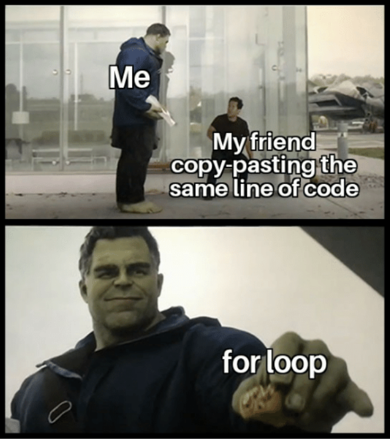

# 1.2 Boucle `#!python for ... in ...`

{: .center width=30%}


## 1. Les énumérables

En mathématiques, on dit qu'un ensemble est *dénombrable* lorsqu'on peut associer à chaque élément de l'ensemble un nombre (traditionnellement 1, 2, 3 ...)

- les fraises Tagada d'un paquet sont dénombrables.
- les voitures qui roulent sur l'autoroute sont dénombrables.
- l'eau qui coule d'un robinet n'est pas dénombrable.

En informatique, il existe un concept similaire qui va désigner les objets que l'on peut **énumérer**, c'est-à-dire les décomposer en une succession ordonnée d'éléments. On les appelle les **énumérables** ou les **itérables** (Python utilise le mot anglais ```iterable```).

- la variable ```NSI``` (qui est de type ```String```) est énumérable : on peut la décomposer en  ```N```,  ```S```, ```I```.
- la variable ```[4, 3, 17]```  (qui est de type ```List```) est énumérable : on peut la décomposer en  ```4```,  ```3```, ```17```.
- la variable ```5```  (qui est de type ```Int```) n'est PAS énumérable : on ne peut pas la décomposer. 


## 2. Itérer sur les itérables : la boucle `#!python for ... in ...`

### 2.1 Itérer sur une chaîne de caractères

La principale caractéristique d'un ordinateur est d'exceller dans les opérations répétitives.

(je vous laisse retrouver la citation de Gérard Berry, professeur au Collège de France, commençant par *«l'ordinateur est...»*)

Il existe donc une instruction permettant de faire une (ou plusieurs) action(s) à chaque itération sur un élément énumérable.

!!! note "Exemple fondateur n°1 :heart:"
    Le programme suivant :
    ```python linenums='1'
    for k in 'NSI':
        print(k)
    ```
    va donner ceci :
    ```python
    N
    S
    I
    ```

!!! aide "Analyse grâce à PythonTutor"
    Étudions, grâce à PythonTutor, le détail de cette exécution.

    Cliquez sur Next et observez bien l'évolution de la variable ```k```. 
    <iframe width="800" height="300" frameborder="0" src="https://pythontutor.com/iframe-embed.html#code=for%20k%20in%20'NSI'%3A%0A%20%20%20%20print%28k%29&codeDivHeight=400&codeDivWidth=350&cumulative=false&curInstr=0&heapPrimitives=nevernest&origin=opt-frontend.js&py=3&rawInputLstJSON=%5B%5D&textReferences=false"> </iframe>

    La variable ```k``` prend donc **successivement** toutes les lettre de la chaîne de caractère ```"NSI"```. 

    Pour chaque valeur de ```k```, la ou les instruction(s) situées **de manière indentée** sous la ligne du ```for``` seront exécutées. 

Ici, il y a simplement un ```print(k)```, donc chaque lettre de ```"NSI"``` s'affiche l'une après l'autre.

!!! example "Exercice 1"
    === "Énoncé"
        Que donne le script suivant ?
        ```python linenums='1'
        for m in 'NASA':
            print("bonjour")
        ``` 
    === "Correction"
        ```python
        bonjour
        bonjour
        bonjour
        bonjour
        ``` 

Dans cet exercice, la **variable de boucle** ```m``` est **muette** : elle n'apparaît dans les instructions indentées sous le ```for```. 

La variable ```m``` prend successivement les valeurs ```'N```, ```'A'```, ```'S'``` et ```'A'```, mais on ne le voit pas.

{: .center width=40%}


!!! warning "Comment éviter les erreurs classiques"
    Quand vous écrivez une boucle `#!python for ... in ...`, veillez bien à :

    - finir la ligne du ```for``` par les deux points ```:```
    - indenter sous le ```for``` les instructions qui doivent être répétées. Si l'indentation ne s'est pas faite automatiquement après appui sur la touche ```Entrée```, c'est que vous avez oublié les ```:```.  


### 2.2 Itérer sur une liste

!!! note "Exemple fondateur n°2 :heart:"
    Le programme suivant :
    ```python linenums='1'
    for jour in ["lundi", "mardi", "mercredi", "jeudi", "vendredi"]:
        print("je vais au lycée le", jour)

    ```
    va donner ceci :
    ```python
    je vais au lycée le lundi
    je vais au lycée le mardi
    je vais au lycée le mercredi
    je vais au lycée le jeudi
    je vais au lycée le vendredi
    ```

!!! aide "Analyse grâce à PythonTutor"
    <iframe width="800" height="300" frameborder="0" src="https://pythontutor.com/iframe-embed.html#code=for%20jour%20in%20%5B%22lundi%22,%20%22mardi%22,%20%22mercredi%22,%20%22jeudi%22,%20%22vendredi%22%5D%3A%0A%20%20%20%20print%28%22je%20vais%20au%20lyc%C3%A9e%20le%22,%20jour%29%0A&codeDivHeight=400&codeDivWidth=350&cumulative=false&curInstr=0&heapPrimitives=nevernest&origin=opt-frontend.js&py=3&rawInputLstJSON=%5B%5D&textReferences=false"> </iframe>


**:warning: Attention:** très souvent, l'objet énumérable que la boucle va parcourir aura été **au préalable** stocké dans une variable :

!!! note "Exemple fondateur n°3 :heart:"
    Le programme précédent est équivalent à :
    ```python linenums='1'
    semaine = ["lundi", "mardi", "mercredi", "jeudi", "vendredi"]
    for jour in semaine:
        print("je vais au lycée le", jour)

    ```
  

Notez l'importance d'avoir choisi des noms de variables explicites : ils aident grandement à la lisibilité du code.


*Trailer : Dans le cours spécifique sur les listes, nous verrons une toute autre manière de parcourir une liste.*

## 3. Comment répéter ```n``` fois la même action ?

Scratch dispose du (très pratique) bloc suivant :
{: .center width=10%}

Comment effectuer la même chose en Python ?

Comment répéter 10 fois la phrase ```"We're up all night to get lucky"``` ?

Nous pourrions nous en sortir par 
```python linenums='1'
for k in "blablablab": #(1) 
    print("We're up all night to get lucky")
```

1. n'importe quel mot de 10 caractères ferait l'affaire...


mais il doit clairement y avoir mieux...

Il y a mieux !

!!! note "L'ensemble ```range```  :heart:"
    Le programme suivant :
    ```python linenums='1'
    for i in range(5):
        print("We're up all night to get lucky")
    ```
    va donner ceci :
   
        We're up all night to get lucky
        We're up all night to get lucky
        We're up all night to get lucky
        We're up all night to get lucky
        We're up all night to get lucky
    
Là encore, le ```i``` est une variable muette.

## 4. Tout sur le ```range```. 

### 4.1 Retour sur l'exemple précédent.
Si nous rendions la variable ```i``` moins muette ?

```python linenums='1'
for i in range(5):
    print(i, "We're up all night to get lucky")
```
va donner ceci :
```python
0 We're up all night to get lucky
1 We're up all night to get lucky
2 We're up all night to get lucky
3 We're up all night to get lucky
4 We're up all night to get lucky
```
```i``` prend donc successivement toutes les valeurs entières entre 0 et 4. Il y en a bien 5.

### 4.2 Utilisation minimale de l'objet ```range()```  

!!! note "Syntaxe minimale de ```range()```  :heart:"
    Le programme suivant :
    ```python linenums='1'
    for k in range(4):
        print(k)

    ```
    va donner ceci :
    ```python
    0
    1
    2
    3
    ```
    **Interprétation :** faire parcourir à une variable ```k``` l'ensemble **```range(n)```** va faire prendre à ```k``` les valeurs 0, 1, 2, ..., n-1. 


### 4.3 Utilisation avancée de l'objet ```range()```  
!!! note "Syntaxe complète de ```range()```  :heart:"
    Le programme suivant :
    ```python linenums='1'
    for k in range(5, 15, 2):
        print(k)

    ```
    va donner ceci :
    ```python
    5
    7
    9
    11
    13
    ```    
    **Interprétation :** faire parcourir à ```k``` l'ensemble `range(start, stop, step)` fait :

    - démarrer ```k``` à la valeur ```start``` ,
    - progresser ```k```  de ```step``` en ```step``` tant que ```k``` est strictement inférieur à ```stop``` .


**Remarques** :

- si le ```step``` est omis, il vaut 1 par défaut.
- l'objet ```range(5)``` n'est pas «techniquement» égal à la liste ```[0, 1, 2, 3, 4]```, car ce n'est pas un objet de type ```List```:

```python
>>> type(range(5))
<class 'range'>
```
Si nécessaire, on peut le convertir en liste :
```python
>>> list(range(5))
[0, 1, 2, 3, 4]
```

Il faut donc garder en tête que l'objet renvoyé par ```range()``` est un **itérable** assimilable à une liste de nombres.  


!!! example "Exercice 2"

        Faire afficher les séries de nombres suivantes.
        
        On utilisera la syntaxe ```print(k, end = ' ')``` ) pour afficher les nombres horizontalement.

        A. ```0 1 2 3 4 5``` 
        ??? note "Correction"
            ```python linenums='1'
            for k in range(6):
                print(k, end = ' ')
            ```
        B. ```10 11 12 13 14 15 ``` 
        ??? note "Correction"
            ```python linenums='1'
            for k in range(10,16):
                print(k, end = ' ')
            ```
        C. ```3 6 9 12 ``` 
        ??? note "Correction"
            ```python linenums='1'
            for k in range(3,13,3):
                print(k, end = ' ')
            ```
        D. ```10 9 8 7 6 5 4 3 2 1 0  ``` 
        ??? note "Correction"
            ```python linenums='1'
            for k in range(10,-1,-1):
                print(k, end = ' ')
            ```
    
## 5. Une situation classique : la double boucle

Il est très souvent utile d'imbriquer une boucle dans une autre, notamment lors du parcours de tous les pixels d'une image (voir les exercices graphiques sous Processing). Prenons pour l'instant un exemple numérique.

!!! note "Exemple fondateur :heart:"
    Le programme suivant :
    ```python linenums='1'
    for a in range(1,5):
        for b in range(1,4):
            p = a * b
            print(a, '*', b, '=', p)
    ```
    va donner ceci :
    ```python
    1 * 1 = 1
    1 * 2 = 2
    1 * 3 = 3
    2 * 1 = 2
    2 * 2 = 4
    2 * 3 = 6
    3 * 1 = 3
    3 * 2 = 6
    3 * 3 = 9
    4 * 1 = 4
    4 * 2 = 8
    4 * 3 = 12
    ```


!!! aide "Analyse grâce à PythonTutor"
    <iframe width="800" height="300" frameborder="0" src="https://pythontutor.com/iframe-embed.html#code=for%20a%20in%20range%281,5%29%3A%0A%20%20%20%20for%20b%20in%20range%281,4%29%3A%0A%20%20%20%20%20%20%20%20p%20%3D%20a%20*%20b%0A%20%20%20%20%20%20%20%20print%28a,%20'*',%20b,%20'%3D',%20p%29%0A&codeDivHeight=400&codeDivWidth=350&cumulative=false&curInstr=0&heapPrimitives=nevernest&origin=opt-frontend.js&py=3&rawInputLstJSON=%5B%5D&textReferences=false"> </iframe>


!!! example "Exercice 3"
    === "Énoncé"
        Écrire un programme qui affiche :
        ```python
        Papa dit : « et une cuillère pour Riri ! »
        Papa dit : « et une cuillère pour Fifi ! »
        Papa dit : « et une cuillère pour Loulou ! »
        Maman dit : « et une cuillère pour Riri ! »
        Maman dit : « et une cuillère pour Fifi ! »
        Maman dit : « et une cuillère pour Loulou ! »
        Mamie dit : « et une cuillère pour Riri ! »
        Mamie dit : « et une cuillère pour Fifi ! »
        Mamie dit : « et une cuillère pour Loulou ! »
        ```
    === "Correction"
        ```python linenums='1'
        for parent in ["Papa", "Maman", "Mamie"]:
            for enfant in ["Riri", "Fifi", "Loulou"]:
                print(parent, "dit : « et une cuillère pour", enfant, "! »")
        ```

!!! example "Exercice 4"
    === "Énoncé"
        Rajouter à la phrase précédente le contenu de la cuillère (purée puis compote). 
        
        Exemple :
        ```
        Papa dit : « et une cuillère de purée pour Riri ! »
        Papa dit : « et une cuillère de compote pour Riri ! »
        Papa dit : « et une cuillère de purée pour Fifi ! »
        Papa dit : « et une cuillère de compote pour Fifi ! »
        Papa dit : « et une cuillère de purée pour Loulou ! »
        Papa dit : « et une cuillère de compote pour Loulou ! »
        Maman dit : « et une cuillère de purée pour Riri ! »
        Maman dit : « et une cuillère de compote pour Riri ! »
        ...
        ``` 

    === "Correction"
        ```python linenums='1'
        for parent in ["Papa", "Maman", "Mamie"]:
            for enfant in ["Riri", "Fifi", "Loulou"]:
                for nourriture in ["purée", "compote"]:
                    print(parent, "dit : « et une cuillère de", nourriture, "pour", enfant, "! »")
        ```


## 6. Pour conclure

!!! done "À retenir :heart: :heart: :heart:"
    - La boucle `#!python for ... in ...` s'utilise lorsque :
        - on veut parcourir un à un les éléments d'un objet itérable (une chaîne de caractère, une liste, un tuple, un dictionnaire...)
        - on veut répéter une action un nombre de fois **connu à l'avance**. On parle de boucle **bornée**.
    - Les instructions répétées peuvent - mais ce n'est pas obligatoire - faire appel à la variable de boucle, mais il ne faut pas que ces instructions la modifient.

    - Ne pas oublier les `:` et l'indentation !
    - `range(n)` génère une séquence de `n` nombres entiers: on s'en servira dès qu'on aura besoin de répéter `n` fois des instructions.
