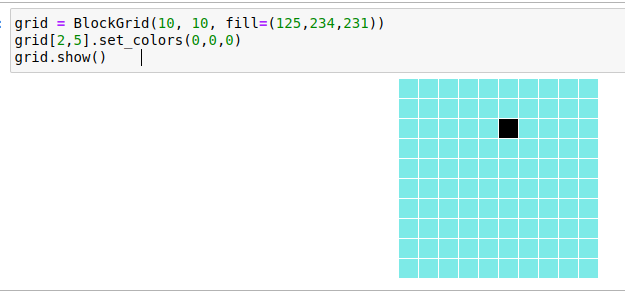

# Exercices sur la boucle `for ... in`

{{ initexo(0) }}

!!! example "{{ exercice() }}"
    
    On donne une liste d'acteurs : 
    ```python
    liste_acteurs = ['Tahar', 'Omar', 'Guillaume', 'Swann', 'Alex', 'Roschdy']
    ```

    Utilisez cette liste pour produire la sortie suivante:
    ```python
    Tahar a eu le César du meilleur acteur
    Omar a eu le César du meilleur acteur
    Guillaume a eu le César du meilleur acteur
    Swann a eu le César du meilleur acteur
    Alex a eu le César du meilleur acteur
    Roschdy a eu le César du meilleur acteur
    ```
    
    {{
    correction(True,
    """
    ??? success \"Correction\" 
        ```python linenums='1'
        liste_acteurs = ['Tahar', 'Omar', 'Guillaume', 'Swann', 'Alex', 'Roschdy']

        for acteur in liste_acteurs:
            print(acteur, 'a eu le César du meilleur acteur')
        ```        
    """
    )
    }}
        

        


!!! info ":heart: Concaténation de caractères :heart:"
    Il est possible de *coller* (le vrai mot est *concaténer*) deux chaînes de caractères par l'opérateur ```+``` :
    ```python
    >>> "a" + "b"
    'ab'
    ``` 
         


!!! example "{{ exercice() }}"
    
    Dans l'extrait de code suivant:

    - `chaine` est une variable initialisée avec un `str` vide : `""`;
    - on veut qu'en sortie de programme cette variable contienne la valeur `'bravo'`.

    L'idée est d'ajouter une par une les lettres à la variable `chaine`.

    À l'exécution, le programme doit afficher uniquement ```bravo```.

    Compléter le code.


    ```python linenums='1'
    chaine = ""
    for ... in ['b', 'r', 'a', 'v', 'o']:
        ...
    print(chaine)
    ```

    Cette variable `chaine` est appelée un **accumulateur**.

    {{
    correction(True,
    """
    ??? success \"Correction\" 
        ```python linenums='1'
        chaine = ''
        for lettre in ['b', 'r', 'a', 'v', 'o']:
            chaine = chaine + lettre #(1)

        print(chaine)
        ```        

        1. Ou bien ```chaine += lettre``` 
    """
    )
    }}
        

        


{#
!!! example "{{ exercice() }}"
    === "Énoncé"
        1. Fabriquer la chaîne de caractères suivante (qui comporte 80 caractères) :
        ```python
        IIIIIIIIIIIIIIIIIIIIIIIIIIIIIIIIIIIIIIIIIIIIIIIIIIIIIIIIIIIIIIIIIIIIIIIIIIIIIIII
        ```
        2. Fabriquer la chaîne de caractères suivante :
        ```python
        IIIIIIIIIIIIIIIIIIIIIIIIIIIIIIIIIIIIIIIIIIIIIIIIIIIIIIIIIIIIIIIIIIIIIIIIIIIIIIII
        NNNNNNNNNNNNNNNNNNNNNNNNNNNNNNNNNNNNNNNNNNNNNNNNNNNNNNNNNNNNNNNNNNNNNNNNNNNNNNNN
        FFFFFFFFFFFFFFFFFFFFFFFFFFFFFFFFFFFFFFFFFFFFFFFFFFFFFFFFFFFFFFFFFFFFFFFFFFFFFFFF
        OOOOOOOOOOOOOOOOOOOOOOOOOOOOOOOOOOOOOOOOOOOOOOOOOOOOOOOOOOOOOOOOOOOOOOOOOOOOOOOO
        ```
<!--     === "Correction"
        1.
        ```python linenums='1'
        sol = ""
        for k in range(80):
            sol = sol + 'I'

        print(sol)
        ``` 
        2.
        ```python linenums='1'
        for lettre in 'INFO':
            sol = ""
            for k in range(80):
                sol = sol + lettre
            print(sol)
        ``` -->

#}

!!! example "{{ exercice() }}"
    
    En Python, la fonction `ord` renvoie le code Unicode d'un caractère et la fonction `chr` le contraire: elle renvoie le caractère correspondant à un code Unicode.

    Par exemple:
    ```python 
    >>> ord('a')
    97
    >>> chr(97)
    'a'
    ```

    Voici une liste contenant les codes Unicode des lettres d'un mot secret...
    À vous d'écrire un programme où en sortie, la variable `mot_secret` contiendra la chaîne de caractères de ce mot.   


    ```python linenums='1'
    mystere = [111, 107, 44, 32, 98, 105, 101, 110, 32, 106, 111, 117, 233]
    mot_secret = ""

    # à vous !
    ```

    {{
    correction(True,
    """
    ??? success \"Correction\" 
        ```python linenums='1'
        mystere = [111, 107, 44, 32, 98, 105, 101, 110, 32, 106, 111, 117, 233]
        mot_secret = ""

        for nombre in mystere:
            lettre = chr(nombre)
            mot_secret = mot_secret + lettre

        print(mot_secret)
        ```        
    """
    )
    }}

!!! example "{{ exercice() }}"
    
    On souhaite calculer la somme des 1000 premiers nombres entiers naturels, c'est-à-dire:

    $1+2+3+4+5+ \dots +999+1000$

    Écrire un programme avec une variable `somme` **accumulateur** (comme à l'exercice 3) qui contiendra la valeur souhaitée en fin de programme.

    {{
    correction(True,
    """
    ??? success \"Correction\" 
        ```python linenums='1'
        somme = 0
        for k in range(1001):
            somme += k
        print(somme)
        ```        
    """
    )
    }}
        

        

!!! example "{{ exercice() }}"
    
    Calculer $1\times 2 \times 3 \times \dots 99 \times 100$.

    {{
    correction(False,
    """
    ??? success \"Correction\" 
        ```python linenums='1'
        produit = 1
        for k in range(1,101):
            produit = produit * k
        print(produit)  
        ```        
    """
    )
    }}
        

        
        

      

!!! example "{{ exercice() }}"
    
    Proposer un code qui écrit la **table de multiplication** de 7, de 8 et de 9.

    La sortie doit ressembler à :
    ```
    7*1 = 7

    7*2 = 14

    ...    
    ...

    9*9 = 81    
    ```
    
    {{
    correction(False,
    """
    ??? success \"Correction\" 
        ```python linenums='1'
        for a in range(7, 10):
            for b in range(1, 10):
                print(a, '*', b, '=', a*b)
        ```        
    """
    )
    }}
        

        

!!! example "{{ exercice() }}"
    
    Sur un jeu d'échecs, les cases sont repérées par une lettre (de A jusqu'à H) et par un chiffre (de 1 jusqu'à 8).

    Les cases sont donc A1, A2, A3, ..., H7, H8.

    Proposer un code qui écrit **toutes** les cases possibles.

    {{
    correction(False,
    """
    ??? success \"Correction\" 
        ```python linenums='1'
        for lettre in 'ABCDEFGH':
            for chiffre in '12345678':
                case = lettre + chiffre
                print(case)
        ```

        Autre solution utilisant la conversion d'un entier en chaine de caractères, grâce à la fonction ```str``` : 


        ```python linenums='1'
        for lettre in 'ABCDEFGH':
            for chiffre in range(1, 9):
                case = lettre + str(chiffre)
                print(case)
        ```        
    """
    )
    }}
        

        


!!! example "{{ exercice() }}"

    Travail sur ```ipythonblocks``` :
    {: .center}
    
    Exercice à faire sur Capytale : [https://capytale2.ac-paris.fr/web/c/8869-1863952](https://capytale2.ac-paris.fr/web/c/8869-1863952){. target="_blank"}


!!! example "{{ exercice() }}"
    
    Dans ma trousse je dispose de 5 feutres de couleur :

    - jaune (J)
    - vert (V)
    - noir (N)
    - bleu (B)
    - orange (O)

    Pour un exercice, je dois colorier 3 pastilles en choissant sans aucune contrainte des couleurs parmi les 5 disponibles. Je peux tout colorier en jaune (```JJJ```) ou bien colorier la 1ère en orange, la 2ème en bleu, la 3ème en vert (```OBV``` )

    Faire afficher la totalité des combinaisons possibles.


    {{
    correction(False,
    """
    ??? success \"Correction\" 
        ```python linenums='1'
        couleurs = 'JVNBO'
        for c1 in couleurs:
            for c2 in couleurs:
                for c3 in couleurs:
                    print(c1 + c2 + c3)
        ```        
    """
    )
    }}

        

        