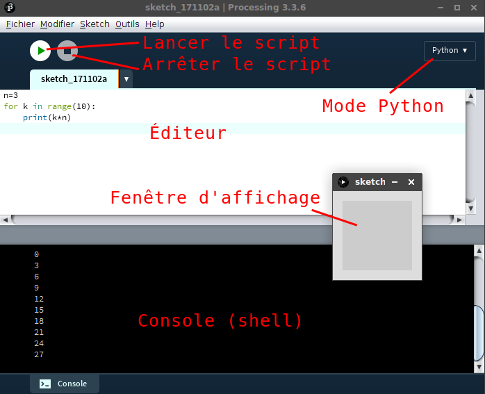
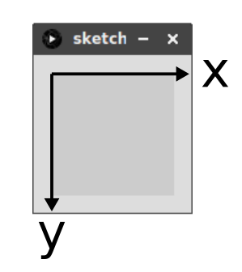
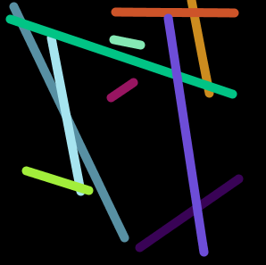
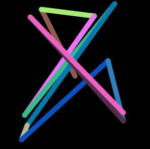
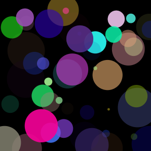
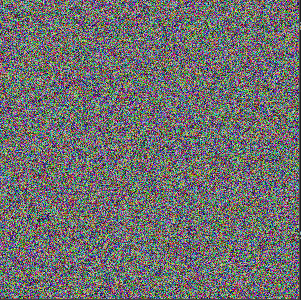
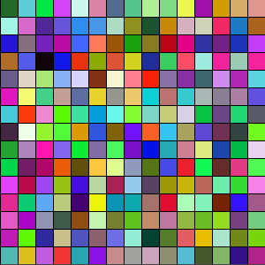

{{ initexo(0)}}

# Exercices sous Processing

## 1. Présentation de Processing

{align=right} 
Processing est un outil de création multimédia utilisant le code informatique. Simple de prise en main, il a été créé par des artistes pour des artistes. On peut utiliser le langage Python pour entrer les instructions.

Nous l'utiliserons pour ajouter du graphisme à nos créations. Dans tous les exercices de cette page, les dessins réalisés seront statiques. Nous verrons plus tard comment Processing permet très facilement de faire des animations.

??? info "Documentation"
    - [Le site officiel (anglais)](https://processing.org/){:target="_blank"} 
    - [Un manuel d'utilisation (français)](https://fr.flossmanuals.net/processing/introduction/){:target="_blank"} 


{: .center} 


## 2. Les bases de Processing
### 2.1 Repère

À l'exécution de tout script Processing, une fenêtre s'affiche avec une zone de dessin. Sa taille se définit à l'aide de la fonction `size`. Par exemple, pour créer une zone de dessin de 300 pixels sur 200 pixels, on utilisera:

```python
size(300, 200)
```

Chaque pixel de cette zone est repérée par des coordonnées dans le repère suivant, dont l'origine se situe en haut à gauche et l'axe des ordonnées est **orienté vers le bas**.

{: .center} 

### 2.2 Tracés

!!! info "Tracés de base"
    - `point` : permet de dessiner un point (pixel). En paramètre, les coordonnées du point.
    - `line`: permet de tracer une ligne entre deux points. En paramètres, les coordonnées des deux points.
    - `rect`: permet de tracer un rectangle. En paramètres, les coordonnées du sommet haut-gauche, puis la largeur et la hauteur du rectangle.
    - `ellipse`: permet de tracer une ellipse. En paramètres, les coordonnées du centre, puis la largeur et la hauteur (mettre la même valeur pour un cercle).

??? note "Exemples"
    Copier-coller le code suivant et faire varier les paramètres pour bien les comprendre.

    ```python
    size(200, 200)
    point(10, 60)
    line(10, 10, 100, 150)
    rect(80, 10, 20, 50)
    ellipse(150, 100, 80, 40)
    ```

### 2.3 Couleurs

!!! info "Pinceau"
    - `background`: permet de définir la couleur du fond de la zone de dessin. En paramètres, les trois composantes RGB de la couleur.
    - `stroke`: permet de définir la couleur du pinceau (noir par défaut) pour le contour de la forme. En paramètres, les trois composantes RGB de la couleur.
    - `noStroke`: permet de dessiner une forme sans coutour (pas de paramètre).
    - `strokeWeight`: permet de définir la largeur du pinceau. En paramètre, le nombre de pixel.
    - `fill`: permet de définir la couleur de remplissage de la forme. En paramètres, les trois composantes RGB de la couleur.
    
??? note "Exemples"
    Copier-coller le code suivant et faire varier les paramètres pour bien les comprendre.

    ```python
    size(200, 200)
    background(255, 255, 255)
    stroke(255, 0, 0)
    point(10, 60)
    line(10, 10, 100, 150)
    stroke(0, 127, 255)
    strokeWeight(5)
    rect(80, 10, 20, 50)
    noStroke()
    fill(204, 153, 204)
    ellipse(150, 100, 80, 40)
    ```

## 3. Exercices sur la simple boucle
Tous les exercices sont à faire dans une fenêtre de 300 pixels sur 300 pixels.

!!! example "{{ exercice() }}"
    === "Énoncé"
        L'objectif est d'obtenir dix lignes aléatoires, de couleur aléatoire et d'épaisseur 10.

        {: .center} 

        *Aide*

        - la fonction ```random(a,b)``` permet d'obtenir un entier pseudo aléatoire entre ```a``` et ```b```.
    === "Correction"
        ```python linenums='1'
        size(300,300)
        background(0)
        for k in range(10):
            Ax = random(0,300)
            Ay = random(0,300)
            Bx = random(0,300)
            By = random(0,300)
            strokeWeight(10)
            stroke(random(0,255), random(0,255), random(0,255))
            line(Ax,Ay,Bx,By)
        ```


!!! example "{{ exercice() }} :warning: *difficile*"
    === "Énoncé"
        Reprendre l'exercice précédent en faisant en sorte que chaque ligne commence là où une autre s'arrête (hormis la première)
        {: .center} 

    === "Correction"
        ```python linenums='1'
        size(300,300)
        background(0)
        Ax = random(0,300)
        Ay = random(0,300)
        for k in range(10):
            Bx = random(0,300)
            By = random(0,300)
            strokeWeight(10)
            stroke(random(0,255), random(0,255), random(0,255))
            line(Ax,Ay,Bx,By)
            Ax = Bx
            Ay = By
        ```


!!! example "{{ exercice() }}"
    === "Énoncé"
        Tracer 50 disques de position, diamètre, couleur et transparence aléatoires.
        {: .center} 

        *Aide*

        - la transparence s'obtient en rajoutant un 4ème paramètre (entre 0 et 255) à la suite de RGB. On appelle ce paramètre le canal Alpha.
        Ex : (255,0,0,200) est un rouge très transparent.

    === "Correction"
        ```python linenums='1'
        size(300,300)
        background(0)
        for k in range(50):
            Ax = random(0,300)
            Ay = random(0,300)
            diametre = random(0,50)
            noStroke()
            r = random(0,255)
            g = random(0,255)
            b = random(0,255)
            a = random(0,255)
            fill(r, g, b, a)
            ellipse(Ax,Ay,diametre, diametre)

        ```

!!! capytale "À faire sur Capytale : [activité ]()"
    :warning: lire au préalable la page «Comment passer d'un code Processing à un code p5»
    !!! example "{{ exercice() }}"
        === "Énoncé"
            flsdjl


## 4. Exercices sur la double boucle
La structure de double boucle va permettre (par exemple) de parcourir l'intégralité des pixels d'une image.

!!! example "{{ exercice() }}"
    Construire une image où tous les points ont une couleur aléatoire.
    {: .center} 

<!--
size(300,300)
background(0)


for x in range(300):
    for y in range(300):
        r = random(0,255)
        g = random(0,255)
        b = random(0,255)
        stroke(r,g,b)
        point(x,y)
-->

!!! example "{{ exercice() }}"
    Construire une image constituée de carrés de 20 pixels de coté, de couleur aléatoire. L'image est toujours un carré de côté 300 pixels.
    {: .center} 

<!--
size(300,300)
background(0)


for xk in range(15):
    for yk in range(15):
        r = random(0,255)
        g = random(0,255)
        b = random(0,255)
        fill(r,g,b)
        rect(xk*20,yk*20,20,20)
-->

