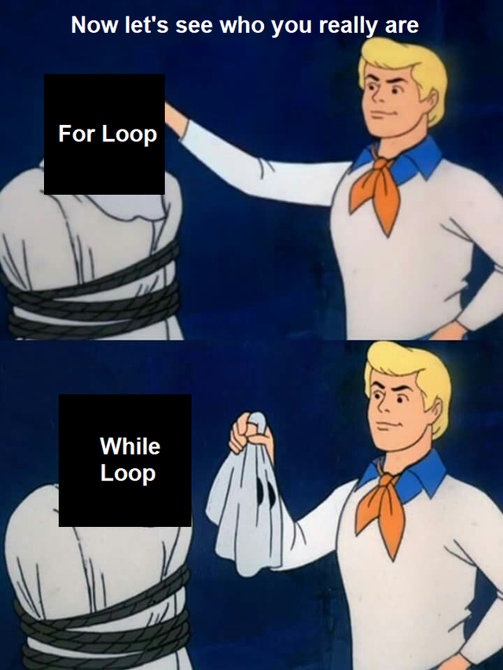
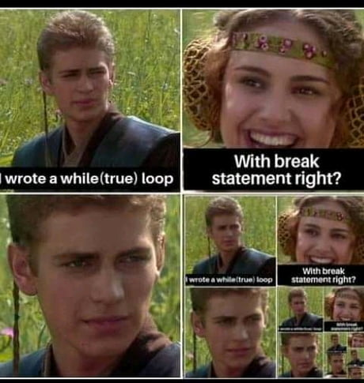

# 1.3 Boucle While

## 1. Premiers exemples

À la différence essentielle des boucles `for`, dont on peut savoir à l'avance combien de fois elles vont être exécutées, les boucles `while` sont des boucles dont on ne sort que lorsqu'une condition n'est plus satisfaite. 

Avec donc le risque de rester infiniment bloqué à l'intérieur !  

{: .center width=40%}

!!! note "Exemple fondateur n°1 :heart:"
    Le programme suivant :
    ```python linenums='1'
    a = 0
    while a < 3 :
        print("ok")
        a = a + 1
    print("fini")
    ```
    va donner ceci :
    ```python
    ok
    ok
    ok
    fini

    ```
!!! aide "Analyse grâce à PythonTutor"
    <iframe width="800" height="300" frameborder="0" src="https://pythontutor.com/iframe-embed.html#code=a%20%3D%200%0Awhile%20a%20%3C%203%3A%0A%20%20%20%20print%28%22ok%22%29%0A%20%20%20%20a%20%3D%20a%20%2B%201%0Aprint%28%22fini%22%29&codeDivHeight=400&codeDivWidth=350&cumulative=false&curInstr=0&heapPrimitives=nevernest&origin=opt-frontend.js&py=3&rawInputLstJSON=%5B%5D&textReferences=false"> </iframe>


!!! question
    le code ci-dessous va-t-il donner un résultat différent ?
    ```python linenums='1'
    a = 0
    while a < 3 :
        a = a + 1
        print("ok")
    print("fini")
    ```

??? info "Résultat du programme ⏬"
    ```python
    ok
    ok
    ok
    fini
    ```


**Conclusion** : l'évaluation de la condition ne se fait pas à chaque ligne mais bien au début de chaque tour de boucle. Si la variable qui déclenchera la sortie de boucle atteint sa valeur de sortie au milieu des instructions, les lignes restantes sont quand même exécutées.


## 2. Syntaxe générale
todo
## 3. Les pièges ...

### 3.1 piège n°1 : ne JAMAIS SORTIR de la boucle


!!! bug "Exemple fondateur n°2 :heart:"
    Le programme suivant :
    ```python linenums='1'
    a = 0
    while a < 3 :
        print("ok")
        a = a + 1
        a = a * 0
    print("ce texte ne s'écrira jamais")
    ```
    va écrire une suite infinie de ```ok``` et ne **jamais s'arrêter**


### 3.2 piège n°2 : ne JAMAIS ENTRER dans la boucle

!!! bug "Exemple fondateur n°3 :heart:"
    Le programme suivant :
    ```python
    a = 0
    b = 0
    while a > 10 :
        print("ce texte non plus ne s'écrira jamais")
        a = a + 1
        
    print("fini") 
    ```

    va écrire ```fini``` et s'arrêter.

{{ initexo(0) }}
!!! example "{{ exercice() }}"
    === "Énoncé"
        Trouver le plus petit nombre entier $n$ tel que $2^n$ soit supérieur à 1 milliard.
    === "Correction"
        ```python linenums='1'
        n = 1
        while 2**n < 10**9 :
            n = n + 1
            print("trop petit")
        print("trouvé : ",n)
        ```

!!! example "{{ exercice() }}"
    === "Énoncé"
        Demander à l'utilisateur de taper la lettre S (puis sur la touche Entrée). Recommencer tant qu'il n'a pas obéi.
    === "Correction"
        ```python linenums='1'
        touche = ""  #chaine de caractère vide
        while touche != 'S' :
            touche = input("appuyez sur S s'il vous plaît ")

        print("ouf, merci !")
        ```


## 4. Quelques remarques
### 4.1 Lien entre ```while``` et ```for```
{: .center width=40%}

### 4.2 Les boucles infinies volontaires
{: .center width=40%}

 
