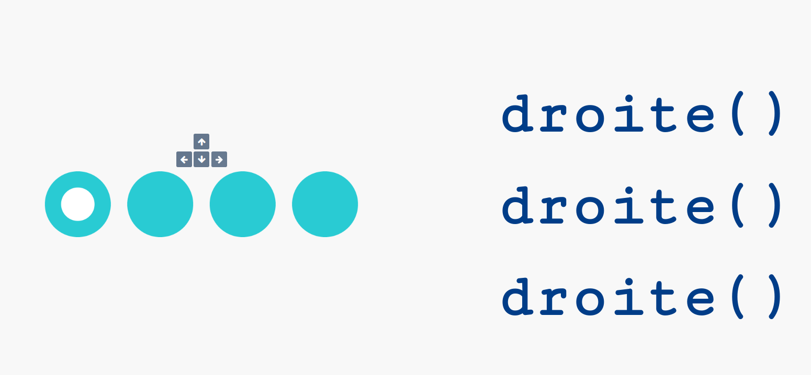

# 1.4 Instruction conditionnelle if

{: .center width=50%}


L'instruction conditionnelle `if` permet de soumettre l'exécution d'instructions à une condition donnée.
Cette condition sera une expression booléenne, comme pour la boucle `while`.


## 1. Exemples fondateurs
Dans les exemples ci-dessous, changez la valeur affectée à la variable ```age``` afin d'observer les modifications de comportement du programme.


!!! note "Exemple fondateur n°1 :heart:"
    L'exemple minimal ci-dessous ne contient que le mot-clé ```if```. 
    ```python  linenums="1"
    age = 20
    if age >= 18:
        print("Tu as le droit de vote")
    ```


!!! note "Exemple fondateur n°2 :heart:"
    La structure qu'on rencontrera le plus souvent est la structure ```if ... else ...``` 

    ```python linenums="1"
    age = 20
    if age >= 18:
        print("Tu as le droit de vote")
    else:
        print("Désolé, il faudra attendre", 18 - age, "ans avant de pouvoir voter")
    ```

!!! abstract "**Syntaxe générale**"
    ```
    if expression booléenne:
        *instructions à effectuer si l'expression est vraie*
    else:
        *instructions à effectuer si l'expression est fausse*
    ```

## 2. L'évaluation de la condition

Comme pour la boucle ```while```, on dit que l'expression qui suit le ```if``` est **évaluée** par Python lors de l'exécution du programme.

Cette évaluation renvoie un booléen, ```True``` ou ```False```.

Les symboles de comparaison (ou d'appartenance) permettant d'écrire une condition sont :

!!! info inline  "Opérateurs de comparaison"
    |Opérateur|Signification|
    |:-:|:-:|
    |`==`| est égal à|
    |`!=`|est différent de|
    |`<`|inférieur à|
    |`>`|supérieur à|
    |`<=`|inférieur ou égal à|
    |`>=`|supérieur ou égal à|
    |`in`| appartient à|
    |`not in`| n'appartient pas à|

!!! note "Exemples"
    ```python
    >>> a = 2

    >>> a == 3
    False

    >>> a == 2
    True

    >>> a != 1
    True

    >>> a > 2
    False

    >>> a >= 2
    True

    >>> a <= 2
    True

    >>> a <= 5
    True

    >>> 'e' in 'abracadabra'
    False

    >>> 'b' in 'abracadabra'
    True

    >>> 'A' not in 'abracadabra'
    True

    >>> not True
    False


    ```
    
Comme nous le verrons dans le cours sur les booléens, ces conditions peuvent être combinées avec (par exemple) les mots-clés ``` and``` ou ``` or``` :

```python
>>> b = 20
>>> b > 15 and b < 30
True
>>> b > 2000 or b < 30
True
```

!!! example "Exercice"
    === "Énoncé"
        Compter le nombre de voyelles de la phrase ```'cet exercice est prodigieusement ennuyeux'``` 
    === "Correction"
        {{ correction(True,
        "
        ```python linenums='1'
        phrase = 'cet exercice est prodigieusement ennuyeux'

        voyelles = 'aeiouy'

        compteur = 0

        for lettre in phrase:
            if lettre in voyelles:
                compteur += 1
                
        print(compteur)
        ```
        "
        ) }}


## 3. Un test très fréquent : le test de divisibilité


!!! note "Exemple fondateur n°3 :heart:"
    Pour tester si un nombre ```n``` est divisible par un nombre ```d```, on teste si le reste de la division euclidienne de ```n``` par ```d``` est égal à 0 :

    ```python
    n = 17
    if n % 2 == 0:
        print(n, "est un nombre pair")
    else:
        print(n, "est un nombre impair")
    ```     


!!! example "Exercice"
    === "Énoncé"
        Afficher la liste de tous les nombres entre 1 et 100 qui sont divisibles à la fois par 2 et par 7. 
    === "Correction"
        {{ correction(True,
        "
        ```python linenums='1'
        for n in range(1,101):
            if n % 2 == 0 and n % 7 == 0:
                print(n)
        ```
        "
        ) }}


## 4. Les cas multiples : utilisation de `elif` 

{: .center width=30%}


Dans les situations où l'on veut effectuer des instructions différentes selon les différentes valeurs prises par une variable, on peut imbriquer les instructions `if` ... `else`.

Observer par exemple le code ci-dessous :

```python linenums='1'
moyenne = 13

if moyenne < 8:
    print("raté")
else:
    if moyenne < 10:
        print("repêchage")
    else:
        if moyenne < 12:
            print("admis")
        else:
            if moyenne < 14:
                print("mention AB")
            else:
                if moyenne < 16:
                    print("mention B")
                else:
                    print("mention TB")
```


Mais cela est vite long et peu lisible, et les différents niveaux d'indentation peuvent devenir piégeux.

Il existe alors une instruction qui contracte `else` et `if` : `elif` (sinon si).

Ce code devient alors

```python linenums="1"
moyenne = 7

if moyenne < 8:
    print("raté")
elif moyenne < 10:
    print("repêchage")
elif moyenne < 12:
    print("admis")
elif moyenne < 14:
    print("mention AB")
elif moyenne < 16:
    print("mention B")
else:
    print("mention TB")

```


## 4. Récréation : à vous d'obéir !

{: .center width=30%}

Le site [https://compute-it.toxicode.fr/](https://compute-it.toxicode.fr/) vous demande d'exécuter mentalement les instructions affichées, à l'aide des touches directionnelles de votre clavier. Attention, c'est très addictif !