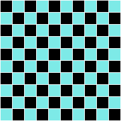

# Exercices

{{ initexo(0) }}

!!! example "{{ exercice() }}"
    === "Énoncé"
        Écrire un programme qui demande deux nombres et qui affiche le plus grand des deux.

        Aide :
        pour stocker dans une variable ```n``` un nombre tapé au clavier par l'utilisateur, on utilise le code suivant :

        ```python
        n = int(input('Entrez un nombre'))
        ``` 

    === "Correction"
        {{ correction(True,
        "
        ```python linenums='1'
        n1 = int(input('Premier nombre ?'))
        n2 = int(input('Deuxième nombre ?'))

        if n1 > n2:
            print('le nombre le plus grand est', n1)
        elif n2 > n1:
            print('le nombre le plus grand est', n2)
        else:
            print('les deux nombres sont égaux')

        ```
        "
        ) }}


!!! example "{{ exercice() }}"
    === "Énoncé"
        Exercices à réaliser sur Capytale à partir de ce [lien](https://capytale2.ac-paris.fr/web/c/dc75-658380/mlc){. target="_blank"}.
        {: .center}
        

    === "Corrections"
        Q2 : une colonne sur 2 noire
        ```python linenums='1'
        grid = BlockGrid(10, 10, fill=(125,234,231))
        for ligne in range(10):
            for colonne in range(1,10,2):
                grid[ligne,colonne].set_colors(0,0,0)
        grid.show()
        ```

        Q3 : un damier
        ```python linenums='1'
        n = 10
        grid = BlockGrid(n, n, fill=(125,234,231))
        for colonne in range(n):
            for ligne in range(n):
                if (ligne + colonne) %2 == 0:
                    grid[ligne,colonne].set_colors(0,0,0)
        grid.show()
        ```

        Q4 : un escalier
        ```python linenums='1'
        n = 10
        grid = BlockGrid(n, n, fill=(125,234,231))
        for colonne in range(n):
            for ligne in range(n):
                if (ligne + colonne) > 9 :
                    grid[ligne,colonne].set_colors(0,0,0)
        grid.show()
        ```

!!! example "{{ exercice() }}"
    === "Énoncé"
        Le jeu du FizzBuzz : il s'agit de compter à partir de 1 en remplaçant certains nombres par Fizz, Buzz ou Fizzbuzz :

        - si le nombre est divisible par 3, on ne le dit pas et on le remplace par Fizz.
        - si le nombre est divisible par 5, on ne le dit pas et on le remplace par Buzz.
        - si le nombre est divisible par 3 et par 5, on ne le dit pas et on le remplace par FizzBuzz.

        Écrire un code qui joue au FizzBuzz jusqu'à 50.

    === "Correction"
        {{ correction(True,
        "
        ```python linenums='1'
        for k in range(1,20):
            if k % 3 == 0 and k % 5 == 0:
                print('fizzbuzz')
            elif k % 3 == 0:
                print('fizz')
            elif k % 5 == 0:
                print('buzz')
            else:
                print(k)
        ```
        "
        ) }}


!!! example "{{ exercice() }}"
    === "Énoncé"
        Une année est déclarée bissextile (et compte donc 366 jours au lieu de 365) si elle est :

        - soit divisible par 400.
        - soit divisible par 4 mais pas divisible par 100.

        Écrire un code qui détermine si une année est bissextile ou non.

        *Explication : la Terre faisant le tour du Soleil en [un peu plus que 365 jours](https://fr.vikidia.org/wiki/R%C3%A9volution_de_la_Terre_autour_du_Soleil), on s'est dit qu'on allait rajouter un jour tous les 4 ans, mais c'était trop, alors on a enlevé un jour tous les 100 ans, mais c'était plus assez, alors on a rajouté un jour tous les 400 ans, ce qui donne une approximation convenable.*

    === "Correction"
        {{ correction(True,
        """
        ```python linenums='1'
        annee = 2022

        if annee % 400 == 0:
            print(annee, \"est bissextile\")
        elif annee % 4 == 0 and annee % 100 != 0:
            print(annee, \"est bissextile\")
        else:
            print(annee, \"n'est pas bissextile\")
            


        ```
        """
    


        
        ) }}
