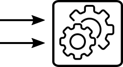
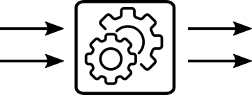

# 1.5 Fonctions

{: .center width=40%}


La notion de fonction est essentielle en programmation.  
Elle permet de construire des codes modulaires, plus faciles à lire et à modifier.  
En Python, une fonction se crée avec le mot-clé `def`.

## 1. Fonctions sans paramètre, sans valeur renvoyée

{: .center }

!!! note "Exemple fondateur n°1 :heart:"
    ```python linenums='1'
    def accueil():
        print("bonjour")
        print("comment allez-vous")
    ```


Lorsque l'interpréteur Python parcourt cette fonction, **rien** ne s'affiche. La fonction est maintenant prête à être appelée, mais n'est pas exécutée tant que l'utilisateur ne le demande pas explicitement.


```python
accueil()
```

    bonjour
    comment allez-vous


## 2. Fonction avec paramètre(s), sans valeur renvoyée

{: .center}

### Exemple


```python
def chat_penible(n):
    for k in range(n):
        print("meoww")
```

La valeur `n` est appelée *paramètre* de la fonction `chat_penible`. On dit qu'on *passe* le paramètre `n` à la fonction `chat_penible`.


```python

chat_penible(3)

```

    meoww
    meoww
    meoww


Dans l'exemple ci-dessus, on dit qu'on a appelé la fonction `chat_penible` avec *l'argument* 3.

**Remarque :** la bien connue fonction `print()` est une fonction à paramètre, qui affiche dans la console le contenu du paramètre.

### Paramètres multiples

Une fonction peut avoir de multiples paramètres :


```python
def repete(mot, k) :
    for i in range(k):
        print(mot)

repete("NSI", 3)
```

    NSI
    NSI
    NSI


L'ordre des paramètres passés est alors important ! Le code ci-dessous est incorrect.


```python
repete(3, "test")
```


    ---------------------------------------------------------------------------

    TypeError                                 Traceback (most recent call last)

    <ipython-input-9-a84914f8a6c6> in <module>()
    ----> 1 repete(3, "test")
    

    <ipython-input-8-7dc8032e3f17> in repete(mot, k)
          1 def repete(mot, k) :
    ----> 2     for i in range(k):
          3         print(mot)
          4 
          5 repete("NSI", 5)


    TypeError: 'str' object cannot be interpreted as an integer


## 3. Fonction avec paramètre(s) et avec valeur renvoyée

{: .center}


On retrouve ici la notion classique de fonction rencontrée en mathématiques : un procédé qui prend un nombre et en renvoie un autre. En informatique, l'objet renvoyé ne sera pas forcément un nombre (cela pourra être aussi une liste, un tableau, une image...).
Le renvoi d'une valeur se fait grâce au mot-clé `return`.

### Exemple
la fonction mathématique $f : x \longmapsto 2x+3$ se codera par :


```python
def f(x):
    return 2*x+3
```


```python
f(10)
```


    23


### Exemple
Dans l'exemple ci-dessous, le paramètre est une liste (de codes ASCII), et la sortie est une chaîne de caractères.


```python
def conversion_ascii_texte(listecodes):
    s = ""
    for k in listecodes :
        s = s + chr(k)
    return s
```


```python
conversion_ascii_texte([85, 66, 66])
```


    'UBB'


## Remarques

**Remarque 1 :** Le mot-clé `return` provoque une *éjection* du code : tout ce qui est situé après le  `return` ne sera pas exécuté.  
Observez la différence entre les fonctions $g$ et $h$.


```python
def g(x):
    print("ce texte sera bien affiché")
    return 2*x+3
```


```python
g(4)
```

    ce texte sera bien affiché


    11


```python
def h(x):
    return 2*x+3
    print("ceci ne sera jamais affiché")
```


```python
h(5)
```


    13


**Remarque 2 :** Pour les puristes, une fonction sans valeur renvoyée sera plutôt appelée *procédure*. Le mot *fonction* étant réservé aux fonctions qui ont effectivement un `return`.

**Remarque 3 :** Dans un code amené à être partagé ou à beaucoup évoluer, on prendra l'habitude de *documenter* la fonction grâce à une *docstring*, située en début de fonction et encadrée par des triples quotes.


```python
def conversion_ascii_texte(listecodes):
    """ 
    Cette fonction convertit une liste de codes Ascii (ex [69, 78, 72]) 
    en une chaîne de caractères (ex 'ENH')
    """
    s = ""
    for k in listecodes :
        s = s + chr(k)
    return s
```

Cette docstring est une sorte de manuel de la fonction, qu'on appelle avec le mot-clé `help`.


```python
help(conversion_ascii_texte)
```

    Help on function conversion_ascii_texte in module __main__:
    
    conversion_ascii_texte(listecodes)
        Cette fonction convertit une liste de codes Ascii (ex [69, 78, 72]) 
        en une chaîne de caractères (ex 'ENH')
    


## Exercices

### Exercice 1
Définissez une fonction `max(n1,n2)` qui renvoie le plus grand élément entre `n1` et `n2`.


```python
def max(n1, n2):
    if n1 < n2 :
        return n2
    else :
        return n1
```


```python
max(12,15)
```


    15


### Exercice 2
Définissez une **fonction** `decale(lettre)` qui décale de 3 rangs dans l'alphabet la lettre `lettre` passée en argument (après Z, on recommencera à A..)


```python
def decale(lettre):
    code_ascii_ancienne_lettre = ord(lettre)
    code_ascii_nouvelle_lettre = #à compléter ! 
    
    return chr(code_ascii_nouvelle_lettre)


```


```python
decale("Z") # doit renvoyer "C"
```


    ']'


### Exercice 3
Rajoutez un paramètre `n` à la fonction précédente pour pouvoir décaler la lettre de `n` rangs.

### Exercice 4
Utilisez la fonction précédente pour créer la fonction `decale_phrase(p, n)` qui décale toutes les lettres d'une phrase `p` de `n` rangs.

## Exercice 5
Décodez la phrase `PRZRFFNTRARPBAGVRAGEVRAQVAGRERFFNAG`
