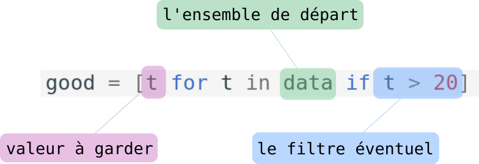

# 2.1 Listes

{: .center}


Les listes font partie de ce qu'on appelle les *données composites* (nous verrons plus tard les *tuples* et les *dictionnaires*). Elles permettent de regrouper de manière structurée un **ensemble de valeurs** (et non plus une valeur unique).
On les appelle *listes* en Python, ou bien *tableaux* de manière plus générale.

## 1. Déclaration d'une liste
!!! note "Exemple fondateur n°1 :heart:"
    Une variable de type liste sera délimitée par des **crochets**, et ses éléments séparés par des **virgules** :
    ```python
    >>> maliste = ["riri", "fifi", "loulou"]
    ```

On peut observer le type de la variable ainsi créée :
```python
>>> type(maliste)
<class 'list'>
```

**Remarques :**

- Même si cela n'a ici un grand intérêt, les éléments d'une liste peuvent donc être de types différents : ici, tous les éléments de ma liste sont des chaînes de caractères (`str`), mais la liste `["riri", 5, "fifi", "loulou"]` est aussi une liste valide.

- Une liste **vide** se déclarera avec ```[]```.
```python
>>> copies_corrigees = []
``` 
Nous verrons plus tard qu'il est fréquent dans les exercices de partir d'une liste vide et d'ajouter progressivement des éléments.


## 2. Accès aux éléments d'une liste

!!! note "Exemple fondateur n°2 :heart:"
    On accède à un élément d'une liste en mettant entre crochets l'indice de l'élément (qui commence à **zéro**).
    ```python
    >>> famille = ["Bart", "Lisa", "Maggie"] # (1)
    >>> famille[0]
    'Bart'
    >>> famille[1]
    'Lisa'
    >>> famille[2]
    'Maggie'
    >>> famille[3]
    Traceback (most recent call last):
      File "<pyshell>", line 1, in <module>
    IndexError: list index out of range

    ```

    1. Nous prendrons souvent l'exemple de la famille Simpsons.


**Remarques :**

- Un indice qui dépasse la valeur  `longueur de la liste -1` provoquera donc une erreur `list index out of range`. C'est une erreur **très fréquente** lorsqu'on manipule des listes.
{: .center width=50%}


- Il est par contre possible d'utiliser des indices **négatifs**. On utilise par exemple très souvent l'indice -1 pour accéder au dernier élément de la liste, sans avoir à connaître la longueur de celle-ci :

```python
>>> famille[-1]
'Maggie'
```

## 3. Longueur d'une liste

!!! note "Exemple fondateur n°3 :heart:"
    La longueur d'une liste sera donnée par la fonction `len()`, qui renvoie donc un nombre entier positif ou nul.
    ```python
    >>> len(famille)
    3
    ```

**Remarques :**

- La liste vide a pour longueur 0 :
```python
>>> len([])
0
```
- Le dernier élément d'une liste ```maliste``` (non vide) sera donc toujours l'élément d'indice ```len(maliste)-1```.
```python
>>> famille[len(famille) - 1]
'Maggie'
```
- Comme indiqué précédemment, ce dernier élément est aussi accessible par l'indice -1.


## 4. Parcours des éléments d'une liste :star: :star: :star:

Il existe deux méthodes pour parcourir séquentiellement tous les éléments d'une liste. Ces deux méthodes sont à maîtriser impérativement.

### 4.1 Parcours «par éléments»

C'est la méthode la plus naturelle, celle déjà vue lors de la présentation de la boucle ```for```. Nous allons simplement *itérer* sur les éléments de la liste.

!!! note "Exemple fondateur n°4 :heart:"
    Le code :
    ```python linenums='1'
    famille = ["Bart", "Lisa", "Maggie"]

    for membre in famille:
        print(membre)
    ```
    renverra :
    ```python
    Bart
    Lisa
    Maggie
    ```

**Remarque :**

- Penser à donner un nom signifiant à la variable qui parcourt la liste. Il aurait par exemple été très maladroit d'écrire 
```python
for k in famille:
    print(k)
```
En effet le nom de variable ```k``` est habituellement utilisé pour les nombres (les indices, les compteurs...).

{{ initexo(0)}}
!!! example "{{ exercice() }}"
    === "Énoncé"
        Après un référendum, la liste ```urne``` contient uniquement des ```'oui'``` ou des ```'non'```.
        Déterminer le vainqueur de ce référendum.


        ```python
        urne = ['oui', 'non', 'non', 'oui', 'oui', 'oui', 'non', 'oui', 'oui', 'oui', 'non', 'oui', 'non', 'non', 'oui', 'non', 'non', 'oui', 'oui', 'oui', 'oui', 'non', 'non', 'oui', 'non', 'oui', 'non', 'non', 'non', 'oui', 'oui', 'oui', 'oui', 'non', 'oui', 'non', 'non', 'oui', 'non', 'non', 'oui', 'non', 'non', 'non', 'non', 'non', 'non', 'non', 'oui', 'non', 'non', 'oui', 'oui', 'non', 'oui', 'oui', 'oui', 'oui', 'oui', 'oui', 'non', 'non', 'oui', 'oui', 'oui', 'oui', 'non', 'non', 'non', 'oui', 'oui', 'oui', 'non', 'non', 'non', 'non', 'oui', 'non', 'non', 'non', 'non', 'non', 'non', 'non', 'non', 'oui', 'non', 'oui', 'non', 'non', 'oui', 'oui', 'non', 'non', 'non', 'oui', 'oui', 'non', 'oui', 'oui', 'non', 'non', 'oui', 'oui', 'oui', 'non', 'oui', 'non', 'oui', 'oui', 'oui', 'oui', 'oui', 'non', 'non', 'non', 'non', 'oui', 'oui', 'oui', 'non', 'oui', 'non', 'oui', 'oui', 'oui', 'oui', 'oui', 'non', 'non', 'oui', 'non', 'non', 'non', 'non', 'non', 'non', 'oui', 'non', 'non', 'oui', 'non', 'non', 'oui', 'non', 'non', 'oui', 'oui', 'oui', 'oui', 'oui', 'oui', 'non', 'oui']
        ``` 
    === "Correction"
        {{ correction(True,
        "
        ```python linenums='1'
        urne = ['oui', 'non', 'non', 'oui', 'oui', 'oui', 'non', 'oui', 'oui', 'oui', 'non', 'oui', 'non', 'non', 'oui', 'non', 'non', 'oui', 'oui', 'oui', 'oui', 'non', 'non', 'oui', 'non', 'oui', 'non', 'non', 'non', 'oui', 'oui', 'oui', 'oui', 'non', 'oui', 'non', 'non', 'oui', 'non', 'non', 'oui', 'non', 'non', 'non', 'non', 'non', 'non', 'non', 'oui', 'non', 'non', 'oui', 'oui', 'non', 'oui', 'oui', 'oui', 'oui', 'oui', 'oui', 'non', 'non', 'oui', 'oui', 'oui', 'oui', 'non', 'non', 'non', 'oui', 'oui', 'oui', 'non', 'non', 'non', 'non', 'oui', 'non', 'non', 'non', 'non', 'non', 'non', 'non', 'non', 'oui', 'non', 'oui', 'non', 'non', 'oui', 'oui', 'non', 'non', 'non', 'oui', 'oui', 'non', 'oui', 'oui', 'non', 'non', 'oui', 'oui', 'oui', 'non', 'oui', 'non', 'oui', 'oui', 'oui', 'oui', 'oui', 'non', 'non', 'non', 'non', 'oui', 'oui', 'oui', 'non', 'oui', 'non', 'oui', 'oui', 'oui', 'oui', 'oui', 'non', 'non', 'oui', 'non', 'non', 'non', 'non', 'non', 'non', 'oui', 'non', 'non', 'oui', 'non', 'non', 'oui', 'non', 'non', 'oui', 'oui', 'oui', 'oui', 'oui', 'oui', 'non', 'oui']

        nb_oui = 0
        for vote in urne:
            if vote == 'oui':
                nb_oui += 1
        print('pourcentage de oui', 100*nb_oui/len(urne), '%')
        ```
        "
        ) }}

### 4.2 Parcours «par indice»

Chaque élément étant accessible par son indice (de ```0``` à   ```len(liste) - 1``` ), il suffit de faire parcourir à une variable ```i``` l'ensemble des entiers de ```0``` à   ```len(liste) - 1```, par l'instruction ```range(len(liste))``` :


!!! note "Exemple fondateur n°5 :heart:"
    Le code :
    ```python linenums='1'
    famille = ["Bart", "Lisa", "Maggie"]

    for i in range(len(famille)):
        print(famille[i])
    ```
    renverra :
    ```python
    Bart
    Lisa
    Maggie
    ```

:warning: **Bonne habitude à prendre** : nommer sa variable d'indice ```i```, ```j```, ```k``` ou ```indice``` mais pas autre chose !  


### 4.3 Avantages et inconvénients de chaque méthode

#### 4.3.1 Parcours par élément 

```python
    for membre in famille:
        print(membre)
```

**Les avantages** :+1:

- la simplicité : un code plus facile à écrire, avec un nom de variable explicite.
- la sécurité  : pas de risque d'```index out of range``` !

**Les inconvénients** :-1:

- méthode rudimentaire : lorsqu'on est «positionné» sur un élément, il n'est pas possible d'accéder au précédent ou au suivant. (et c'est parfois utile).
- on ne peut pas modifier l'élément sur lequel on est positionné :

```python
>>> lst = [1, 2, 3]
>>> for nb in lst:
        nb = nb * 2 # (1)
    
>>> lst 
[1, 2, 3] # (2)
```

1. On veut multiplier par 2 chaque élément de la liste
2. La liste ```lst``` n'a pas changé...


#### 4.3.2 Parcours par indice 

```python
    for i in range(len(famille)):
        print(famille[i])
```

**Les avantages**  :+1:

- le contrôle : en parcourant par indice, on peut s'arrêter où on veut, on peut accéder au suivant/précédent...
- pour les tableaux à deux dimensions, on retrouve la désignation classique d'un élément par numéro de ligne / numéro de colonne.

**Les inconvénients** :-1:

- la complexité : il faut connaître le nombre d'éléments de la liste (ou le récupérer par la fonction ```len()``` )
- le risque d'erreur : encore et toujours le ```index out of range```...


{{initexo(0)}}
!!! example "{{ exercice() }}"
    === "Énoncé"
        On donne la liste :
        ```python
        lst = [3, 1, 4, 1, 5, 9]
        ```
        En utilisant un parcours **par indice** :
        
        1. Afficher les éléments de cette liste.
        2. Afficher les éléments de cette liste **dans l'ordre inverse** (en commençant par 9)

    === "Correction :heart:"
        {{ correction(True,
        "
        ```python linenums='1'
        lst = [3, 1, 4, 1, 5, 9]

        for i in range(len(lst)-1, -1, -1):
            print(lst[i])


        ```
        "
        ) }}

!!! example "{{ exercice() }}"
    === "Énoncé"
        Trouvez le nombre qui est **exactement à la même place** dans la liste `list1` et dans la liste `list2`, sachant que :

        - les deux listes ont la même taille
        - vous n'avez droit qu'à une seule boucle ```for```. 

        ```python
        list1 = [8468, 4560, 3941, 3328, 7, 9910, 9208, 8400, 6502, 1076, 5921, 6720, 948, 9561, 7391, 7745, 9007, 9707, 4370, 9636, 5265, 2638, 8919, 7814, 5142, 1060, 6971, 4065, 4629, 4490, 2480, 9180, 5623, 6600, 1764, 9846, 7605, 8271, 4681, 2818, 832, 5280, 3170, 8965, 4332, 3198, 9454, 2025, 2373, 4067]
        list2 = [9093, 2559, 9664, 8075, 4525, 5847, 67, 8932, 5049, 5241, 5886, 1393, 9413, 8872, 2560, 4636, 9004, 7586, 1461, 350, 2627, 2187, 7778, 8933, 351, 7097, 356, 4110, 1393, 4864, 1088, 3904, 5623, 8040, 7273, 1114, 4394, 4108, 7123, 8001, 5715, 7215, 7460, 5829, 9513, 1256, 4052, 1585, 1608, 3941]
        ```
        
    === "Correction"
        {{ correction(True,
        "
        ```python linenums='1'
        list1 = [8468, 4560, 3941, 3328, 7, 9910, 9208, 8400, 6502, 1076, 5921, 6720, 948, 9561, 7391, 7745, 9007, 9707, 4370, 9636, 5265, 2638, 8919, 7814, 5142, 1060, 6971, 4065, 4629, 4490, 2480, 9180, 5623, 6600, 1764, 9846, 7605, 8271, 4681, 2818, 832, 5280, 3170, 8965, 4332, 3198, 9454, 2025, 2373, 4067]
        list2 = [9093, 2559, 9664, 8075, 4525, 5847, 67, 8932, 5049, 5241, 5886, 1393, 9413, 8872, 2560, 4636, 9004, 7586, 1461, 350, 2627, 2187, 7778, 8933, 351, 7097, 356, 4110, 1393, 4864, 1088, 3904, 5623, 8040, 7273, 1114, 4394, 4108, 7123, 8001, 5715, 7215, 7460, 5829, 9513, 1256, 4052, 1585, 1608, 3941]

        for i in range(len(list1)):
            if list1[i] == list2[i]:
                print(list1[i])
        ```
        "
        ) }}

!!! example "{{ exercice() }}"
    === "Énoncé"
        Dans la liste 

        ```python
        lst = [2428970, 1518306, 4971405, 1690994, 7918102, 4030834, 8830131, 7514856, 7903128, 6307569, 6624056, 5260490, 6447835, 4598783, 9108626, 5045240, 4128269, 4460134, 2497873, 5076659, 8104003, 7604887, 7451976, 4136924, 5691945, 8726293, 7855592, 3562473, 8849129, 6488474, 5303587, 2606124, 5484044, 4559758, 7592232, 2211406, 9974334, 7988936, 7582946, 7668748, 1799997, 3837917, 3196209, 7064342, 2543765, 1182013, 7253381, 1153735, 1037391, 4375946, 4445821, 5965587, 6001887, 4162629, 5235783, 8716582, 4901175, 5445422, 1120005, 8332321, 7075046, 2194175, 5557300, 2887907, 5103214, 2520744, 5104399, 2065665, 3035703, 7890213, 1758301, 3407982, 1355453, 4896338, 7979392, 9671602, 9690721, 7423779, 7423780, 3080825, 6785783, 3836837, 7310931, 1857470, 3492507, 2823231, 1492310, 1911148, 9620515, 5564910, 7009452, 7464745, 9608747, 7267383, 6939140, 6556578, 3592267, 8135497, 4881660, 5346884, 6859150]

        ```
        se cachent deux nombres consécutifs. Pouvez-vous les trouver ?

    === "Correction"
        ```python linenums='1'
        lst = [2428970, 1518306, 4971405, 1690994, 7918102, 4030834, 8830131, 7514856, 7903128, 6307569, 6624056, 5260490, 6447835, 4598783, 9108626, 5045240, 4128269, 4460134, 2497873, 5076659, 8104003, 7604887, 7451976, 4136924, 5691945, 8726293, 7855592, 3562473, 8849129, 6488474, 5303587, 2606124, 5484044, 4559758, 7592232, 2211406, 9974334, 7988936, 7582946, 7668748, 1799997, 3837917, 3196209, 7064342, 2543765, 1182013, 7253381, 1153735, 1037391, 4375946, 4445821, 5965587, 6001887, 4162629, 5235783, 8716582, 4901175, 5445422, 1120005, 8332321, 7075046, 2194175, 5557300, 2887907, 5103214, 2520744, 5104399, 2065665, 3035703, 7890213, 1758301, 3407982, 1355453, 4896338, 7979392, 9671602, 9690721, 7423779, 7423780, 3080825, 6785783, 3836837, 7310931, 1857470, 3492507, 2823231, 1492310, 1911148, 9620515, 5564910, 7009452, 7464745, 9608747, 7267383, 6939140, 6556578, 3592267, 8135497, 4881660, 5346884, 6859150]

        for i in range(len(lst)-1): # Il faut s'arrêter à l'avant-dernier élément de la liste
            if lst[i] + 1 == lst[i+1]:
                print(lst[i], lst[i+1])

        ```


## 5. Modification d'une liste

En Python, les objets de type ```List``` sont modifiables (on emploie le mot *mutables*). Et c'est souvent une bonne chose, car des listes peuvent évoluer après leur création.
Lorsqu'on souhaitera **figer** le contenu d'une liste (pour des raisons de sécurité du code essentiellement), on utilisera alors le type ```Tuple```, qui sera vu ultérieurement.

### 5.1 Modification d'un élément existant
Il suffit d'écraser la valeur actuelle avec une nouvelle valeur

!!! note "Exemple fondateur n°6 :heart:"
    ```python 
    >>> famille = ["Bart", "Lisa", "Maggie"]
    >>> famille[0] = "Bartholomew" # oui, c'est son vrai nom
    >>> famille
    ['Bartholomew', 'Lisa', 'Maggie']   
    
    ```


### 5.2 Ajout d'un élement à la fin d'une liste : la méthode **append()** :star: 


!!! note "Exemple fondateur n°7 :heart:"
    ```python 
    >>> famille = ["Bart", "Lisa", "Maggie"]
    >>> famille.append("Milhouse")
    >>> famille
    ['Bart', 'Lisa', 'Maggie', 'Milhouse']  
    ```

**Remarques :**

- La méthode `append()` rajoute donc un élément **à la fin** de la liste.
- Dans **beaucoup** d'exercices, on part d'une liste vide ```[]``` que l'on remplit peu à peu avec des ```append()```.
- *(HP)* Il est possible d'insérer un élément à la position ```i``` avec la méthode ```insert``` :
```python
>>> famille = ["Bart", "Lisa", "Maggie"]
>>> famille.insert(1, "Nelson") # on insère à la position 1
>>> famille
['Bart', 'Nelson', 'Lisa', 'Maggie']
```


!!! example "{{ exercice() }}"
    === "Énoncé"
        Construire une liste contenant tous les nombres inférieurs à 100 qui sont divisibles par 7.
    === "Correction"
        {{ correction(True,
        "
        ```python linenums='1'
        lst = []
        for n in range(1, 101):
            if n % 7 == 0:
                lst.append(n)
        ```
        "
        ) }}


!!! example "{{ exercice() }}"
    === "Énoncé"
        On considère la liste ```temp = [4, -5, 8, 10, -1, -2, 7, 13]```.  
        Construire la liste ```temp_pos``` qui ne contient que les éléments positifs de  ```temp```. 
    === "Correction"
        {{ correction(True,
        "
        ```python linenums='1'
        temp = [4, -5, 8, 10, -1, -2, 7, 13]

        temp_pos = []
        for t in temp:
            if t > 0:
                temp_pos.append(t)
        ```
        "
        ) }}

### 5.3 Suppression d'un élément d'une liste ...
#### 5.3.1 ... par la méthode remove() 

!!! note "Exemple fondateur n°7 :heart:"
    ```python 
    >>> famille = ['Bart', 'Nelson', 'Lisa', 'Maggie']
    >>> famille.remove("Nelson")
    >>> famille
    ['Bart', 'Lisa', 'Maggie']
    ```

**Remarques :**

- Attention, ```remove``` n'enlève que la *première occurrence* de l'élément désigné. S'il y en a d'autres après, elles resteront dans la liste :
```python
>>> lst = [3, 1, 4, 5, 1, 9, 4]
>>> lst.remove(4)
>>> lst
[3, 1, 5, 1, 9, 4]
```
- Si l'élément à supprimer n'est pas trouvé, un message d'erreur est renvoyé :
```python
>>> lst = [3, 1, 4, 5, 1, 9]
>>> lst.remove(2)
Traceback (most recent call last):
  File "<pyshell>", line 1, in <module>
ValueError: list.remove(x): x not in list
```


### 5.3.2 ... par l'instruction ```del```
L'instruction `del`  (qui n'est pas une fonction) permet de supprimer un élément en donnant son indice.


```python
>>> maliste = [8, 4, 2, 5, 7]
>>> del maliste[3]
>>> maliste
[8, 4, 2, 7]
```


!!! example "{{ exercice() }}"
    === "Énoncé"
        [Exercice 01.1](https://glassus.github.io/terminale_nsi/T6_6_Epreuve_pratique/cours/#exercice-011) de la BNS.
    === "Correction"
        


## 6. Construction d'une liste d'éléments identiques
Il est souvent pratique d'initialiser une liste de taille donnée, souvent en la remplissant de 0.

Imaginons par exemple que nous souhaitions une liste de taille 26 remplie de 0.
Il est possible de faire comme ceci :

```python linenums='1'
lst = []
for _ in range(26):
    lst.append(0)
```

mais on préfèrera ce code :

!!! note "Exemple fondateur n°8 :heart:"
    ```python 
    >>> lst = [0]*26
    ```
qui produira la liste ```[0, 0, 0, 0, 0, 0, 0, 0, 0, 0, 0, 0, 0, 0, 0, 0, 0, 0, 0, 0, 0, 0, 0, 0, 0, 0]``` 


!!! example "{{ exercice() }}"
    === "Énoncé"
        Que fait le code ci-dessous ?
        ```python
        texte = "cet texte est prodigieusement ennuyeux"

        def rang(lettre):
            return(ord(lettre) - 97)

        compt = [0]*26
        for lettre in texte :
            if lettre != " " :
                compt[rang(lettre)] += 1
        ```

    === "Correction"
        {{ correction(True,
        "
        À l'issue de ce code la variable ```compt``` contient ```[0, 0, 1, 1, 9, 0, 1, 0, 2, 0, 0, 0, 1, 3, 1, 1, 0, 1, 2, 5, 3, 0, 0, 2, 1, 0]```, qui correspond au nombre d'occurences de chaque lettre : 0 fois la lettre 'a', 0 fois la lettre 'b', 1 fois la lettre 'c', etc.

        Ce genre de comptage se fera de manière beaucoup plus efficace et élégante avec la structure de dictionnaire.
        "
        ) }}


## 7. Construction d'une liste *en compréhension* :star: :star: :star:

C'est une grande caractéristique du langage Python (même si ce n'est pas une exclustivité) : la méthode de liste en compréhension propose une manière élégante, rapide et naturelle pour créer des listes.

### 7.1 «en compréhension», pourquoi ?
Cette expression vient des mathématiques. On dit qu'on définit un sous-ensemble *par compréhension* lorsqu'on part d'un ensemble plus grand dont on ne garde que les éléments vérifiant une certaine propriété.

On pourrait par exemple définir les élèves de Première NSI de cette manière :

*«élèves du lycée inscrits en classe de Première ayant choisi la spécialité NSI»*

On part d'un ensemble large (les élèves du lycée) qu'on va ensuite réduire par des caractérisations spécifiques : être un élève de Première, puis avoir choisi la spécialité NSI.

### 7.2 Premier exemple


!!! note "Exemple fondateur n°9 :heart:"
    Imaginons que nous possédons une liste ```data``` de températures, dont nous ne voulons garder que celles strictement supérieures à 20.

    ```python
    >>> data = [17, 22, 15, 28, 16, 13, 21, 23]
    >>> good = [t for t in data if t > 20]
    >>> good
    [22, 28, 21, 23]
    ```

**Explications :**

{: .center width=50%}

#### 7.2.1 le filtre éventuel

C'est lui qui donne tout son sens à cette méthode : il permet de ne garder que certaines valeurs. 
Il est pourtant éventuel : que se passe-t-il s'il n'y a pas de filtre ?

```python
>>> data = [17, 22, 15, 28, 16, 13, 21, 23]
>>> good = [t for t in data]
>>> good
[17, 22, 15, 28, 16, 13, 21, 23]
```
On se retrouve évidemment avec une nouvelle liste qui contient exactement les éléments de la liste de départ, ce qui n'est pas très intéressant.
Pourtant les listes en compréhension *sans filtre* sont très fréquentes, nous le verrons plus loin.

!!! example "{{ exercice() }}"
    === "Énoncé"
        On considère la variable ```phrase = 'Bonjour les vacances sont finies'``` et la variable ```voyelles = 'aeiouy'```.

        Construire en compréhension la liste ```liste_voyelles``` qui contient toutes les voyelles présentes dans la variable ```phrase```.   

    === "Correction"
        {{ correction(True,
        "
        ```python
        >>> phrase = 'Bonjour les vacances sont finies'
        >>> voyelles = 'aeiouy'
        >>> liste_voyelles = [lettre for lettre in phrase if lettre in voyelles]
        >>> liste_voyelles
        ['o', 'o', 'u', 'e', 'a', 'a', 'e', 'o', 'i', 'i', 'e']
        ```
        "
        ) }}


#### 7.2.2 l'ensemble de départ

C'est à partir de lui que va se construire notre liste. Pour l'instant, cet ensemble de départ a toujours été de type ```list```.

Cet ensemble peut être aussi donné à partir de l'instruction ```range()```. 
Souvenons-nous de l'exercice 4 : «Construire une liste contenant tous les nombres inférieurs à 100 qui sont divisibles par 7.».

Une solution possible était :

```python linenums='1'
lst = []
for n in range(1, 101):
    if n % 7 == 0:
        lst.append(n)
```

Ce code peut maintenant s'écrire très simplement en une seule instruction :

!!! note "Exemple fondateur n°10 :heart:"
    ```python
    >>> lst = [n for n in range(1,101) if n % 7 == 0]
    >>> lst
    [7, 14, 21, 28, 35, 42, 49, 56, 63, 70, 77, 84, 91, 98]
    ```


#### 7.2.3 la valeur à garder

Pour l'instant, nous avons procédé à des filtres sur des ensembles existants, sans modifier la valeur filtrée (la valeur _à garder_).  
Les listes en compréhension deviennent encore plus intéressantes lorsqu'on comprend qu'il est possible de modifier la valeur filtrée :

!!! note "Exemple fondateur n°11 :heart:"
    ```python
    >>> lst_carres = [t**2 for t in range(1,10)]
    >>> lst_carres
    [1, 4, 9, 16, 25, 36, 49, 64, 81]
    ```

!!! example "{{ exercice() }}"
    === "Énoncé"
        1. On considère la fonction mathématique $f : x \mapsto 2x+3$. Coder la fonction ```f```.
        2. Créer (en compréhension) une liste contenant l'image des entiers de 1 à 10 par la fonction $f$.
    === "Correction"
        {{ correction(True,
        "
        ```python linenums='1'
        def f(x):
            return 2*x + 3

        lst = [f(x) for x in range(1, 11)]
        ```
        "
        ) }}

!!! example "{{ exercice() }}"
    === "Énoncé"
        On considère la liste ```lst = [51, 52, 66, 91, 92, 82, 65, 53, 86, 42, 79, 95]```. Seuls les nombres entre 60 et 90 ont une signification : ce sont des codes ASCII (récupérables par la fonction ```chr``` ).  
        Créer (en compréhension) une liste ```sol``` qui contient les lettres correspondants aux nombres ayant une signification.
    === "Correction"
        {{ correction(True,
        "
        ```python
        >>> lst = [51, 52, 66, 91, 92, 82, 65, 53, 86, 42, 79, 95]
        >>> decode = [chr(k) for k in lst if k > 60  and k < 90]
        >>> decode
        ['B', 'R', 'A', 'V', 'O']
        ```
        "
        ) }}

## 8. Un phénomène inquiétant : la copie de liste


!!! danger "une copie un peu trop parfaite"
    Observez le code ci-dessous, réalisé sans trucage.
    ```python
    >>> listA = [1, 2, 3]
    >>> listB = listA
    >>> listA.append(7)
    >>> listB
    [1, 2, 3, 7]
    >>> listB.append(8)
    >>> listA
    [1, 2, 3, 7, 8]
    ```


Tout se passe comme si les listes  ```listA``` et```listB``` étaient devenus des clones «synchronisés» depuis l'affectation ```listB = listA```.

!!! aide "Analyse grâce à PythonTutor"
    <iframe width="800" height="300" frameborder="0" src="https://pythontutor.com/iframe-embed.html#code=listA%20%3D%20%5B1,%202,%203%5D%0AlistB%20%3D%20listA%0AlistA.append%287%29%0AlistB.append%288%29%0A&codeDivHeight=400&codeDivWidth=350&cumulative=false&curInstr=0&heapPrimitives=nevernest&origin=opt-frontend.js&py=3&rawInputLstJSON=%5B%5D&textReferences=false"> </iframe>


L'illustration de PythonTutor nous donne la clé de l'énigme :
{: .center width=30%}


```listA``` et```listB``` sont en fait **un seul et même objet**.

Comment en avoir le cœur net ? En observant leur adresse-mémoire, disponible grâce à la fonction ```id``` :

```python
>>> id(listA)
140485841327616
>>> id(listB)
140485841327616
```

Ceci met en évidence que la métaphore du tiroir dont on se sert pour expliquer ce qu'est une variable est malheureusement inexacte. Une variable est une référence vers une adresse-mémoire. Si deux variables font référence à la même adresse-mémoire, alors elles sont totalement identiques:  toute modification de l'une entraîne une modification de l'autre.  

Pour en savoir plus sur les variables, vous pouvez revenir sur la [partie optionnelle](../../../T1_Demarrer_en_Python/1.1_Variables/cours/#b2-une-realite-bien-plus-complexe) du cours sur les variables.


### Mais alors, comment copier le contenu d'une liste vers une autre sans créer un clone ?

!!! note "Exemple fondateur n°12 :heart:"
    ```python
    >>> listA = [3, 4, 5]
    >>> listB = list(listA)
    ```
    D'autres possibilités existent, comme ```listA.copy()```, ou encore ```listA[::]```...  


!!! example "{{ exercice() }}"
    === "Énoncé"
        Effectuer les tests nécessaires pour prouver que l'exemple précédent a bien produit deux objets différents.
    === "Correction"
        {{ correction(True,
        "
        ```python
        >>> listA = [3, 4, 5]
        >>> listB = list(listA)
        >>> listA.append(9)
        >>> listB
        [3, 4, 5]
        >>> id(listA)
        140157471522368
        >>> id(listB)
        140157465797184
        ```
        "
        ) }}


## 9. Tableaux à plusieurs dimensions : listes de listes

Nous avons vu qu'une liste pouvait contenir des éléments de tous types : des entiers, des chaines des caractères... et pourquoi pas une liste qui contient des listes ?

### 9.1 Syntaxe

!!! note "Exemple fondateur n°12 :heart:"
    La liste ```tab``` ci-dessous est composée de 3 listes qui elles-mêmes contiennent trois nombres :
    ```python
    tab =  [[3, 5, 2],
            [7, 1, 4], 
            [8, 6, 9]]
    ```

    - ```tab[0][0] = 3```
    - ```tab[0][1] = 5```
    - ```tab[2][1] = 6``` 
    - ```tab[1] = [7, 1, 4]``` 

    {: .center width=30%}
    
La liste `a` est composée de 3 éléments qui sont eux-même des listes de 3 éléments.


!!! example "{{ exercice() }}"
    === "Énoncé"
        On considère le jeu du Morpion (ou *Tic-Tac-Toe*) dont la surface de jeu vierge est representée par le tableau :  
        ```tab = [[' ', ' ', ' '], [' ', ' ', ' '], [' ', ' ', ' ']]``` 

        Les premiers coups joués sont ceux-ci :

        - ```tab[1][1] = 'X'``` 
        - ```tab[2][1] = 'O'``` 
        - ```tab[2][2] = 'X'``` 
        - ```tab[0][0] = 'O'``` 

        Quel coup doit maintenant jouer le joueur  `'X'` pour s'assurer la victoire ?

    === "Correction"
        {{ correction(True,
        "
        ```python
        tab[0][2] = 'X'
        # ou
        tab[1][2] = 'X'
        ```
        "
        ) }}


### 9.2 Parcours d'une liste de listes

!!! note "Exemple fondateur n°13 :heart:"

    - Parcours par éléments :
    ```python linenums='1'
    for ligne in tab:
        for elt in ligne:
            print(elt)
    ```

    - Parcours par indice :
    ```python linenums='1'
    for i in range(3):
        for j in range(3):
            print(tab[i][j])
    ```

!!! example "{{ exercice() }}"
    === "Énoncé"
        On considère la liste ```m``` ('m' comme *matrice*) suivante :  

        ```m = [[1, 9, 4], [4, 1, 8], [7, 10, 1]]```  

        Quelle est la somme de tous les nombres de la matrice ```m``` ?

    === "Correction"
        {{ correction(True,
        "
        ```python linenums='1'
        m = [[1, 9, 4], [4, 1, 8], [7, 10, 1]]

        somme = 0
        for ligne in m:
            for elt in ligne:
                somme += elt

        print(somme)
        ```
        "
        ) }}


