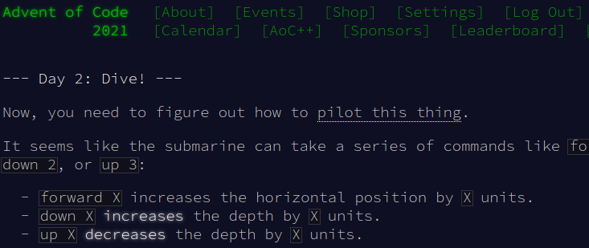

{{initexo(0)}}

!!! example "{{ exercice() }}"
    === "Énoncé"
        {: .center width=60%}
        Résolvez le **Pydéfi** proposé à [cette adresse](https://pydefis.callicode.fr/defis/Herculito04Sanglier/txt)

        Vous pouvez vous créer un compte pour valider vos résultats, ce site (géré par l'Académie de Poitiers) est **remarquable**. 
    
    === "Correction"
        (avec les valeurs de test)
        ```python linenums='1'
        lst = [0, 50, 40, 100, 70, 90, 0]

        total = 0
        for i in range(len(lst)-1):
            if lst[i] > lst[i+1]:
                nb_pierres = (lst[i]-lst[i+1])//10 + 1
                total += nb_pierres

        print(total)
        ```

!!! example "{{ exercice() }}"

    === "Énoncé"
        On donne la liste ```jours``` suivante :
        ```python
        jours = ["lundi", "mardi", "mercredi", "jeudi", "vendredi", "samedi", "dimanche"]
        ```  

        On rappelle que la fonction ```len``` permet d'obtenir le nombre de caractères d'une chaine de caractères :

        ```python
        >>> len("test")
        4
        ```

        1. Créer **en compréhension** une liste ```lst1``` contenant uniquement les jours comportant 5 lettres.
        2. Créer **en compréhension** une liste ```lst2``` contenant uniquement les jours comportant la lettre ```a``` dans leur nom.
        3. Créer une fonction ```compte_e``` qui prend en paramètre une chaine de caractères et qui renvoie le nombre de ```e``` que contient cette chaine de caractères.
        4.  Créer **en compréhension** une liste ```lst4``` contenant uniquement les jours comportant deux fois la lettre ```e``` dans leur nom.

    === "Correction"    
        1.
        ```python
        lst1 = [day for day in jours if len(day) == 5]
        ```
        2.  
        ```python
        lst2 = [day for day in jours if 'a' in day]
        ```

        3. 
        ```python linenums='1'
        def compte_e(mot):
            compteur = 0
            for lettre in mot:
            if lettre == 'e':
                compteur += 1
            return compteur
        ```

        4. 
        ```python
        lst4 = [day for day in jours if compte_e(day) == 2]
        ```


!!! example "{{ exercice() }}"
    === "Énoncé"
        On donne le tableau ```m``` suivant :
        ```python linenums='1'
        m = [[17, 71, 75, 89, 45, 10, 54, 26, 59, 47, 57, 64, 44], \
            [67, 25, 47, 49, 28, 40, 10, 17, 77, 35, 87, 15, 68], \
            [66, 89, 28, 43, 16, 14, 12, 21, 68, 22, 14, 18, 59], \
            [60, 35, 30, 23, 22, 37, 49, 89, 82, 80, 85, 28, 17], \
            [61, 42, 39, 46, 29, 38, 85, 72, 44, 60, 47, 35, 52], \
            [44, 28, 24, 40, 71, 71, 46, 25, 78, 54, 66, 84, 52], \
            [29, 71, 7, 38, 71, 60, 71, 60, 16, 82, 35, 39, 23], \
            [18, 61, 38, 7, 8, 32, 67, 43, 23, 28, 29, 16, 30], \
            [45, 30, 74, 9, 84, 78, 11, 80, 42, 64, 9, 39, 26], \
            [78, 57, 54, 66, 57, 63, 10, 42, 61, 19, 26, 25, 53], \
            [38, 87, 10, 64, 75, 26, 14, 68, 19, 33, 75, 50, 18], \
            [52, 81, 24, 67, 37, 78, 17, 19, 61, 82, 57, 24, 54]]

        ```
        Afficher successivement chaque ligne du tableau en respectant les règles suivantes :

        - si le nombre est divisible par 7, afficher ```*```, sinon afficher une espace ``` ```
        - sur une même ligne, on affichera tous les symboles côte à côte, en rajoutant le paramètre ```end = ''``` à la fonction ```print```. (*exemple :* ```print('*', end = '')``` )
        - on ira à la ligne à la fin de chaque ligne, par l'instruction ```print()```     
    === "Correction"
        {{ correction(True,
        "
        ```python linenums='1'
        m = [[17, 71, 75, 89, 45, 10, 54, 26, 59, 47, 57, 64, 44], \\
            [67, 25, 47, 49, 28, 40, 10, 17, 77, 35, 87, 15, 68], \\
            [66, 89, 28, 43, 16, 14, 12, 21, 68, 22, 14, 18, 59], \\
            [60, 35, 30, 23, 22, 37, 49, 89, 82, 80, 85, 28, 17], \\
            [61, 42, 39, 46, 29, 38, 85, 72, 44, 60, 47, 35, 52], \\
            [44, 28, 24, 40, 71, 71, 46, 25, 78, 54, 66, 84, 52], \\
            [29, 71, 7, 38, 71, 60, 71, 60, 16, 82, 35, 39, 23], \\
            [18, 61, 38, 7, 8, 32, 67, 43, 23, 28, 29, 16, 30], \\
            [45, 30, 74, 9, 84, 78, 11, 80, 42, 64, 9, 39, 26], \\
            [78, 57, 54, 66, 57, 63, 10, 42, 61, 19, 26, 25, 53], \\
            [38, 87, 10, 64, 75, 26, 14, 68, 19, 33, 75, 50, 18], \\
            [52, 81, 24, 67, 37, 78, 17, 19, 61, 82, 57, 24, 54]]

        for ligne in m:
            for elt in ligne:
                if elt % 7 == 0:
                    print('*', end = '')
                else:
                    print(' ', end = '')
            print('')
        ```
        "
        ) }}


!!! example "{{ exercice() }}"
    === "Énoncé"
        Résolvez le pydéfi **Insaisissable matrice** proposé à [cette adresse](https://pydefis.callicode.fr/defis/AlgoMat/txt)        
    === "Correction"
        {{ correction(True,
        "
        ```python linenums='1'
        M=[[17, 3, 4, 14, 5, 17], [8, 16, 3, 17, 14, 12], [13, 5, 15, 4, 16, 3], [14, 7, 3, 16, 3, 2], [6, 1, 16, 10, 5, 13], [11, 1, 9, 11, 18, 8]]

        def f(k):
            return (9*k + 3) % 19

        for _ in range(39):
            for i in range(6):
                for j in range(6):
                    M[i][j] = f(M[i][j])

        somme = 0
        for i in range(6):
            for j in range(6):
                somme += M[i][j]

        print(somme)

        ```
        "
        ) }}


!!! example "{{ exercice() }}"
    === "Énoncé"
        **D'après Advent Of Code 2021, day02**

        {: .center}
        

        Un sous-marin peut se déplacer horizontalement (toujours vers la droite) grâce à l'instruction ```forward``` suivie d'un nombre.

        Il peut aussi monter ou descendre, grâce aux instructions ```up``` ou ```down```, elles aussi suivies d'un nombre.

        Un grand nombre d'instructions successives sont données. Le but de l'exercice est de trouver le produit final de l'abscisse du sous-marin et de sa profondeur.

        Exemple :

        ```
        forward 5
        down 5
        forward 8
        up 3
        down 8
        forward 2
        ``` 

        Après ces déplacements, le sous-marin se trouve à l'abscisse 15 et à la profondeur 10. La réponse à l'énigme serait donc 150.

        - [énoncé orginal](https://adventofcode.com/2021/day/2){. target="_blank"}

       
        - Téléchargez le fichier [input1.txt](https://raw.githubusercontent.com/glassus/aoc2021/main/day02/input1.txt). Votre fichier ```.py``` de travail doit se situer dans le même répertoire que le fichier ```input1.txt```.

        **Q1.** Nous allons récupérer toutes les données (on dit *parser les données*) dans une liste, grâce à l'instruction :
        ```python
        data_str = open('input1.txt').read().splitlines()
        ```
        Combien cette liste comporte-t-elle d'éléments ?

        **Q2.** Afficher successivement tous les éléments de cette liste.

        **Q3.**  Pour séparer une chaine de caractères en une **liste** de plusieurs chaines de caractères, nous pouvons utiliser la fonction ```split``` :

        ```python
        >>> "hello world".split(" ")
        ['hello', 'world']
        ``` 
        Grâce à cette fonction ```split```,  affichez successivement uniquement les instructions ```forward```, ```up``` ou ```down```. 

        **Q4**. Appelons ```x``` et ```y``` l'abscisse et l'ordonnée (initialisées à 0) du sous-marin. 
        Que valent ```x``` et ```y``` à la fin des instructions ?

        On rappelle que la fonction ```int``` permet de convertir une chaine de caractères en nombre :

        ```python
        >>> int('4')
        4
        ```   


    === "Correction"
        {{ correction(True,
        "
        ```python
        data_str = open('input1.txt').read().splitlines()

        for ligne in data_str:
            lst = ligne.split(' ')
            if lst[0] == 'forward':
                x += int(lst[1])
            elif lst[0] == 'down':
                y += int(lst[1])
            else:
                y -= int(lst[1])

        print(x*y)
        ```
        "
        ) }}