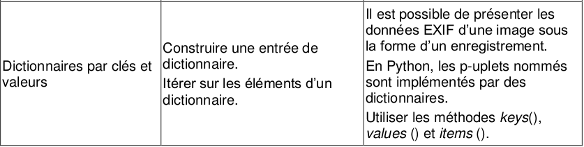

# 2.3 Dictionnaires

{: .center}

# 1. Les dictionnaires : premiers exemples

Une liste est un ensemble d'éléments accessibles par leur **indice**. Cet indice est en quelque sorte la «place» de l'élément dans la liste.
On peut dire que cet indice est **la clé** qui permet d'accéder à l'élément.

Dans un dictionnaire, chaque élément est accessible par une clé qui n'est plus forcément un nombre : une chaine de caractère, un nombre, ou autre chose, peut être une clé.

Imaginons que je fasse l'inventaire de mon dressing :

| habits | quantité |
| :--: | :--: |
| pantalons | 3 |
| pulls | 4 |
| tee-shirts | 8 |


!!! note "Exemple fondateur n°1 :heart:"
    - La création du dictionnaire représentant mon dressing se fera par :
        ```python
        >>> dressing = {"pantalons":3, "pulls":4, "tee-shirts":8}
        ```
    - L'accès à une valeur se fera par :
        ```python
        >>> dressing["pulls"]
          4
        ```
    - On dit que ```"pulls"``` est **la clé** et que 4 est **la valeur** associée à la clé.

    - Un dictionnaire est un ensemble clés / valeurs.  


**Attention** :warning:  : une clé peut aussi être un nombre :
 ```python
 >>> myst = {9:4, 1:2, 6:3, 7:4} 
 ```
Que vaudrait ```myst[2]``` ? 

??? tip "réponse"
    ```myst``` associe à chaque nombre le nombre de lettre de son écriture en français. Donc ```myst[2] = 4``` car ```deux``` s'écrit avec 4 lettres.


## 2. Définitions et propriétés d'un dictionnaire

### 2.1 Définitions
!!! note "Définition" 
    Un dictionnaire est une donnée composite qui **n'est pas ordonnée** (à la différence des listes !)
    Il fonctionne par un système de `clé:valeur`.  
    Les clés, comme les valeurs, peuvent être de types différents.
    Un dictionnaire est délimité par des accolades. 

_Rappel :_

- crochets `[ ]` -> listes
- parenthèses `( )` -> tuples
- **accolades `{ }` -> dictionnaires**


### 2.2 Méthodes ```.keys()``` et   ```.values()```

!!! note "Exemples fondateurs n°2 :heart:"
    - Pour lister les clés d'un dictionnaire :
        ```python
        >>> dressing.keys()
        dict_keys(['pantalons', 'pulls', 'tee-shirts'])
        ```
    - Pour lister les valeurs d'un dictionnaire :
        ```python
        >>> dressing.values()
        dict_values([3, 4, 8])
        ```


### 2.3 Parcours d'un dictionnaire :star:
!!! note "Exemple fondateur n°3 :heart:"
    ```python
    >>> for habit in dressing:
            print(dressing[habit])
    3
    4
    8
    ```


### 2.4 Création d'un dictionnaire vide

!!! note "Exemple fondateur n°4 :heart:"
    Deux méthodes existent pour créer un dictionnaire : ```dict()``` et ```{}```  
        ```python
        >>> mondico = dict()
        >>> mondico
        {}
        >>> mondico['john'] = 12
        >>> mondico
        {'john': 12}
        ```
        ```python
        >>> contacts = {}
        >>> contacts['bob'] = '06 12 17 21 32'
        ```


### 2.5 Ajout / Modification d'un élément dans un dictionnaire

!!! note "Exemple fondateur n°5 :heart:"
    Pas besoin d'une méthode `append()`, il suffit de rajouter une paire `clé : valeur`
    ```python
    >>> dressing["chaussettes"] = 12
    ```

    On peut aussi modifier un dictionnaire existant.
    ```python
    dressing["chaussettes"] = 11
    ```


### 2.6 Suppression d'une valeur
!!! note "Exemple fondateur n°6 :heart:"
    On utilise l'instruction `del` (déjà rencontrée pour les listes)
    ```python
    del dressing["chaussettes"]
    ```

{{ initexo(0)}}
!!! example "{{ exercice() }}"
    === "Énoncé"
        Reprenons notre dictionnaire ```dressing``` :
        ```python
        dressing = {"pantalons":3, "pulls":4, "tee-shirts":8}
        ```
        Créer une fonction `achat(habit)` qui augmente de 1 le nombre d'habits (pantalon, pull ou tee-shirt) de mon dressing.
    === "Correction"
        {{ correction(True,
        "
        
        "
        ) }}


**Remarque :**
Petit problème si on essaie d'acheter un vêtement pour la 1ère fois

```python
>>> achat("chemises")
    ---------------------------------------------------------------------------

    KeyError                                  Traceback (most recent call last)

    <ipython-input-28-fd9d1ac5f62d> in <module>
    ----> 1 achat("chemises")
    

    <ipython-input-27-feb173444189> in achat(habit)
          1 def achat(habit):
    ----> 2     dressing[habit] = dressing[habit] + 1
    

    KeyError: 'chemises'
```

Nous allons résoudre ce problème grâce à :


### 2.7 Test d'appartenance à un dictionnaire

!!! note "Exemple fondateur n°7 :heart:"
    Le mot `in` permet de tester l'appartenance d'une clé à un dictionnaire. Un booléen est renvoyé.
    ```python
    >>> "cravates" in dressing
      False
    ```


!!! example "{{ exercice() }}"
    === "Énoncé"
        Améliorer la fonction `achat(habit)` en y incluant un test pour prendre en compte les nouveaux habits.
    === "Correction"
        {{ correction(True,
        "
        
        "
        ) }}


!!! example "{{ exercice() }}"
    === "Énoncé"
        On considère la liste suivante :
        ```lst = ['5717', '1133', '5545', '4031', '6398', '2734', '3070', '1346', '7849', '7288', '7587', '6217', '8240', '5733', '6466', '7972', '7341', '6616', '5061', '2441', '2571', '4496', '4831', '5395', '8584', '3033', '6266', '2452', '6909', '3021', '5404', '3799', '5053', '8096', '2488', '8519', '6896', '7300', '5914', '7464', '5068', '1386', '9898', '8313', '1072', '1441', '7333', '5691', '6987', '5255']``` 

        Quel est le **chiffre** qui revient le plus fréquemment dans cette liste ?
        
    === "Correction"
        {{ correction(True,
        "
        
        "
        ) }}