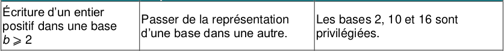
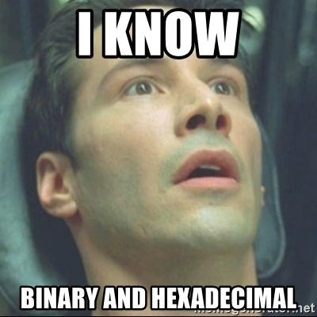

# 2.4 Représentation d'un entier positif dans différentes bases

{: .center}


{: .center}


Hormis la base 10, deux bases sont utilisées en informatique :

- la base 2  (le système **binaire**)
- la base 16 (le système **hexadécimal**)

Dans toute la suite, la base dans laquelle le nombre est écrit sera précisée en indice.  
Exemple : $13_{10}=1101_2=\rm{D}_{16}$

## 1. Le système binaire 

En base 2, on ne dispose que des chiffres `0` et `1`. Le système binaire est un système de numération de position (comme le système décimal, hexadécimal... mais pas comme le système romain). À chaque rang correspond une puissance de 2.

### 1.1 Du binaire vers le décimal :


|...|128|64|32|16|8|4|2|1|
|:---:|:---:|:---:|:---:|:---:|:---:|:---:|:---:|:---:|
|...|$2^7$|$2^6$|$2^5$|$2^4$|$2^3$|$2^2$|$2^1$|$2^0$|
|...|1|1|0|1|0|0|1|0|


 $11010010_2=1 \times 2^7+ 1 \times 2^6+0 \times 2^5+1 \times 2^4+0 \times 2^3+0 \times 2^2+1 \times 2^1+0 \times 2^0=128+64+32+2=210_{10}$
 
 Le nombre binaire 11010010 correspond donc au nombre décimal 210.
 

!!! note "Code Python"
    En Python, on peut utiliser la fonction `int("nombre", base)`.
    ```python
    >>> int("11010010", 2)
    210
    ```


### 1.2 Du décimal vers le binaire : 
Principe : dans chaque nombre décimal, il existe une plus grande puissance de 2 qui est inférieure au nombre. 

Par exemple, dans 243, il y a 128. Donc   
$243=128 + (115)$   
$243=128+64+(51)$     
$243=128+64+32+(19)$    
$243=128+64+32+16+(3)$   
$243=128+64+32+16+2+1$  
$243=1 \times 2^7+ 1 \times 2^6+1 \times 2^5+1 \times 2^4+0 \times 2^3+0 \times 2^2+1 \times 2^1+1 \times 2^0$

Donc $243_{10}=11110011_2$

**Méthode des divisions successives**

{: .center}

!!! note "Code Python"
    En Python, on peut utiliser la fonction `bin(nombre)`. Elle renvoie une chaîne de caractère où le nombre binaire est précédé de `'0b'`.
    ```python
    >>> bin(243)
    '0b11110011'
    ```

!!! example "Exercice 1"
    === "Énoncé"
        Quelle est la valeur maximale d'un octet (un octet = 8 chiffres binaires) ?
    === "Correction"
        $11111111_2=255$. On retrouve ce nombre comme étant la valeur maximale d'une composante de couleur dans le codage RGB, ce qui signifie que chaque composante est codée sur un octet.

!!! example "Exercice 2"
    === "Énoncé"
        Créer une fonction `binaire(n)` qui renvoie l'écriture binaire de `n`, en utilisant les divisions successives.
    === "Correction"
        ```python linenums='1'
        def restes_successifs(n):
            ''' renvoie la liste des restes successifs lors des divisions de n par 2'''
            restes = []
            while n != 0 :
                restes.append(n % 2)
                n = n // 2
            return restes

        def binaire(n) :
            ''' recompose le mot binaire en mettant dans l'ordre les restes successifs'''
            liste = restes_successifs(n)
            liste.reverse() #permet d'inverser l'ordre des élément d'une liste
            mot = ""
            for k in liste :
                mot += str(k)
            return mot
        ```


## 2. Le système hexadécimal 
L'inconvénient essentiel du système binaire est la longueur de l'écriture des nombres qu'il génère. Pour cette raison, le **système hexadécimal**, ou système de **base 16** est très souvent employé.

- Pour écrire en base 2, il faut 2 chiffres différents : le 0 et le 1.  

- Pour écrire en base 10, il faut 10 chiffres différents: 0,1,2,3,4,5,6,7,8,9.  

- Pour écrire en base 16, il faut donc 16 chiffres différents : **0,1,2,3,4,5,6,7,8,9,A,B,C,D,E,F**.    


On a donc la correspondance :

- A représente 10  
- B représente 11  
- C représente 12  
- D représente 13  
- E représente 14  
- F représente 15 


### 2.1 De l'hexadécimal vers le décimal :

|256|16|1|
|:---:|:---:|:---:|
|$16^2$|$16^1$|$16^0$|
| 1| D|2|


 $\rm{1D2}_{16}=1 \times 16^2+ 13 \times 16^1+2 \times 16^0=256+208+2=466_{10}$
 
 Le nombre hexadécimal `1D2` correspond donc au nombre décimal 466.
 
 
 En pratique, l'hexadécimal est surtout utilisé pour sa capacité à représenter la valeur de n'importe quel octet sur 2 chiffres ("chiffres" étant à prendre au sens large = chiffres ou lettres !).
 

!!! example "Exercice 3"
    === "Énoncé"
        1. Donner la valeur des octets `FF`, `3A`, `B2`.
        2. Expliquer pourquoi la couleur RGB (138,255,51) a pour code html `#8AFF33`.
        3. Quelle est la couleur `html` du blanc ?
    === "Correction"
        1. FF = 255 ; 3A = 58 ; B2 = 178
        2. 138 a pour code hexa 8A, 255 a pour code hexa 255, 51 a pour code hexa 33.
        3. \#FFFFFF

###  2.2 En python :
 
#### 2.2.1 Pour passer du décimal à l'hexadécimal :  
On peut utiliser la fonction `hex(nombre)`. Elle renvoie une chaîne de caractère où le nombre hexadécimal est précédé de `'0x'`.


```python
>>> hex(125)
'0x7d'
```

#### 2.2.2 Pour passer de l'hexadécimal au décimal :  
On peut utiliser la fonction `int("nombre",base)`.

```python
>>> int("FF", 16)
 255
```


## 3. Du binaire inattendu

[Le message secret de Perseverance](../../../T6_Mini-projets/Exercice_Perseverance/ )
