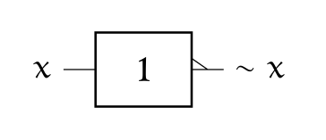
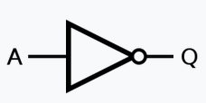
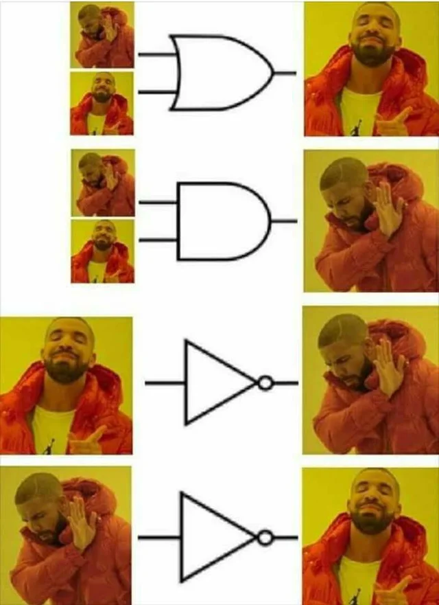
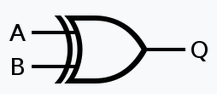
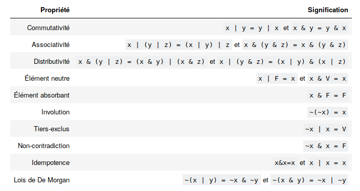

# Les opérateurs booléens

{: .center}


## 1. Repères historiques

{: .center}


En 1847, le  britannique  *George BOOLE*  inventa un formalisme permettant d'écrire des raisonnements logiques : l'algèbre de Boole. La notion même d'informatique n'existait pas à l'époque, même si les calculs étaient déjà automatisés (penser à la Pascaline de 1642).

Bien plus tard, en  1938, les travaux de l'américain *Claude  SHANNON*  prouva  que des  circuits  électriques
peuvent  résoudre tous  les  problèmes  que l'algèbre  de  Boole peut  elle-même résoudre.  Pendant la deuxième guerre mondiale, les travaux  d'*Alan  TURING*  puis de *John VON NEUMANN* poseront définitivement les bases de l'informatique moderne.

## 2. Algèbre de Boole

L'algèbre de Boole définit des opérations dans un ensemble
qui ne contient que **deux éléments** notés **0 et 1**, ou bien **FAUX et VRAI** ,ou encore **False** et **True** (en Python)

Les opérations fondamentales sont :

- la *conjonction* ("ET") 
- la *disjonction* ("OU") 
- la *négation* ("NON").

Dans  toute la  suite,  `x` et  `y` désigneront  des  *Booléens* (éléments  d'une
algèbre de Boole) quelconques, `F` désignera FAUX et `V` désignera VRAI.

____________

### 2.1 Conjonction (AND)
- symbole usuel : & (appelé _esperluette_ en français et _ampersand_ en anglais)
- français : ET
- anglais (et Python) : `and`
- notation logique : $\wedge$
- notation mathématique :  `.`

C'est l'opération définie par:

* `x & F = F`
* `x & V = x`

Puisque l'algèbre de  Boole ne contient que deux éléments,  on peut étudier tous
les cas possibles et les regrouper dans un tableau appelé **table de vérité**:

!!! abstract "Table de vérité de AND :heart:"
    |`x`| `y` | `x & y`|
    |:--:|:-:|:--:|
    |F|F|F|
    |F|V|F|
    |V|F|F|
    |V|V|V|


On représente souvent les opérateurs booléens à l'aide de portes logiques:

{: .center}


Notation usuelle en électronique : $Q=A \wedge B$

{: .center}


#### Exemples en Python


```python
>>> n = 20
>>> (n % 10 == 0) and (n % 7 == 0)
False
>>> (n % 4 == 0) and (n % 5 == 0)
True
```

#### L'évaluation paresseuse
Pouvez-vous prévoir le résultat du code ci-dessous ?


```python
>>> (n % 4 == 0) and (n % 0 == 0)
    ---------------------------------------------------------------------------

    ZeroDivisionError                         Traceback (most recent call last)

    <ipython-input-3-d8a98dcba9be> in <module>
    ----> 1 (n % 4 == 0) and (n % 0 == 0)
    

    ZeroDivisionError: integer division or modulo by zero
```

Évidemment, la division par 0 provoque une erreur.  
Mais observez maintenant ce code :


```python
>>> (n % 7 == 0) and (n % 0 == 0)
False
```

On appelle **évaluation paresseuse** le fait que l'interpréteur Python s'arrête dès que sa décision est prise : comme le premier booléen vaut False et que la conjonction `and` est appelée, il n'est pas nécessaire d'évaluer le deuxième booléen. 


### 2.2 Disjonction (OR)

- symbole usuel : | appelé _pipe_ en anglais
- français : OU
- anglais (et Python) : `or`
- notation logique : $\vee$
- notation mathématique :  $+$

C'est l'opération définie par:


C'est l'opération définie par:

* `x | V = V`
* `x | F = x`

On en déduit la table suivante:


!!! abstract "Table de vérité de OR :heart:"
    |`x`| `y` | `x or y`|
    |:--:|:----:|:--:|
    |F|F| F|
    |F|V|V|
    |V|F|V|
    |V|V|V|


{: .center}

Notation usuelle en électronique : $Q=A \vee B$

{: .center}


#### Exemples en Python


```python
>>> n = 20
>>> (n % 10 == 0) or (n % 7 == 0)
True
>>> (n % 4 == 0) or (n % 5 == 0)
True
>>> (n % 7 == 0) or (n % 3 == 0)
False
```


#### L'évaluation paresseuse (retour)
Pouvez-vous prévoir le résultat du code ci-dessous ?


```python
>>> (n % 5 == 0) or (n % 0 == 0)
```

### 2.3  Négation (NOT)

- symbole usuel : ~
- français : NON
- anglais (et Python) : `not`
- notation logique :  $\neg$
- notation mathématique :  $\overline{x}$

C'est l'opération définie par:

* `~V = F`
* `~F = V`

On en déduit la table suivante:

!!! abstract "Table de vérité de NOT :heart:"
    |`x`| `~x` |
    |:--:|:----:|
    |F|V|
    |V|F|

{: .center}

Notation usuelle en électronique : $Q=\neg A$

{: .center}

#### Exemples en Python


```python
>>> n = 20
>>> not(n % 10 == 0)
False
```


### 2.4 Exercice 1

Comprendre ce mème :
{: .center width=50%}


### 2.5 Exercice 2
1. Ouvrir le [simulateur de circuits](http://dept-info.labri.fr/ENSEIGNEMENT/archi/circuits/blank-teacher.html){. target="_blank"} et créer pour chaque opération AND, OR, NOT un circuit électrique illustrant ses propriétés.

Exemple (inintéressant) de circuit :
{: .center}

2. Utiliser successivement les circuits XOR, NAND et NOR et établir pour chacun leur table de vérité.

## 3. Fonctions composées

### 3.1 Disjonction exclusive XOR
(en français OU EXCLUSIF)

`x ^ y = (x & ~y) | (~x & y)`

!!! abstract "Table de vérité de XOR :heart:"
    |`x`| `y` | `x ^ y`|
    |:--:|:----:|:--:|
    |F|F| F|
    |F|V|V|
    |V|F|V|
    |V|V|F|


{: .center}

{: .center}

Le XOR joue un rôle fondamental en cryptographie car il possède une propriété très intéressante : 
$(x\wedge y)\wedge y=x$

Si $x$ est un message et $y$ une clé de chiffrage, alors $x\wedge y$ est le message chiffré. 
Mais en refaisant un XOR du message chiffré avec la clé $y$, on retrouve donc le message $x$ initial.

### 3.2 Fonction Non Et (NAND)

`x ↑ y = ~(x & y)`

!!! abstract "Table de vérité de NAND :heart:"
    |`x`| `y` | `x ↑ y`|
    |:--:|:----:|:--:|
    |F|F| V|
    |F|V|V|
    |V|F|V|
    |V|V|F|


{: .center}

### 3.3 Fonction Non Ou (NOR)


`x ↓ y = ~(x & y)`

!!! abstract "Table de vérité de NOR :heart:"
    |`x`| `y` | `x ↓ y`|
    |:--:|:----:|:--:|
    |F|F| V|
    |F|V|F|
    |V|F|F|
    |V|V|F|


{: .center}

Il est temps de se reposer un peu et d'admirer cette vidéo :
{: .center}

### Remarque :
Les fonctions NAND ET NOR sont dites **universelles** : chacune d'entre elles peut générer l'intégralité des autres portes logiques. Il est donc possible de coder toutes les opérations uniquement avec des NAND (ou uniquement avec des NOR).
Voir [Wikipedia](https://fr.wikipedia.org/wiki/Fonction_NON-ET)

### 3.4 Exercice 4
Calculer les opérations suivantes.


```python
   1011011
&  1010101
----------
   

   1011011
|  1010101
----------
   

   1011011
^  1010101
----------
   
```

??? tip "solution"
    ```python
     1011011
    &1010101
    ----------
     1010001
    
     1011011
    |1010101
    ----------
     1011111
    
     1011011
    ^1010101
    ----------
     0001110
    ```

### 3.5 Calculs en Python
les opérateurs `&`, `|` et `^` sont utilisables directement en Python


```python
# calcul A
>>> 12 & 7
4
```


```python
# calcul B
>>> 12 | 7
15
```

```python
# calcul C
>>> 12 ^ 5
9
```


Pour comprendre ces résultats, il faut travailler en binaire. Voici les mêmes calculs :


```python
# calcul A
>>> bin(0b1100 & 0b111)
    '0b100'
```

```python
# calcul B
>>> bin(0b1100 | 0b111)
   '0b1111'
```

```python
# calcul C
>>> bin(0b1100 ^ 0b111)
    '0b1011'

```


### Exercice 5 : préparation du pydéfi
Objectif : chiffrer (= crypter) le mot "BONJOUR" avec la clé (de même taille) "MAURIAC".  

Protocole de chiffrage : XOR entre le code ASCII des lettres de même position.

<!-- 

```python 
msg = "BONJOUR"
cle = "MAURIAC"

def crypte_lettre(lm, lc):
    a = ord(lm)
    b = ord(lc)
    c = a^b
    lettre = chr(c)

    return lettre

def crypte_mot(mot1, mot2):
    mot3 = ""
    for i in range(len(mot1)):
        car = crypte_lettre(mot1[i],mot2[i])
        mot3 = mot3 + car
    return mot3

crypte_mot(msg, cle)
```


    '\x0f\x0e\x1b\x18\x06\x14\x11'

-->

### Exercice


!!! capytale "À faire sur Capytale : [Lien](https://capytale2.ac-paris.fr/web/c/56a9-503615)"
    Résolvez le pydéfi [la clé endommagée](https://callicode.fr/pydefis/MasqueJetable/txt){. target="_blank"}
            


<!-- 

*solution :*

[lien](https://gist.github.com/glassus/7aef2c4cbed5097e1857ecc851b7b740)

-->

### Complément : propriétés des opérateurs logiques

Les propriétés suivantes sont facilement démontrables à l'aide de tables de vérités: *(source : G.Connan)*

{: .center}

Toutes ces lois sont aisément compréhensibles si on les transpose en mathématiques : 

- & équivaut à $\times$
- $|$ équivaut à $+$
- $\neg$ équivaut à $-$
