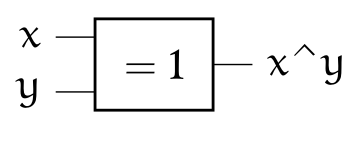

# Les opérateurs booléens

{: .center}


## 1. Repères historiques

{: .center}


En 1847, le  britannique  *George BOOLE*  inventa un formalisme permettant d'écrire des raisonnements logiques : l'algèbre de Boole. La notion même d'informatique n'existait pas à l'époque, même si les calculs étaient déjà automatisés (penser à la Pascaline de 1642).

Bien plus tard, en  1938, les travaux de l'américain *Claude  SHANNON*  prouva  que des  circuits  électriques
peuvent  résoudre tous  les  problèmes  que l'algèbre  de  Boole peut  elle-même résoudre.  Pendant la deuxième guerre mondiale, les travaux  d'*Alan  TURING*  puis de *John VON NEUMANN* poseront définitivement les bases de l'informatique moderne.

## 2. Algèbre de Boole

L'algèbre de Boole définit des opérations dans un ensemble
qui ne contient que **deux éléments** notés **0 et 1**, ou bien **FAUX et VRAI** ,ou encore **False** et **True** (en Python)

Les opérations fondamentales sont :

- la *conjonction* ("ET") 
- la *disjonction* ("OU") 
- la *négation* ("NON").

Dans  toute la  suite,  `x` et  `y` désigneront  des  *Booléens* (éléments  d'une
algèbre de Boole) quelconques, `F` désignera FAUX et `V` désignera VRAI.

____________

### 2.1 Conjonction (AND)
- symbole usuel : & (appelé _esperluette_ en français et _ampersand_ en anglais)
- français : ET
- anglais (et Python) : `and`
- notation logique : $\wedge$
- notation mathématique :  `.`

C'est l'opération définie par:

* `x & F = F`
* `x & V = x`

Puisque l'algèbre de  Boole ne contient que deux éléments,  on peut étudier tous
les cas possibles et les regrouper dans un tableau appelé **table de vérité**:

!!! abstract "Table de vérité de AND :heart:"
    |`x`| `y` | `x & y`|
    |:--:|:-:|:--:|
    |F|F|F|
    |F|V|F|
    |V|F|F|
    |V|V|V|


On représente souvent les opérateurs booléens à l'aide de portes logiques:

{: .center}


Notation usuelle en électronique : $Q=A \wedge B$

{: .center}


#### Exemples en Python


```python
>>> n = 20
>>> (n % 10 == 0) and (n % 7 == 0)
False
>>> (n % 4 == 0) and (n % 5 == 0)
True
```

#### L'évaluation paresseuse
Pouvez-vous prévoir le résultat du code ci-dessous ?


```python
>>> (n % 4 == 0) and (n % 0 == 0)
    ---------------------------------------------------------------------------

    ZeroDivisionError                         Traceback (most recent call last)

    <ipython-input-3-d8a98dcba9be> in <module>
    ----> 1 (n % 4 == 0) and (n % 0 == 0)
    

    ZeroDivisionError: integer division or modulo by zero
```

Évidemment, la division par 0 provoque une erreur.  
Mais observez maintenant ce code :


```python
>>> (n % 7 == 0) and (n % 0 == 0)
False
```

On appelle **évaluation paresseuse** le fait que l'interpréteur Python s'arrête dès que sa décision est prise : comme le premier booléen vaut False et que la conjonction `and` est appelée, il n'est pas nécessaire d'évaluer le deuxième booléen. 


### 2.2 Disjonction (OR)

- symbole usuel : | appelé _pipe_ en anglais
- français : OU
- anglais (et Python) : `or`
- notation logique : $\vee$
- notation mathématique :  $+$

C'est l'opération définie par:


C'est l'opération définie par:

* `x | V = V`
* `x | F = x`

On en déduit la table suivante:


!!! abstract "Table de vérité de OR :heart:"
    |`x`| `y` | `x or y`|
    |:--:|:----:|:--:|
    |F|F| F|
    |F|V|V|
    |V|F|V|
    |V|V|V|


{: .center}

Notation usuelle en électronique : $Q=A \vee B$

{: .center}


#### Exemples en Python


```python
>>> n = 20
>>> (n % 10 == 0) or (n % 7 == 0)
True
>>> (n % 4 == 0) or (n % 5 == 0)
True
>>> (n % 7 == 0) or (n % 3 == 0)
False
```


#### L'évaluation paresseuse (retour)
Pouvez-vous prévoir le résultat du code ci-dessous ?


```python
>>> (n % 5 == 0) or (n % 0 == 0)
```

### 2.3  Négation (NOT)

- symbole usuel : ~
- français : NON
- anglais (et Python) : `not`
- notation logique :  $\neg$
- notation mathématique :  $\overline{x}$

C'est l'opération définie par:

* `~V = F`
* `~F = V`

On en déduit la table suivante:

!!! abstract "Table de vérité de NOT :heart:"
    |`x`| `~x` |
    |:--:|:----:|
    |F|V|
    |V|F|

{: .center}

Notation usuelle en électronique : $Q=\neg A$

{: .center}

#### Exemples en Python


```python
>>> n = 20
>>> not(n % 10 == 0)
False
```


### 2.4 Exercice 1

Comprendre ce mème :
{: .center width=50%}


### 2.5 Exercice 2

!!! abstract "Exercice 2"
    Ouvrir le [simulateur de circuits](http://dept-info.labri.fr/ENSEIGNEMENT/archi/circuits/blank-teacher.html){. target="_blank"} et créer pour chaque opération AND, OR, NOT un circuit électrique illustrant ses propriétés.

    Exemple (inintéressant) de circuit :
    {: .center}


## 3. Fonctions composées

### 3.1 Disjonction exclusive XOR
(en français OU EXCLUSIF)

`x ^ y = (x & ~y) | (~x & y)`

!!! abstract "Table de vérité de XOR :heart:"
    |`x`| `y` | `x ^ y`|
    |:--:|:----:|:--:|
    |F|F| F|
    |F|V|V|
    |V|F|V|
    |V|V|F|


{: .center}

{: .center}

Le XOR joue un rôle fondamental en cryptographie car il possède une propriété très intéressante : 
$(x\wedge y)\wedge y=x$

Si $x$ est un message et $y$ une clé de chiffrage, alors $x\wedge y$ est le message chiffré. 
Mais en refaisant un XOR du message chiffré avec la clé $y$, on retrouve donc le message $x$ initial.

### 3.2 Fonction Non Et (NAND)

`x ↑ y = ~(x & y)`

!!! abstract "Table de vérité de NAND :heart:"
    |`x`| `y` | `x ↑ y`|
    |:--:|:----:|:--:|
    |F|F| V|
    |F|V|V|
    |V|F|V|
    |V|V|F|


{: .center}

### 3.3 Fonction Non Ou (NOR)


`x ↓ y = ~(x & y)`

!!! abstract "Table de vérité de NOR :heart:"
    |`x`| `y` | `x ↓ y`|
    |:--:|:----:|:--:|
    |F|F| V|
    |F|V|F|
    |V|F|F|
    |V|V|F|


{: .center}

Il est temps de se reposer un peu et d'admirer cette vidéo :

<center>
<gif-player src="https://glassus.github.io/premiere_nsi/T2_Representation_des_donnees/2.5_Booleens/data/watergates.gif" speed="1" play></gif-player>
</center>


### Remarque :
Les fonctions NAND ET NOR sont dites **universelles** : chacune d'entre elles peut générer l'intégralité des autres portes logiques. Il est donc possible de coder toutes les opérations uniquement avec des NAND (ou uniquement avec des NOR).
Voir [Wikipedia](https://fr.wikipedia.org/wiki/Fonction_NON-ET)

### 3.4 Exercice 4


!!! abstract "Exercice 4"
    === "Énoncé"
        Effectuer les opérations suivantes.
        ```python
           1011011
        &  1010101
        ----------


           1011011
        |  1010101
        ----------


           1011011
        ^  1010101
        ----------

        ```
        
    === "Correction"
        ```python
         1011011
        &1010101
        ----------
         1010001

         1011011
        |1010101
        ----------
         1011111

         1011011
        ^1010101
        ----------
         0001110
        ```
         

### 3.5 Calculs en Python
les opérateurs `&`, `|` et `^` sont utilisables directement en Python


```python
# calcul A
>>> 12 & 7
4
```


```python
# calcul B
>>> 12 | 7
15
```

```python
# calcul C
>>> 12 ^ 5
9
```


Pour comprendre ces résultats, il faut travailler en binaire. Voici les mêmes calculs :


```python
# calcul A
>>> bin(0b1100 & 0b111)
    '0b100'
```

```python
# calcul B
>>> bin(0b1100 | 0b111)
   '0b1111'
```

```python
# calcul C
>>> bin(0b1100 ^ 0b111)
    '0b1011'

```


### Exercice 5 : Cryptographie

!!! abstract "Exercice 5"
    On souhaite chiffrer (*chiffrer* est le mot utilisé en cryptographie pour *crypter*) le mot `"BONJOUR"` avec la clé `"MAURIAC"`. Le chiffrement retenu est un chiffrement par XOR, ce qui signifie qu'on va effectuer un XOR entre les deux nombres associés aux lettres.

    Exemple :

    - la lettre ```'B'``` va être chiffrée grâce au ```'M'```.
    - Le code ASCII de ```'B'``` est 66. (on le sait car ```ord('B')``` renvoie 66 )
    - Le code ASCII de ```'M'``` est 77. (on le sait car ```ord('M')``` renvoie 77 )
    - 66 ^ 77 vaut 15.
    - Le «caractère» associé à 15 est ```'\x0f'``` (on le sait car ```chr(15)``` renvoie ```'\x0f'``` )


    Le premier caractère du mot chiffré sera donc ```'\x0f'```


    **Q1.** Écrire une fonction ```chiffre``` qui prendra en paramètre un mot ```mot_clair``` et un mot de passe ```cle``` **de même taille** que ```mot_clair``` et qui renvoie la chaîne de caractères obtenue en XORant ``mot_clair``` avec ```cle```.

    ??? tip "correction"
        ```python linenums='1'
        def chiffre(mot_clair, cle):
            mot_chiffre = ""
            for i in range(len(mot_clair)):
                code = ord(mot_clair[i]) ^ ord(cle[i])
                mot_chiffre += chr(code)
            return mot_chiffre
        ```
    **Q2.** Chiffrer le mot `"BONJOUR"` avec la clé `"MAURIAC"`.

    ??? tip "correction"
        ```python
        >>> chiffre("BONJOUR", "MAURIAC")
        '\x0f\x0e\x1b\x18\x06\x14\x11'
        ```

    **Q3.** Reprendre la chaîne de caractères précédemment obtenue et la rechiffrer à nouveau avec la clé `"MAURIAC"`. Que constate-t-on ? Etait-ce prévisible ?
    ??? tip "correction"
        ```python
        >>> chiffre('\x0f\x0e\x1b\x18\x06\x14\x11', "MAURIAC")
        'BONJOUR'
        ```
        C'était prévisible car c'est une propriété remarquable du XOR : ```(a^b)^b = a```

    **Q4.** :skull: Résoudre le Pydéfi [La clé endommagée](https://pydefis.callicode.fr/defis/MasqueJetable/txt){. target="_blank"}

    ??? tip "correction"
        ```python linenums='1'
        msg = [255, 87, 255, 93, 254, 112, 98, 239, 146, 205, 59, 198, 173, 65, 50, 174, 200, 218, 189, 130, 96, 4, 57, 173, 143, 8, 175, 19, 2, 109, 216, 2, 65, 14, 36, 206, 32, 157, 181, 22, 248, 119, 153, 204, 8, 137, 7, 203, 0, 89, 251, 16, 79, 214, 52, 15, 249, 42, 115, 67, 241, 175, 160, 65, 217, 40, 36, 68, 205, 234, 14, 21, 73, 172, 70, 81, 37, 83, 1, 113, 180, 8, 194, 90, 46, 239, 194, 122, 244, 15, 24, 14, 86, 72, 43, 246, 241, 24, 182, 91, 220, 48, 92, 147, 16, 82, 139, 169, 104, 236, 88, 106, 192, 76, 23, 72, 233, 130, 92, 67, 235, 199, 149, 108, 180, 217, 156, 175, 175, 234, 177, 145, 242, 17, 245, 94, 113, 16, 88, 170, 71, 226, 13, 122, 189, 56, 44, 48, 185, 159, 73, 160, 84, 147, 231, 21, 86, 81, 238, 196, 137, 133, 222, 174, 208, 9, 105, 83, 80, 60, 49, 191, 19, 220, 231, 196, 172, 10, 72, 237, 211, 163, 23, 119, 247, 37, 177, 3, 246, 136, 82, 222, 93, 245, 202, 24, 164, 177, 167, 174, 203, 247, 101, 201, 32, 99, 83, 189, 241, 46, 208, 125, 167, 111, 217, 84, 120, 5, 158, 50, 180, 129, 202, 116, 149, 226, 195, 6, 56, 221, 54, 1, 233, 119, 186, 113, 87, 194, 240, 244, 29, 195, 251, 186, 54, 175, 66, 8, 193, 189, 143, 151, 101, 153, 25, 100, 151, 75, 71, 176, 55, 183, 66, 28, 119, 90, 142, 60, 100, 170, 46, 231, 149, 131, 139, 249, 247, 209, 60, 206, 40, 121, 175, 78, 246, 189, 88, 33, 46, 147, 11, 30, 65, 208, 131, 163, 37, 44, 77, 220, 148, 101, 101, 167, 34, 68, 179, 117, 200, 234, 91, 170, 134, 203, 240, 164, 71, 220, 122, 77, 249, 76, 39, 145, 217, 151, 36, 96, 249, 61, 105, 52, 59, 231, 86, 166, 88, 42, 134, 182, 74, 166, 106, 36, 194, 160, 92, 69, 84, 74, 15, 217, 189, 28, 89, 41, 212, 60, 49, 30, 225, 95, 196, 36, 199, 0, 126, 127, 251, 23, 76, 182, 66, 213, 119, 28, 187, 173, 239, 27, 97, 196, 17, 95, 124, 4, 95, 222, 191, 238, 152, 142, 208, 122, 139, 135, 12, 212, 96, 4, 126, 210, 7, 71, 225, 202, 106, 79, 206, 156, 216, 22, 163, 159, 49, 248, 120, 100, 2, 88, 41, 145, 234, 38, 196, 189, 77, 247, 71, 172, 109, 215, 134, 37, 145, 236, 6, 198, 217, 89, 94, 98, 158, 165, 99, 17, 99, 246, 90, 161, 76, 159, 194, 75, 208, 234, 18, 51, 205, 227, 167, 199, 1, 128, 68, 112, 25, 10, 66, 202, 255, 243, 163, 16, 3, 72, 43, 143, 76, 241, 108, 239, 216, 30, 236, 224, 7, 1, 222, 6, 244, 70, 151, 110, 175, 49, 153, 253, 241, 160, 117, 232, 42, 68, 77, 253, 64, 142, 11, 88, 234, 251, 20, 1, 239, 39, 157, 181, 106, 47, 180, 26, 227, 121, 164, 183, 124, 180, 238, 42, 89, 75, 19, 244, 245, 116, 82, 124, 85, 12, 7, 22, 1, 25, 118, 126, 36, 209, 22, 226, 252, 6, 72, 26, 101, 127, 23, 124, 151, 185, 184, 203, 231, 56, 26, 128, 110, 216, 94, 202, 174, 211, 210, 125, 145, 220, 185, 43, 204, 215, 210, 224, 54, 111, 217, 202, 47, 31, 224, 46, 177, 165, 31, 68, 127, 206, 99, 11, 213, 192, 46, 222, 34, 115, 16, 73, 131, 221, 218, 180, 4, 249, 207, 74, 155, 84, 87, 242, 58, 133, 248, 61, 205, 9, 158, 226, 21, 216, 80, 154, 153, 79, 98, 105, 190, 56, 134, 187, 37, 10, 224, 82, 97, 126, 246, 24, 190, 173, 21, 62, 236, 10, 180, 242, 144, 244, 145, 117, 67, 62, 246, 57, 96, 192, 92, 126, 27, 67, 168, 223, 222, 247, 236, 224, 240, 243, 100, 150, 193, 79, 223, 143, 208, 133, 125, 80, 107, 106, 245, 118, 248, 79, 199, 116, 190, 54, 236, 81, 106, 244, 212, 241, 16, 179, 245, 238, 185, 89, 199, 175, 54, 218, 86, 84, 184, 177, 174, 92, 171, 176, 43, 149, 46, 202, 151, 181, 98, 86, 18, 58, 46, 163, 117, 33, 149, 87, 248, 235, 0, 181, 136, 16, 188, 110, 20, 108, 213, 104, 165, 45, 86, 19, 208, 48, 153, 186, 163, 221, 165, 39, 70, 200, 98, 235, 68, 167, 252, 42, 102, 52, 228, 210, 187, 151, 178, 242, 221, 44, 143, 79, 230, 159, 164, 253, 25, 90, 24, 182, 142, 122, 140, 115, 45, 182, 104, 132, 22, 109, 55, 205, 185, 27, 27, 77, 224, 184, 199, 121, 21, 250, 254, 78, 158, 215, 245, 187, 143, 211, 110, 228, 18, 36, 68, 168, 100, 126, 85, 238, 208, 98, 241, 34, 235, 254, 184, 39, 182, 239, 34, 242, 232, 6, 187, 18, 113, 176, 228, 2, 103, 135, 52, 28, 183, 9, 19, 142, 156, 242, 21, 253, 48, 21, 67, 138, 207, 131, 72, 191, 198, 107, 233, 202, 227, 108, 186, 124, 165, 23, 247]

        cle = [111, 22, 12, 177, 12, 199, 78, 21, 175, 181, 64, 73, 174, 101, 212, 225, 63, 106, 248, 91, 175, 48, 247, 245, 51, 250, 160, 111, 23, 4, 70, 167, 177, 49, 17, 53, 17, 73, 85, 89]

        def decrypt(dec):
            l = ""
            for i in range(len(cle)):
                c = msg[i + dec] ^ cle[i]
                l = l + chr(c)
            return l

        for i in range(0, len(msg)-len(cle)):
            print(decrypt(i))

        ```

     
### Complément mathématique: propriétés des opérateurs logiques

Les propriétés suivantes sont facilement démontrables à l'aide de tables de vérités: *(source : G.Connan)*

{: .center}

Toutes ces lois sont aisément compréhensibles si on les transpose en mathématiques : 

- & équivaut à $\times$
- $|$ équivaut à $+$
- $\neg$ équivaut à $-$
