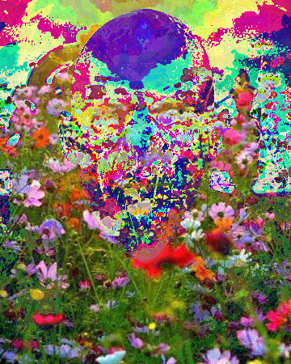

# Énigme

## 1. À la recherche du personnage mystère

Vous avez trouvé une image bien étrange :

{: .center}

Un visage semble se deviner derrière un champ de fleurs... mais quel est ce visage ?

L'image du champ de fleurs ne vous est pas inconnue, d'ailleurs en cherchant bien vous l'avez retrouvée dans vos dossiers :

{: .center}


On dirait que le personnage-mystère a voulu se fondre dans le champ de fleurs...

**XORez-vous découvrir qui est ce personnage-mystère ?**


## 2. Aide pour la manipulation d'images et l'extraction de pixels

### 2.1 Code de démarrage

```python linenums='1'
from PIL import Image

img_myst = Image.open("mystere.bmp")
img_mask = Image.open("mask.jpg")

largeur = img_myst.width
hauteur = img_myst.height

img_new = Image.new('RGB', img_myst.size)
```
### 2.2 Manipulation de pixels

Les expressions ci-dessous sont à tester pour en comprendre le fonctionnement. 

#### 2.2.1 Récupérer le code ```RGB```  un pixel

```python
>>> img_myst.getpixel((125, 80))
(54, 217, 174)
```
Le pixel de coordonnées (125, 80) a pour composantes RGB (54, 217, 174).

### 2.2.2 Modifier la couleur d'un pixel

```python
>>> img_new.putpixel((30,70), (255,0,0))
>>> 
```
Le pixel de coordonnées (30, 70) est maintenant un pixel rouge.

#### 2.2.3 Afficher une image

```python
>>> img_mask.show()
```

#### 2.2.4 Sauvegarder une image
```python
>>> img_new.save("solution.png")
```