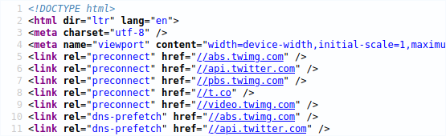
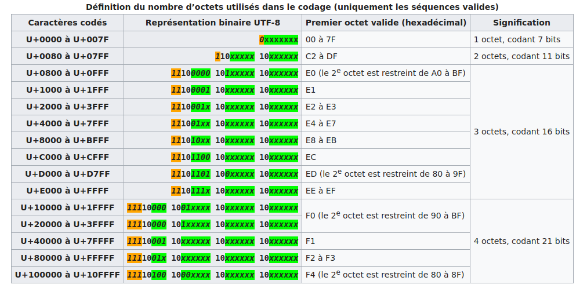

# 2.6 Codage des caractères
Tout pour comprendre et éviter les erreurs d'encodage

{: .center}


## 1. Au commencement était l'ASCII
pour *American Standard Code for Information Interchange*, créé en 1960 aux États-Unis.
{: .center}

En ASCII, 127 *«points de code»* (nombres associés aux caractères) sont disponibles. Les caractères sont donc codés sur **7 bits**.

{{initexo(0)}}

!!! example "{{ exercice() }}"
    

    Décoder l'expression suivante, écrite en ASCII :

    `1101100 1100101 1110011 100000 1001110 1010011 1001001 100000 1100011 100111 1100101 1110011 1110100 100000 1101100 1100101 1110011 100000 1101101 1100101 1101001 1101100 1101100 1100101 1110101 1110010 1110011`

    ??? aide "Aide"
        - la fonction `split(" ")` permet de décomposer une chaine de caractères en une liste, en se servant de l'espace `" "` comme caractère séparateur.
        ```python
        >>> msg = '1101100 1100101 1110011'
        >>> msg = msg.split(' ')
        >>> msg
        ['1101100', '1100101', '1110011']
        ```
        - `int("1101100", 2)` permet de récupérer facilement la valeur en base 10 du nombre binaire `1101100`.
        ```python
        >>> int("1101100", 2)
        108
        ```
        - ```chr``` permet de récupérer le caractère associé à un codes ASCII :
        ```python
        >>> chr(108)
        'l'
        ```          

    {{
    correction(True,
    """
    ??? success \"Correction\" 
        ```python
        msg = '1101100 1100101 1110011 100000 1001110 1010011 1001001 100000 1100011 100111 1100101 1110011 1110100 100000 1101100 1100101 1110011 100000 1101101 1100101 1101001 1101100 1101100 1100101 1110101 1110010 1110011'
        msg = msg.split(' ')
        s = ''
        for k in msg :
            s += chr(int(k ,2))
        print(s)
        ``` 
    """
    )
    }}


## 2. Et le reste du monde ?
Lorsque d'autres personnes que des americains ou des anglais ont voulu s'échanger des données faisant intervenir du texte, certains caractères (é, è, à, ñ, Ø, Ö, β, 漢...) étaient manquants. Les 127 caractères de l'ASCII étaient largement insuffisants. 
Il a donc été décidé de passer à... 256 caractères ! Il suffisait pour cela de coder les caractères non plus sur 7 bits mais sur 8 bits.

Ainsi naquît, après de nombreuses modifications successives (la dernière en date rajoutant par exemple le symbole €), la célèbre table **ISO 8859-15**, dite aussi **Latin-9** :
{: .center}

### Utilisation :
Les codes sont donnés en hexadécimal :

- le caractère € correspond au code hexadécimal A4, donc au nombre décimal 164.
- le caractère A correspond au code hexadécimal 41, donc au nombre décimal 65.

65... comme en ASCII ! Oui, la (seule) bonne idée aura été d'inclure les caractères ASCII avec leur même code, ce qui rendait cette nouvelle norme rétro-compatible.


**Exemple :** 

Le fichier `test.txt` contient un texte enregistré avec l'encodage Latin-9. Ce fichier est ensuite ouvert avec un éditeur hexadécimal, qui permet d'observer la valeur des octets qui composent le fichier. (Comme le fichier est un .txt, le fichier ne contient que les données et rien d'autre.)
{: .center}


Parfait, mais comment font les Grecs pour écrire leur alphabet ?
Pas de problème, il leur suffit d'utiliser... une autre table, appelée ISO-8859-7 :

{: .center}

On retrouve les caractères universels hérités de l'ASCII, puis des caractères spécifiques à la langue grecque... oui mais les Thaïlandais alors ? 

Pas de problème, ils ont la ISO-8859-11 :

{: .center}

Évidemment, quand tous ces gens veulent discuter entre eux, les problèmes d'encodage surviennent immédiatement : certains caractères sont remplacés par d'autres.

## 3. Que fait un logiciel à l'ouverture d'un fichier texte ?
Il essaie de deviner l'encodage utilisé... Parfois cela marche, parfois non.
{: .center}

Normalement, pour un navigateur, une page web correctement codée doit contenir dans une balise `meta` le `charset` utilisé. 
{: .center}

Mais parfois, il n'y a pas d'autre choix pour le logiciel d'essayer de deviner l'encodage qui semble être utilisé.


!!! example "{{ exercice() }}"
    
    Le mot représenté par les octets ci-dessous est-il encodé en ASCII ou en Latin-9 ?
    {: .center}

    {{
    correction(True,
    """
    ??? success \"Correction\" 
        C'est du Latin-9, et c'est le mot \"vélo\"        
    """
    )
    }}


## 4. Enfin une normalisation : l'arrivée de l'UTF

{: .center}

En 1996, le [Consortium Unicode](https://home.unicode.org/) décide de normaliser tout cela et de créer un système unique qui contiendra l'intégralité des caractères dont les êtres humains ont besoin pour communiquer entre eux.  

{: .center}


Ils créent l'Universal character set Transformation Format : l'UTF. 
Ou plutôt ils en créent... plusieurs  :cry: :

- l'UTF-8 : les caractères sont codés sur 1, 2, 3 ou 4 octets.
- l'UTF-16 : les caractères sont codés sur 2 ou 4 octets.
- l'UTF-32 : les caractères sont codés sur 4 octets.

Pourquoi est-ce encore si compliqué ? En UTF-32, 32 bits sont disponibles, soit $2^{32}=4294967296$ caractères différents encodables. 

C'est largement suffisant, mais c'est surtout très très lourd !  
D'autres encodages plus légers, mais plus complexes, sont donc proposés :


Arrêtons-nous sur l'UTF-8 :
{: .center}

Le principe fondateur de l'UTF-8 est qu'il est **adaptatif** : les caracères les plus fréquents sont codés sur un octet, qui est la taille minimale (et qui donne le 8 de "UTF-8"). Les autres caractères peuvent être codés sur 2, 3 ou 4 octets au maximum.

## 5. La réponse à une question existentielle

!!! example "{{ exercice() }} : Pourquoi le caractère `é` en UTF-8 devient-il `é` en ISO 8859-15 ?"
    
    {: .center width=30%}
    
        
    **Q1.** Grâce à la fonction ```ord``` puis à la fonction ```bin```, écrire en binaire le nombre associé au caractère ```é``` en UTF-8.

    {{
    correction(True,
    """
    ??? success \"Correction\" 
        ```python
        >>> ord('é')
        233
        >>> bin(233)
        '0b11101001'
        ```
        Donc en UTF-8, ```é``` est associé au nombre ```11101001```. 
    """
    )
    }}


    **Q2.** D'après l'explication de fonctionnement de l'encodage adaptatif de l'UTF-8 (voir ci-dessus), les 8 bits nécessaires à l'encodage de ```é``` en UTF-8 vont être «encapsulés» dans 2 octets de la forme ```110XXXXX 10XXXXXX```, où les 11 ```X``` représentent les 11 bits d'information disponibles. Écrire ces 2 octets en complétant si nécessaire avec des ```0``` à gauche.

    {{
    correction(True,
    """
    ??? success \"Correction\" 
        Sur 11 bits, le nombre ```11101001``` va s'écrire ```00011101001```. En séparant ces 11 bits en deux groupes de 5 bits et 6 bits (```00011```et ```101001```), et en les encapsulant, on obtient les deux octets ```11000011 10101001```. 
    """
    )
    }}


    **Q3.** Convertir les deux octets obtenus en notation décimale (grâce à ```int```) puis en hexadécimal (grâce à ```hex```).
    
    {{
    correction(True,
    """
    ??? success \"Correction\" 
        ```python
        >>> int('11000011', 2)
        195
        >>> hex(195)
        '0xc3'
        >>> int('10101001', 2)
        169
        >>> hex(169)
        '0xa9'
        ``` 
    """
    )
    }}


    **Q4.** Si un logiciel considère **à tort** que les deux octets servant à encoder le ```é``` en UTF-8 servent à encoder deux caractères en ISO 8859-15, quels seront ces deux caractères ?

    {{
    correction(True,
    """
    ??? success \"Correction\" 
        Le premier octet, ```c3``` en hexadécimal, sera perçu en ISO 8859-15 comme le caractère ```Ã```.  
        Le deuxième octet, ```a9``` en hexadécimal, sera perçu en ISO 8859-15 comme la lettre ```©```.  
        
        Finalement, ce qui aurait dû être un ```é``` en UTF-8 se retrouvera être un ```é``` en ISO 8859-15. 

        {: .center} 
    """
    )
    }}


        
         
          
         


## Utilisation grandissante de l'encodage UTF-8 
La majorité des sites internet utilisent maintenant l'UTF-8, tout comme les systèmes d'exploitation récents.
{: .center}


