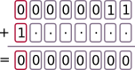
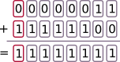
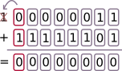

# Le codage des nombres entiers
*dans toute la suite, sauf mention contraire, les nombres seront codés sur 1 octet.*

 ## 1. Les nombres entiers en binaire non signé
 L'expression "non signé" signifie que la contrainte du signe n'existe pas : tous les nombres sont considérés comme étant positifs.
 
 Nous avons déjà vu comment ces nombres se codaient en binaire.  

Sur un octet, le nombre minimal qu'on puisse coder est `00000000`. C'est l'entier naturel 0.  
Le nombre maximal qu'on puisse coder est `11111111`. C'est l'entier naturel 255.


**Exercice :**
1. Quel est le plus grand entier non signé codable sur 16 bits ?
2. ... sur 32 bits ?
3. ... $n$ bits ?


*correction :*

1. $N=1+2+2^2+2^3+\dots+2^{15}= 65535$
2. $N=1+2+2^2+2^3+\dots+2^{31}= 4294967295$
3. Pour tout $n \in \mathbb{N}$, $1+2+2^2+2^3+\dots+2^{n}=2^{n+1}-1$ (formule de la somme des termes d'une suite géométrique de raison 2).

**Exercice sur l'addition binaire :**  
1. Effectuer la somme des deux nombres binaires `00001101` et `00001011`.
2. Vérifier que le résultat est cohérent en base 10.

*correction :*

1. 
2. Cette addition correspond à $13+11=24$

 ## 2. Les nombres entiers en binaire signé 

Comment différencier les nombres positifs des nombres négatifs ?  
L'idée naturelle est de réserver 1 bit pour le signe.

Par exemple, on peut décréter que le premier bit (appelé **bit de poids fort**) sera le bit de signe :
- 0 pour un nombre positif
- 1 pour un nombre négatif

Dans ce cas, `00000011` serait le nombre $+3$ et `10000011` serait le nombre $-3$.

**Problèmes :**
- le zéro serait représenté à la fois par `00000000` et `10000000`, ce qui n'est pas très économe.
- plus grave : l'addition $(+3)+(-3)$ serait égale à $-6$ !


**Recherche de l'opposé d'un nombre :**  
Que faut-il ajouter au nombre $(+3)$ pour obtenir 0 ?


*Indice :* en inversant chaque bit (on dit qu'on prend le *complément à 2* du bit), on obtient en additionnant l'octet maximal `11111111` :

Que se passe-t-il alors si on rajoute encore `1` à ce nombre maximal ?
La retenue (en anglais *carry*) sera perdue car elle débordera de l'octet : seuls 8 bits sont prévus pour écrire le nombre, le 9ème bit est donc perdu.  

Pour trouver l'opposé de `00000011`, il suffit donc de rajouter `1` au nombre construit par complément à 2 :


Le nombre $-3$ s'écrit donc `11111101`.

*remarque :* ce nombre `11111101` représente 253 en codage non signé. Il est donc nécessaire, lorsqu'on représente un nombre, de savoir si les nombres manipulés seront des entiers naturels (*non signés*) ou bien relatifs (*signés*).


### Conclusion : méthode de codage de l'opposé d'un nombre positif
- On prend le complément à 2 de chaque bit du nombre.
- On ajoute 1 au nombre obtenu.

**Exercice :**
Donner l'écriture binaire sur un octet du nombre $-13$.

*correction :*

Commençons par écrire le nombre 13 en binaire. Il s'écrit  `00001101`.
- en prenant le complément à 2 de chaque bit, on obtient `11110010`.
- en ajoutant 1 à ce dernier nombre, on obtient `11110011`. 

Le nombre $-13$ s'écrit donc `11110011`.

### Travail inverse : passage du binaire signé au nombre relatif
Considérons le nombre `11101101`, codé en binaire signé. À quel nombre relatif correspond-il ?
1. On observe son bit de poids fort : ici 1, donc ce nombre est négatif. Si ce bit est égal à 0, le nombre codé est positif, il suffit d'opérer une conversion binaire classique.
2. Comme ce nombre est négatif, il va falloir inverser le protocole précédent. On commence donc par **enlever 1** au nombre proposé. On trouve `11101100`.
3. On prend ensuite le complément à 2 de chaque bit. On trouve `00010011`.
4. On convertit en base 10 le nombre obtenu, qui était donc 19.
5. Le nombre initial était donc $-19$.

**Exercices :**
1. En binaire signé, à quel nombre correspond `11110001`?
2. En binaire signé, quel est le plus grand nombre que l'on puisse écrire sur un octet ? 
3. Quel est le plus petit nombre ?

*correction :*

1. `11110001` - `1` = `11110000`. En prenant le complément à 2, on trouve `00001111`, qui vaut 15. Le nombre `11110001` représente donc $-15$.
2. Le plus grand nombre est `01111111`, soit $+127$.
3. Le plus petit nombre est `10000000`. `10000000` - `1` = `01111111`. Le complément est `10000000`, qui est égal à 128. Donc le nombre minimal est $-128$.


```python

```
