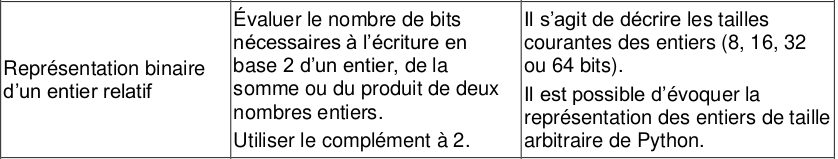
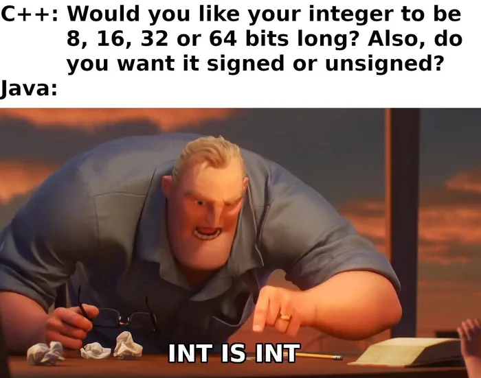
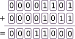
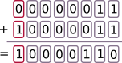
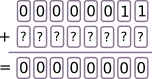
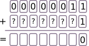
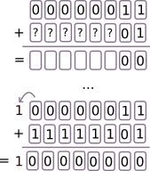

# 2.7 Codage des entiers

{: .center}

{: .center width=40%}

!!! abstract ":warning: Attention :warning:"
    La manière dont les nombres (entiers, non-entiers, positifs, négatifs...) sont traités par un langage de programmation est **spécifique** à ce langage.

    Dans toute la suite de ce cours, pour simplifier, nous considérerons que les nombres sont codés sur **1 octet** seulement. Ce qui ne correspond pas à la réalité, mais permet de comprendre les notions essentielles.

## 1. Les nombres entiers en binaire non signé
 L'expression "non signé" signifie que la contrainte du signe n'existe pas : tous les nombres sont considérés comme étant positifs.
 
 Nous avons déjà vu comment ces nombres se codaient en binaire.  

Sur un octet, le nombre minimal qu'on puisse coder est `00000000`. C'est l'entier naturel 0.  
Le nombre maximal qu'on puisse coder est `11111111`. C'est l'entier naturel 255.

!!! abstract "Exercice"
    === "Énoncé"
        1. Quel est le plus grand entier non signé codable sur 16 bits ?
        2. ... sur 32 bits ?
        3. ... $n$ bits ?
    === "Correction"
        1. $N=1+2+2^2+2^3+\dots+2^{15}= 65535$
        2. $N=1+2+2^2+2^3+\dots+2^{31}= 4294967295$
        3. Pour tout $n \in \mathbb{N}$, $1+2+2^2+2^3+\dots+2^{n}=2^{n+1}-1$ (formule de la somme des termes d'une suite géométrique de raison 2).

!!! note "Python et les entiers :heart:"
    Depuis la version 3 du langage Python, il n'y a plus de taille maximale pour les entiers en Python.

    Ceci implique que la taille nécessaire au codage de l'entier est allouée dynamiquement par Python (avec pour seule limite celle de la mémoire disponible). 

!!! abstract "Exercice"
    === "Énoncé"
        1. Effectuer la somme des deux nombres binaires `00001101` et `00001011`.
        2. Vérifier que le résultat est cohérent en base 10.
    === "Correction"
        1. 
        2. Cette addition correspond à $13+11=24$

## 2. Les nombres entiers en binaire signé 

### 2.1 La fausse bonne idée
Comment différencier les nombres positifs des nombres négatifs ?  
L'idée naturelle est de réserver 1 bit pour le signe.

Par exemple, on peut décréter que le premier bit (appelé **bit de poids fort**) sera le bit de signe :

- 0 pour un nombre positif
- 1 pour un nombre négatif

Dans ce cas, `00000011` serait le nombre $+3$ et `10000011` serait le nombre $-3$.

**Problèmes :**

- le zéro serait représenté à la fois par `00000000` et `10000000`, ce qui n'est pas très économe.
- plus grave : l'addition $(+3)+(-3)$ serait égale à $-6$ !
{: .center}

**Moralité :**

Indiquer le signe d'un nombre par son premier bit est une fausse bonne idée, il faut trouver autre chose.

### 2.2 À la recherche de l'opposé d'un nombre

**Idée :**

Plutôt que de chercher à écrire directement le nombre $-3$, nous allons chercher à déterminer ce qu'il faut ajouter à $(+3)$ pour obtenir 0.

Que faut-il ajouter au nombre $(+3)$ pour obtenir 0 ?
{: .center}

L'idée naturelle est de commencer par la droite, en essayant de «fabriquer du zéro» en choisissant le bon bit à ajouter :

{: .center}

{: .center}

On arrive bien à fabriquer des 0 sur tout notre octet, mais que devient la retenue (en anglais *carry*) de 1 qui déborde de notre octet ?

Réponse : rien ! Elle sera perdue et c'est une très bonne nouvelle. Ce nombre sera donc considéré comme un 0 : nous avons trouvé comment coder $-3$.

Le nombre $-3$ s'écrit donc `11111101`.

Comment, à partir du nombre `00000011`, aurait-on pu le trouver directement (sans raisonner de proche en proche) ?

On peut remarquer qu'en inversant chaque bit du nombre de départ `00000011`, on obtient `11111100`, qui appelé le **complément à 2** du nombre `00000011`.

Il ne reste donc plus qu'à ajouter `1` à ce nombre `11111100` pour obtenir le nombre cherché, `11111101`

:warning:  ce nombre `11111101` représente 253 en codage non signé. Il est donc nécessaire, lorsqu'on représente un nombre, de savoir si les nombres manipulés seront des entiers naturels (*non signés*) ou bien relatifs (*signés*).

### 2.3 Conclusion : écriture l'opposé d'un nombre positif

!!! note "Écriture de l'opposé d'un nombre positif :heart:"
    - On prend le complément à 2 de chaque bit du nombre de départ
    - On ajoute 1 au nombre obtenu.

!!! abstract "Exercice"
    === "Énoncé"
        Donner l'écriture binaire sur un octet du nombre $-13$.
    === "Correction"
        Commençons par écrire le nombre 13 en binaire. Il s'écrit  `00001101`.

        - en prenant le complément à 2 de chaque bit, on obtient `11110010`.
        - en ajoutant 1 à ce dernier nombre, on obtient `11110011`. 

        Le nombre $-13$ s'écrit donc `11110011`.

## 3. Travail inverse : passage du binaire signé au nombre relatif
Considérons le nombre `11101101`, codé en binaire signé. À quel nombre relatif correspond-il ?

1. On observe son bit de poids fort : ici 1, donc ce nombre est négatif. Si ce bit est égal à 0, le nombre codé est positif, il suffit d'opérer une conversion binaire classique.
2. Comme ce nombre est négatif, il va falloir inverser le protocole précédent. On commence donc par **enlever 1** au nombre proposé. On trouve `11101100`.
3. On prend ensuite le complément à 2 de chaque bit. On trouve `00010011`.
4. On convertit en base 10 le nombre obtenu, qui était donc 19.
5. Le nombre initial était donc $-19$.

!!! abstract "Exercice"
    === "Énoncé"
        1. En binaire signé, à quel nombre correspond `11110001`?
        2. En binaire signé, quel est le plus grand nombre que l'on puisse écrire sur un octet ? 
        3. Quel est le plus petit nombre ?
        4. Au total, combien de nombres différents peuvent être écrits en binaire signé ?

    === "Correction"
        1. `11110001` - `1` = `11110000`. En prenant le complément à 2, on trouve `00001111`, qui vaut 15. Le nombre `11110001` représente donc $-15$.
        2. Le plus grand nombre est `01111111`, soit $+127$.
        3. Le plus petit nombre est `10000000`. `10000000` - `1` = `01111111`. Le complément est `10000000`, qui est égal à 128. Donc le nombre minimal est $-128$.
        4. Il y a 128 nombres négatifs (de $-128$ à $-1$), le nombre 0, puis 127 nombres positifs (de 1 à 127). Il y a donc 256 nombres au total, comme en binaire non signé. 