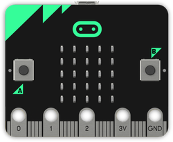
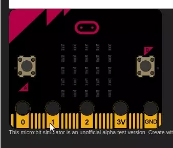

# 3.1 Microbit

{: .center}


## 0. Présentation de la carte BBC micro:bit

**BBC micro:bit** est une carte à [microcontrôleur](https://fr.wikipedia.org/wiki/Microcontr%C3%B4leur) conçue en 2015 au Royaume-Uni pour développer l'apprentissage de l'algorithmique et de la programmation.

{: .center}


La carte micro:bit dispose des [spécificités techniques](https://microbit.org/fr/guide/features/)  suivantes :

- 25 LEDs programmables individuellement
- 2 boutons programmables
- Broches de connexion
- Capteurs de lumière et de température
- Capteurs de mouvements (accéléromètre et boussole)
- Communication sans fil, via Radio et Bluetooth
- Interface USB

## 1. "Hello world !", virtuellement ou IRL...

### 1.1 À distance ? Pas de micro:bit ? le simulateur est là !

Rendez-vous sur la page [https://create.withcode.uk/](https://create.withcode.uk/)

Effacez le code existant et collez-le code ci-dessous :


```python
from microbit import *

while True:
    display.scroll('Hello, World!')
    display.show(Image.HEART)
    sleep(2000)
```

Cliquez sur le triangle vert en bas à droite. C'est parti !


Pour éviter des erreurs, fermez la fenêtre de droite (le simulateur) à chaque fois que vous modifiez votre code de la partie gauche.

### 1.2 Avec une micro:bit réelle

1. Branchez la carte sur un port USB. Un lecteur MICROBIT apparait dans les périphériques USB.
2. Rendez-vous sur l'adresse  [https://create.withcode.uk/](https://create.withcode.uk/)
3. Modifiez le code présent puis cliquez sur la flèche verte.
4. Vous pouvez télécharger le fichier .hex en cliquant sur Download HEX.
5. Transférez (par copier-coller, ou "envoyer vers") ce fichier .hex dans votre lecteur micro:bit.

Cette procédure est à répeter à chaque nouveau code.

## 2. Découverte des fonctionnalités

###  2.1 Commandes de base de l'afficheur, matrice de 5x5 LEDs
[voir vidéo explicative (en anglais)](https://youtu.be/qqBmvHD5bCw)

LED signifie Light Emitting Diode, Diode électroluminescente. La carte micro:bit en dispose de 25, toutes programmables individuellement, ce qui permet d'afficher du texte, des nombres et des images.

#### 2.1.1 Afficher un texte "défilant" `display.scroll(string, delay=400)`


```python
from microbit import *
display.scroll("NSI")
```


La première ligne de ce programme importe la bibliothèque de fonctions micro:bit. La deuxième ligne fait défiler un message à l’écran. Cela n'arrive qu'une seule fois.


La vitesse de défilement peut être ralentie ou accélérée à l'aide du paramètre `delay`. L'unité est la milliseconde.


```python
from microbit import *
display.scroll("mauriac", delay=20)
```

#### 2.1.2 Afficher une "image" `display.show(image)`
Exécuter le programme suivant:


```python
from microbit import *
display.show(Image.SAD)
```

??? note "Liste des images disponibles"
    ```
    Image.HEART
    Image.HEART_SMALL
    Image.HAPPY
    Image.SMILE
    Image.SAD
    Image.CONFUSED
    Image.ANGRY
    Image.ASLEEP
    Image.SURPRISED
    Image.SILLY
    Image.FABULOUS
    Image.MEH
    Image.YES
    Image.NO
    Image.CLOCK12
    Image.CLOCK11
    Image.CLOCK10
    Image.CLOCK9
    Image.CLOCK8
    Image.CLOCK7
    Image.CLOCK6
    Image.CLOCK5
    Image.CLOCK4
    Image.CLOCK3
    Image.CLOCK2
    Image.CLOCK1
    Image.ARROW_N
    Image.ARROW_NE
    Image.ARROW_E
    Image.ARROW_SE
    Image.ARROW_S
    Image.ARROW_SW
    Image.ARROW_W
    Image.ARROW_NW
    Image.TRIANGLE
    Image.TRIANGLE_LEFT
    Image.CHESSBOARD
    Image.DIAMOND
    Image.DIAMOND_SMALL
    Image.SQUARE
    Image.SQUARE_SMALL
    Image.RABBIT
    Image.COW
    Image.MUSIC_CROTCHET
    Image.MUSIC_QUAVER
    Image.MUSIC_QUAVERS
    Image.PITCHFORK
    Image.XMAS
    Image.PACMAN
    Image.TARGET
    Image.TSHIRT
    Image.ROLLERSKATE
    Image.DUCK
    Image.HOUSE
    Image.TORTOISE
    Image.BUTTERFLY
    Image.STICKFIGURE
    Image.GHOST
    Image.SWORD
    Image.GIRAFFE
    Image.SKULL
    Image.UMBRELLA
    Image.SNAKE
    ``` 


#### Créer sa propre image
Chaque pixel LED sur l’affichage physique peut prendre une parmi dix valeurs. Si un pixel prend la valeur 0 c’est qu’il est éteint. Littéralement, il a une luminosité de zéro. En revanche, s’il prend la valeur 9 il est à la luminosité maximale. Les valeurs de 1 à 8 représentent des niveaux de luminosité entre éteint (0) et « au maximum » (9).


```python
from microbit import *

bateau = Image("05050:"
               "05050:"
               "05050:"
               "99999:"
               "09990")

display.show(bateau)
```

Comment dessiner une image? Chaque ligne de l’affichage physique est représentée par une ligne de nombres se terminant par `:` et entourée de guillemets doubles `"`. Chaque nombre indique une luminosité. Il y a cinq lignes de cinq nombres donc il est possible de spécifier la luminosité individuelle de chacune des cinq LED sur chacune des cinq lignes sur l’affichage physique. C’est ainsi que l'on crée une image.


### 2.1.3 Les pixels (`display.set_pixel(x, y, val)`)
Vous pouvez régler la luminosité des pixels de l'affichage individuellement de 0 (désactivé) à 9 (luminosité maximale). Pour des informations sur les coordonnées de l'affichage, voir le [guide pour matrice à LED](https://microbit.org/guide/hardware/leds/).

Exécuter le programme suivant:


```python
from microbit import *
display.set_pixel(1, 4, 9)
```

### 2.2 Boucle `while`
Le programme suivant utilise une boucle `while` pour faire clignoter le pixel central de manière répétée sur l’écran. La boucle `while` se répète tant que la condition spécifiée est vraie (`True`). Dans ce cas, nous avons dit que la condition est vraie. Cela crée une *boucle infinie*. 

L'instruction de veille `sleep()` provoque la pause du micro:bit pendant un nombre défini de millisecondes choisi entre parenthèses.

L'instruction `display.clear()` éteint l'affichage.

Exécuter le programme ci-dessous:


```python
from microbit import *
while True:
    display.set_pixel(2, 2, 9)
    sleep(500)
    display.clear()
    sleep(500)
```

#### Avec un peu d'aléatoire  (voir [documentation sur le hasard](https://microbit-micropython.readthedocs.io/fr/latest/tutorials/random.html))
Dans le programme suivant que vous exécuterez, on importe `randint` du module `random` de MicroPython et on l'utilise pour afficher un pixel au hasard sur la matrice.


```python
from microbit import *
from random import randint
n=randint(0,4)
p=randint(0,4)
display.set_pixel(n, p, 9)
```

Tester le programme précédent plusieurs fois de suite. Pour cela, redémarrer la micro:bit en appuyant sur le bouton `RESET` situé à l'arrière de la carte.


### 2.3 Boucle `for`

Le programme suivant utilise une boucle `for` pour faire défiler un pixel sur une ligne. Exécutez-le.


```python
from microbit import *
while True:
    for i in range(5):
        display.set_pixel(i,0,9)
        sleep(200)
        display.clear()
```

### 2.4 Les entrées boutons A, B et A+B - programmation événementielle [(vidéo explicative)](https://youtu.be/t_Qujjd_38o)

{: .center width=30%}


 Il y a deux boutons sur la face avant du micro:bit (étiquetés A et B). On peut détecter quand ces boutons sont pressés, ce qui permet de déclencher des instructions sur l'appareil.

Exemples avec le boutton A:
- `button_a.is_pressed()`: renvoie *True* si le bouton spécifié est actuellement enfoncé et *False* sinon.
- `button_a.was_pressed()`: renvoie *True* ou *False* pour indiquer si le bouton a été appuyé depuis le démarrage de l'appareil ou la dernière fois que cette méthode a été appelée.

**Exemple :** Essayer le programme suivant qui fait défiler le texte "NSI" indéfiniment. On introduit l'**instruction conditionnelle** `if` qui va tester si le bouton A a été pressé (pendant le défilement du texte ou pendant la pause), auquel cas le programme s'arrête en exécutant la commande `break`.


```python
from microbit import *
while True:
    display.scroll("NSI")
    sleep(200)
    if button_a.was_pressed():
        break
```

!!! example "Exercice 1"
    === "Énoncé"
        Créer le code permettant de basculer d'un visage triste à un visage heureux suivant qu'on appuie sur A ou sur B. 

        {: .center}

    === "Correction"
        ```python
        from microbit import *
        display.clear()
        while True:
            if button_a.was_pressed():
                display.show(Image.SAD)
            if button_b.was_pressed():
                display.show(Image.HAPPY)
        ```


!!! example "Exercice 2"
    === "Énoncé"
        On veut créer le code permettant de déplacer un point vers la gauche ou vers la droite en appuyant sur A ou sur B.

        {: .center}

        Compléter le code proposé :


        ```python
        from microbit import *
        display.clear()
        i = 12
        while True:
            x = ... # à compléter
            y = ... # à compléter
            display.set_pixel(x,y,9)
            if button_a.was_pressed():
                display.set_pixel(x,y,0)
                i = i - 1
                if i < 0 : 
                    i = 0
            if button_b.was_pressed():
                display.set_pixel(x,y,0)
                i = i + 1
                if i > 24 :
                    i = 24
        ```

    === "Correction"


!!! example "Exercice 3"
    === "Énoncé"
        Créer le code permettant de faire défiler toutes les images disponibles. 
        Bouton B pour passer à l'image suivante, bouton A pour revenir à l'image précédente.

        {: .center}

        Compléter le code proposé :


        ```python
        from microbit import *

        lst = [Image.HEART, Image.HEART_SMALL, Image.HAPPY, Image.SMILE,
               Image.SAD, Image.CONFUSED, Image.ANGRY, Image.ASLEEP, Image.SURPRISED, Image.SILLY,
               Image.FABULOUS, Image.MEH, Image.YES, Image.NO, Image.CLOCK12,
               Image.CLOCK11, Image.CLOCK10, Image.CLOCK9, Image.CLOCK8, Image.CLOCK7,
               Image.CLOCK6, Image.CLOCK5, Image.CLOCK4, Image.CLOCK3, Image.CLOCK2,
               Image.CLOCK1, Image.ARROW_N, Image.ARROW_NE, Image.ARROW_E, Image.ARROW_SE,
               Image.ARROW_S, Image.ARROW_SW, Image.ARROW_W, Image.ARROW_NW, Image.TRIANGLE,
               Image.TRIANGLE_LEFT, Image.CHESSBOARD, Image.DIAMOND, Image.DIAMOND_SMALL, Image.SQUARE,
               Image.SQUARE_SMALL, Image.RABBIT, Image.COW, Image.MUSIC_CROTCHET, Image.MUSIC_QUAVER,
               Image.MUSIC_QUAVERS, Image.PITCHFORK, Image.XMAS, Image.PACMAN, Image.TARGET, Image.TSHIRT,
               Image.ROLLERSKATE, Image.DUCK, Image.HOUSE, Image.TORTOISE, Image.BUTTERFLY, Image.STICKFIGURE,
               Image.GHOST, Image.SWORD, Image.GIRAFFE, Image.SKULL, Image.UMBRELLA, Image.SNAKE]


        ```

    === "Correction"


### 2.5 Capteur de lumière [(vidéo)](https://youtu.be/TKhCr-dQMBY)

En inversant les LEDs d'un écran pour devenir un point d'entrée, l'écran LED devient un capteur de lumière basique, permettant de détecter la luminosité ambiante.

La commande `display.read_light_level()` retourne un entier compris entre 0 et 255 représentant le niveau de lumière.

**Exercice :** Compléter le programme ci-dessous qui affiche une image de lune si on baisse la luminosité (en recouvrant la carte avec sa main par exemple) et un soleil sinon.


```python

from microbit import *

soleil = Image("90909:"
               "09990:"
               "99999:"
               "09990:"
               "90909:")

lune = Image("00999:"
             "09990:"
             "09900:"
             "09990:"
             "00999:")

while True:
    if display.read_light_level()> ... : #trouver la bonne valeur (entre 0 et 255)
        display.show(soleil)
    else:
        display.show(...) #trouver la bonne variable
    sleep(10)
```

**Prolongement:** créer un programme qui affiche le niveau de luminosité et le tester avec la LED d'un téléphone portable ou une lampe-torche par exemple. Plus la luminosité sera élevée, plus il y aura de LEDs affichées sur la matrice.

### 2.6 Capteur de température [(vidéo)](https://youtu.be/_T4N8O9xsMA)


Le micro:bit n’a pas un capteur de température dédié. Au lieu de cela, la température fournie est en fait la température de la puce de silicium du processeur principal. Comme le processeur chauffe peu en fonctionnement (c'est un processeur ARM à grande efficacité), sa température est une bonne approximation de la température ambiante.
L'instruction `temperature()` renvoie la température de la carte micro:bit en degrés Celsius.

**Exercice :** Ecrire un programme qui affiche la température (aide: on pourra utiliser l'instruction `display.scroll()`; revoir le point 2.1.1).

### 2.7 Accéléromètre [(vidéo)](https://youtu.be/byngcwjO51U)

Un accéléromètre mesure l'accélération de la carte micro:bit, ce composant détecte quand la micro:bit est en mouvement. Il peut aussi détecter d'autres actions (gestes), par exemple quand elle est secouée, inclinée ou qu'elle tombe.


La carte micro:bit est munie d’un accéléromètre. Il mesure le mouvement selon trois axes :

- X - l’inclinaison de gauche à droite.
- Y - l’inclinaison d’avant en arrière.
- Z - le mouvement haut et bas.

Dans l'exemple suivant à essayer, l'instruction `accelerometer.get_x()` permet de détecter un mouvement de gauche à droite en renvoyant un nombre compris entre -1023 et 1023; 0 étant la position "d'équilibre"


```python
#Exemple
from microbit import *

while True:
    abscisse = accelerometer.get_x()
    if abscisse > 500:
        display.show(Image.ARROW_E)
    elif abscisse < -500:
        display.show(Image.ARROW_W)
    else:
        display.show("-")
```

**Prolongement (*secouer les dés!*):**
!!! example "Exercice 4"
    === "Énoncé"
        Écrire un programme qui simule un dé en affichant une face au hasard lorsque la micro:bit est secouée. On pourra utiliser l'instruction `accelerometer.is_gesture(shake)` qui teste si la carte est secouée. Plus d'informations sur les gestes [ici](https://microbit-micropython.readthedocs.io/fr/latest/tutorials/gestures.html){target = "_blank"}.

    === "Correction"
        {{ correction(True,
        "
        
        "
        ) }}


### 2.8 Boussole

La boussole détecte le champ magnétique de la Terre, nous permettant de savoir quelle direction la micro:bit indique. La boussole doit être étalonnée avant de pouvoir être utilisée. Pour cela, on utilise `compass.calibrate()` qui exécute un petit jeu: au départ, micro:bit fait défiler "Tilt to fill screen". Ensuite, incliner micro:bit pour déplacer le point au centre de l’écran autour jusqu'à ce que vous ayez rempli la totalité de l’écran.

La fonction `compass.heading()` donne le cap de la boussole sous la forme d'un entier compris entre 0 et 360, représentant l'angle en degrés, dans le sens des aiguilles d'une montre, avec le nord égal à 0.

**Exercice :** Compléter le programme suivant qui indique le Nord.


```python

from microbit import *

compass.calibrate()

while True:
    if compass.heading() < "remplir ici" or compass.heading() > "remplir ici":
        display.show(Image.ARROW_N)
    else:
        display.show(Image.DIAMOND_SMALL)
```

**Prolongement:** Améliorer le programme pour que le micro:bit indique "N", "S", "E" et "O" en fonction de l'orientation de la boussole.

**Autre prolongement:** fabriquer une station météo qui détermine la direction du vent.

**Autre prolongement:** étudier l'intensité du champ magnétique autour du périphérique (en utilisant la fonction `compass.get_field_strength()`). Plus d'informations sur les fonctions "boussole" [ici](https://microbit-micropython.readthedocs.io/en/latest/compass.html).


*document basé sur le travail de Thomas Basso, académie de Polynésie*