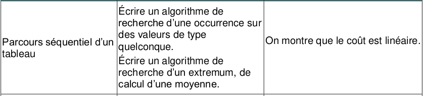

# 4.1 Extremums et moyennes

{: .center}

## 1. Algorithme de recherche de maximum

!!! note "Recherche de maximum :heart:"
    ```python
    def recherche_max(tab):
        '''renvoie le maximum de la liste tab'''
        maxi = tab[0]           # (1)
        for elt in tab:
            if elt > maxi:
                maxi = elt
        return maxi
    ```

    1. On initialise le maximum avec la première valeur du tableau (surtout pas avec 0 ou «moins l'infini» !)

**Utilisation :**
```python
>>> recherche_max([4, 3, 8, 1])
  8
```


## 2. Algorithme de calcul de moyenne

!!! note "Calcul de moyenne :heart:"
    ```python
    def moyenne(tab):
        ''' renvoie la moyenne de tab'''
        somme = 0
        for elt in tab:
            somme += elt
        return somme / len(tab)
    ```

   
**Utilisation :**
```python
>>> moyenne([4, 3, 8, 1])
  4.0
```


## 3. Algorithme de recherche d'occurrence

!!! note "Recherche d'occurrence :heart:"
    ```python
    def recherche_occurrence(elt, tab):
        ''' renvoie la liste (éventuellement vide)
        des indices de elt dans tab'''
        liste_indice = []
        for i in range(len(tab)):
            if tab[i] == elt:
                liste_indice.append(i)
        return liste_indice
    ```

   
**Utilisation :**
```python
>>> recherche_occurrence(3, [1, 6, 3, 8, 3, 2])
[2, 4]
>>> recherche_occurrence(7, [1, 6, 3, 8, 3, 2])
[]
```