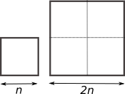

# Complexité d'un algorithme 

La complexité d'un algorithme est une notion qui nous éclaire sur le nombre d'opérations dont a besoin l'algorithme pour s'achever.  Mais attention : on donne un **ordre** d'idée du nombres d'opérations nécessaires, en fonction de la taille $n$ des données d'entrée de l'algorithme.  

# Complexité linéaire

Votre travail est de mettre des bulletins dans des enveloppes pour une campagne de communication. L'algorithme en jeu ici est "je prends un bulletin, je le plie, je le mets dans l'enveloppe, je ferme l'enveloppe". On suppose que vous travaillez à un rythme constant.  
Le premier jour, on vous donne $n$ enveloppes à remplir. Vous mettez un temps $T$ pour les traiter.  
Le deuxième jour, suite à l'absence d'un employé, on vous donne le double d'enveloppes, soit $2n$ enveloppes. Combien de temps allez vous mettre pour les traiter ?

*Réponse :*

Cela prendra deux fois plus de temps, donc $2T$.

## Vocabulaire 

On dit que l'algorithme est de complexité **linéaire**.  
On dit aussi qu'il est **d'ordre n**.  
On pourra aussi rencontrer l'expression mathématique « la complexité est en $O(n)$ », qui se lit «la complexité est en grand o de n ».  
Toutes ces formulations renvoient à la même idée : le nombre d'opérations nécessaires (et donc le temps nécessaire à la terminaison de l'algorithme) évolue **proportionnellement** avec le nombre de données à traiter.

### Attention
Si un employé A met 3 secondes par enveloppe, on aura $T_A=3n$.  
Si un employé B met 20 secondes par enveloppe, on aura $T_B=20n$.  

On retrouve la formulation mathématique d'une fonction linéaire $f$.  
$$f : x \mapsto ax \quad\text{ , avec } a \in \mathbb{R}$$

Ici, la fonction $f_A$ serait $f_A(x)=3x$, la fonction $f_B$ serait $f_B(x)=20x$

Dans **les deux cas** l'algorithme a la même complexité (linéaire donc). Ce qui compte est le fait que pour chacun des employés, avoir deux fois plus d'enveloppes prendrait deux fois plus de temps.

## Vérification expérimentale 
On considère la fonction ci-dessous. Que fait-elle ?


```python
def fabrique(n):
    liste = []
    for k in range(n):
        liste.append("ok")
    return liste
```

Jupyter permet l'utilisation de la fonction [magique](https://ipython.org/ipython-doc/dev/interactive/magics.html#magic-timeit) %timeit, qui mesure le temps moyen d'un code sur un très grand nombre d'exécutions.  

Que pensez-vous des résultats suivants ?


```python
%timeit fabrique(100)
```

    5.76 µs ± 27.9 ns per loop (mean ± std. dev. of 7 runs, 100000 loops each)


```python
%timeit fabrique(1000)
```

    60.6 µs ± 1.16 µs per loop (mean ± std. dev. of 7 runs, 10000 loops each)


```python
%timeit fabrique(5000)
```

    308 µs ± 1.97 µs per loop (mean ± std. dev. of 7 runs, 1000 loops each)


## Exercice : recherche d'un élément dans une liste
Écrire une fonction `recherche(liste, element)` qui renvoie `True` si `element` est dans liste, `False` s'il n'y est pas. 
(bien entendu, interdiction d'utiliser le mot-clé `in`...)


```python
def recherche(liste, element) :
 
    
```

Exemples d'utilisation


```python
mylist = [3, 6, -2, 4]
```


```python
recherche(mylist, 6)
```


    True


```python
recherche(mylist, 5)
```


    False


Quelle est la complexité de cette fonction ?  
Si l'élément recherché est au tout début de la liste, la taille de la liste n'a aucune influence et la complexité est constante. Par contre, si l'élément recherché est le dernier, on a un algorithme de complexité linéaire. On parle alors de **complexité dans le pire des cas**.

# Complexité quadratique

Vous avez l'habitude de tondre la pelouse de votre terrain carré, de côté $n$. Cela vous prend un certain temps $T$.  
Votre voisin vous propose de venir chez lui tondre son terrain carré de côté $2n$.   
Combien de temps cela va-t-il vous prendre pour tondre le terrain de votre voisin ?



*réponse :*  
Cela vous prendra **4 fois** plus de temps.

## Vocabulaire 

On dit que l'algorithme est de complexité **quadratique**.  
On dit aussi qu'il est **d'ordre $n^2$**.  
On pourra aussi rencontrer l'expression mathématique « la complexité est en $O(n^2)$ », qui se lit «la complexité est en grand o de n carré ».  
Toutes ces formulations renvoient à la même idée : le nombre d'opérations nécessaires (et donc le temps nécessaire à la terminaison de l'algorithme) évolue **proportionnellement avec le carré** du nombre de données à traiter.

## Vérification expérimentale 
On considère la fonction ci-dessous. Que fait-elle ?


```python
def tables(n):
    for a in range(n):
        for b in range(n):
            c = a*b

```

Que pensez-vous des résultats suivants ?


```python
%timeit tables(100)
```

    372 µs ± 843 ns per loop (mean ± std. dev. of 7 runs, 1000 loops each)


```python
%timeit tables(200)
```

    1.48 ms ± 6.99 µs per loop (mean ± std. dev. of 7 runs, 1000 loops each)


 
