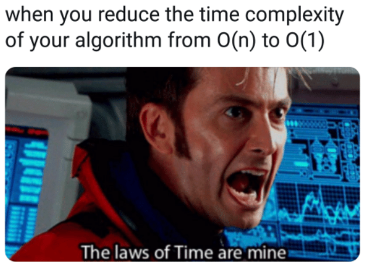
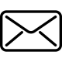
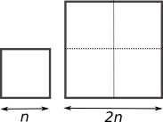

# 4.2 Complexité d'un algorithme 

{: .center width=40%}


La **complexité** d'un algorithme est une notion qui nous éclaire sur la manière dont cet algorithme va être sensible à la taille des données passées en paramètre. Il y a plusieurs types de complexités étudiables (nombre d'opérations, temps nécessaire, espace-mémoire nécessaire...).

En NSI, nous nous contenterons d'estimer (lorsque cela est possible) le nombre d'opérations effectuées par l'algorithme, et nous mesurerons les temps d'exécution de ces algortihmes. 

Nous observerons surtout comment évolue ce temps d'exécution en fonction de la taille des données passées en paramètre (la taille d'une liste, par exemple). Cela nous permettra dans ce cours de classer nos algorithmes en deux catégories : les algorithmes de complexité **linéaire** et ceux de complexité **quadratique**.


## 1. Complexité linéaire

### 1.1 Exemple 

!!! aide "Exemple d'algorithme"
    {: .center}
    Votre travail est de mettre des bulletins dans des enveloppes pour une campagne de communication.  
    L'algorithme en jeu ici est "je prends un bulletin, je le plie, je le mets dans l'enveloppe, je ferme l'enveloppe". 
    
    On suppose que vous travaillez à un rythme constant.  
    Le premier jour, on vous donne $n$ enveloppes à remplir. Vous mettez un temps $T$ pour les traiter.  
    Le deuxième jour, suite à l'absence d'un employé, on vous donne le double d'enveloppes, soit $2n$ enveloppes. Combien de temps allez vous mettre pour les traiter ?

    ??? tip "*Réponse*"
        Cela prendra deux fois plus de temps, donc $2T$.

### 1.2 Vocabulaire 

On dit que l'algorithme ci-dessus est de complexité **linéaire**.  

!!! note "Complexité linéaire :heart:"
    Les expressions suivantes sont équivalentes :
    
    - L'algorithme est de **complexité linéaire**.
    - L'algorithme est **d'ordre n**.  
    - L'algorithme est en **$O(n)$** *  
    («grand O de n»)*

    Toutes ces formulations renvoient à la même idée : le nombre d'opérations nécessaires (et donc le temps nécessaire à la terminaison de l'algorithme) évolue **proportionnellement** avec le nombre de données à traiter.

### 1.3 Formulation mathématique
Si un employé A met 3 secondes par enveloppe, on aura $T_A=3n$.  
Si un employé B met 20 secondes par enveloppe, on aura $T_B=20n$.  

On retrouve la formulation mathématique d'une fonction linéaire $f$.  

$$f : x \mapsto ax \quad\text{ , avec } a \in \mathbb{R}$$

Ici, la fonction $f_A$ serait $f_A(x)=3x$, la fonction $f_B$ serait $f_B(x)=20x$

Dans **les deux cas** l'algorithme a la même complexité (linéaire donc). Ce qui compte est le fait que pour chacun des employés, **avoir deux fois plus d'enveloppes prendrait deux fois plus de temps**.

### 1.4 Vérification expérimentale 
On considère la fonction ci-dessous :


```python
def fabrique(n):
    liste = []
    for _ in range(n):
        liste.append("ok")
    return liste
```

Le code ci-dessous va mesurer le temps d'exécution de cette fonction avec deux paramètres différents : la valeur 400 puis la valeur 800.


```python
import time
t0 = time.time()
lstA = fabrique(400)
print("temps pour une liste de taille 400 :", time.time() - t0)
t0 = time.time()
lstB = fabrique(800)
print("temps pour une liste de taille 800 :", time.time() - t0)
```

Résultats de l'exécution :

```python
temps pour une liste de taille 400 : 2.384185791015625e-05
temps pour une liste de taille 800 : 4.2438507080078125e-05
```

**Interprétation :**  
Doubler la taille du paramètre d'entrée a eu pour effet de doubler (quasiment) le temps d'exécution. Cela semble indiquer que la complexité de cette fonction est **linéaire**.  
En observant l'algorithme, nous pouvons confirmer cette supposition : le nombre d'opérations de la boucle ```for``` est égal au paramètre ```n```, et est donc directement proportionnel à la valeur de ce paramètre.


## 2. Complexité quadratique

### 2.1 Exemple 

!!! aide "Exemple d'algorithme"
    {: .center}
    Vous avez l'habitude de tondre la pelouse de votre terrain carré, de côté $n$. Cela vous prend un certain temps $T$.  
    Votre voisin vous propose de venir chez lui tondre son terrain carré de côté $2n$.   
    Combien de temps cela va-t-il vous prendre pour tondre le terrain de votre voisin ?

    ??? note "*Réponse*"
        Cela vous prendra **4 fois** plus de temps.


### 2.2 Vocabulaire 

On dit que l'algorithme ci-dessus est de complexité **quadratique**.  

!!! note "Complexité quadratique :heart:"
    Les expressions suivantes sont équivalentes :
    
    - L'algorithme est de **complexité quadratique**.
    - L'algorithme est **d'ordre n au carré**.  
    - L'algorithme est en **$O(n^2)$** *  
    («grand O de n carré»)*

    Toutes ces formulations renvoient à la même idée : le nombre d'opérations nécessaires (et donc le temps nécessaire à la terminaison de l'algorithme) évolue **proportionnellement avec le carré** du nombre de données à traiter.


Les algorithmes quadratiques sont moins «intéressants» que les algorithmes linéaires, car ils vont consommer beaucoup plus de ressources. Lors de l'élaboration d'un algorithme, on va toujours essayer de trouver l'algorithme ayant la complexité la plus faible possible.

### 2.3 Vérification expérimentale 
On considère la fonction ci-dessous :

```python
def tables(n):
    for a in range(n):
        for b in range(n):
            c = a * b

```

Le code ci-dessous va mesurer le temps d'exécution de cette fonction avec deux paramètres différents : la valeur 100 puis la valeur 200.


```python
import time
t0 = time.time()
tables(100)
print("temps pour n = 100 :", time.time() - t0)
t0 = time.time()
tables(200)
print("temps pour n = 200 : ", time.time() - t0)
```


Résultats de l'exécution :

```python
temps pour n = 100 : 0.0003533363342285156
temps pour n = 200 : 0.0014693737030029297
```

**Interprétation :**  
Doubler la taille du paramètre d'entrée a eu pour effet de **quadrupler** le temps d'exécution. Cela semble indiquer que la complexité de cette fonction est **quadratique**, car $2^2=4$.  

En observant l'algorithme, nous pouvons confirmer cette supposition : le nombre d'opérations des deux boucles ```for``` est égal à ```n^2```.


## 3. Complexité constante

Il peut arriver (mais c'est rare) que la complexité d'un algorithme soit indépendante de la taille des données à traiter.  
Dans ce cas, c'est souvent une très bonne nouvelle.

Observons l'accès au 1er élément d'une liste :


!!! note "Complexité constante :heart:"
    Les expressions suivantes sont équivalentes :
    
    - L'algorithme est de **complexité constante**.
    - L'algorithme est **d'ordre 1**.  
    - L'algorithme est en **$O(1)$** *  
    («grand O de 1»)*

    Toutes ces formulations renvoient à la même idée : le nombre d'opérations nécessaires (et donc le temps nécessaire à la terminaison de l'algorithme) est constant quelle que soit la taille des données d'entrée de l'algorithme.