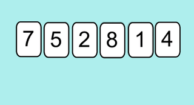
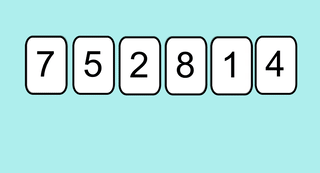

# 4.3 Tri par insertion

{: .center}

{: .center width=30%}


## 0. Préambule
Pourquoi étudier des algorithmes de tri ?  
Autant ne pas le cacher, ces algorithmes sont déjà implémentés (quelque soit le langage) dans des fonctions très performantes.  

En Python, on utilise la fonction `sort()` :


```python
>>> tab = [4, 8, 1, 2, 6]
>>> tab.sort()
>>> tab
[1, 2, 4, 6, 8]

```

{: .center width=30%}


Le meilleur de nos futurs algorithmes de tri sera moins efficace que celui de cette fonction `sort()`...  
Malgré cela, il est essentiel de se confronter à l'élaboration manuelle d'un algorithme de tri.  
Le tri par insertion est le premier des deux algorithmes de tri que nous allons étudier (nous étudierons aussi le tri par sélection).  
Ces deux algorithmes ont pour particularité de :

- ne pas nécessiter la création d'une nouvelle liste. Ils modifient la liste à trier sur place.
- ne pas faire intervenir de fonctions complexes (comme la recherche d'un minimum par exemple)


## 1. Tri par insertion (version la plus intuitive)

### 1.1  Principe et algorithme
Considérons la liste `[7, 5, 2, 8, 1, 4]`  
Voici le fonctionnement de l'algorithme :  

{: .center width=40%}


**Explications :**

- On traite successivement toutes les valeurs à trier, en commençant par celle en deuxième position.
- Traitement : tant que la valeur à traiter est inférieure à celle située à sa gauche, on échange ces deux valeurs.

### 1.2 Codage de l'algorithme

**Algorithme :** 

Pour toutes les valeurs, en commençant par la deuxième :

- Tant qu'on trouve à gauche une valeur supérieure et qu'on n'est pas revenu à la première valeur, on échange ces deux valeurs.


!!! note "Tri par insertion (version simple) :heart:"
    ```python
    def tri_insertion1(lst):
        '''trie en place la liste lst donnée en paramètre'''
        for i in range(1, len(lst)):                 #(1)
            k = i                                    #(2)
            while k > 0 and lst[k-1] > lst[k] :      #(3)
                lst[k], lst[k-1] = lst[k-1], lst[k]  #(4)    
                k = k - 1                            #(5)   
    ```

    1. On commence à 1 et non pas à 0.
    2. On «duplique» la variable `i` en une variable `k`.  
    On se positionne sur l'élément d'indice ```k```. On va faire «reculer» cet élément tant que c'est possible. On ne touche pas à ```i```. 
    3. Tant qu'on n'est pas revenu au début de la liste et qu'il y a une valeur plus grande à gauche.
    4. On échange de place avec l'élément précédent.
    5. Notre élément est maintenant à l'indice ```k - 1```.  
    La boucle peut continuer.

*Application :*


```python
>>> maliste = [7, 5, 2, 8, 1, 4]
>>> tri_insertion1(maliste)
>>> maliste
[1, 2, 4, 5, 7, 8]
```

## 2. Tri par insertion (version optimisée)

### 2.1 Principe et algorithme
Observez l'animation ci-dessous et comparer avec la version initiale.  
{: .center width=40%}

- Au lieu d'effetuer un échange avec la valeur précédente à chaque fois qu'elle est supérieure, on va décaler vers la droite toutes les valeurs situées à gauche et supérieures à notre valeur de travail.
- On **insère** ensuite directement à sa position «la plus à gauche possible» notre valeur de travail. 

### 2.2 Codage de l'algorithme

!!! note "Tri par insertion (version optimisée) :heart:"
    ```python
    def tri_insertion2(lst) :
        '''trie en place la liste lst donnée en paramètre'''
        for i in range(1, len(lst)):         # (1)
            cle = lst[i]                     # (2)
            k = i - 1                        # (3)
            while k >= 0 and lst[k] > cle :  # (4)
                lst[k + 1] = lst[k]          # (5)
                k = k -1                     # (6)
            lst[k + 1] = cle                 # (7)
    ```

    1. On démarre à la deuxième valeur.
    2. On stocke dans une variable ```cle``` notre valeur de travail
    3. On démarre l'étude des valeurs à gauche de notre valeur de travail
    4. Tant qu'on trouve une valeur supérieure à notre valeur de travail, et qu'on n'est pas revenus au début de la liste.
    5. On décale cette valeur de un rang vers la droite.
    6. On se repositionne sur la valeur à gauche de notre valeur actuelle.
    7. On s'est arrêté quand la valeur n'était pas supérieure : on **insère** notre valeur de travail juste à droite de notre position d'arrêt.


*Application :*


```python
>>> maliste = [7, 5, 2, 8, 1, 4]
>>> tri_insertion2(maliste)
>>> maliste
[1, 2, 4, 5, 7, 8]
```

## 3. Complexité de l'algorithme

### 3.1  Étude expérimentale

Lire le [cours sur la complexité](../../4.2_Complexite/cours/) et proposer des mesures expérimentales pour déterminer la complexité du tri par insertion.

<!--
Pour pouvoir utiliser la fonction `%timeit`, nous allons modifier légèrement notre algorithme de tri : comme la fonction `%timeit` effectue un grand nombre d'appel à la fonction `tri()`, la liste serait triée dès le premier appel et les autres appels essaieraient donc de tri une liste *déjà triée*. 


```python
def tri(L) :
    l = list(L) # pour ne pas modifier la liste passée en argument.
    for k ...
```


```python
a = [k for k in range(100,0,-1)] #on se place dans le pire des cas : une liste triée dans l'ordre décroissant
```


```python
b = [k for k in range(200,0,-1)] #on se place dans le pire des cas : une liste triée dans l'ordre décroissant
```


```python
%timeit tri(a)
```


```python
%timeit tri(b)
```

En comparant les temps de tri des listes `a` et `b`, que pouvez-vous supposer sur la complexité du tri par insertion ?

Une liste à trier 2 fois plus longue prend 4 fois plus de temps : l'algorithme semble de complexité **quadratique**.

-->

### 3.2 Démonstration
Dénombrons le nombre d'opérations dans le pire des cas, pour une liste de taille $n$.

- boucle `for` : elle s'exécute $n-1$ fois.
- boucle `while` : dans le pire des cas, elle exécute d'abord 1 opération, puis 2, puis 3... jusqu'à $n-1$. Or 

$$1+2+3+\dots+n-1=\dfrac{n \times (n-1)}{2}$$

Le terme de plus haut degré de l'expression $\dfrac{n \times (n-1)}{2}$ est de degré 2 : le nombre d'opérations effectuées est donc proportionnel au **carré** de la taille des données d'entrée.  
Ceci démontre que le tri par insertion est de complexité **quadratique**.

Dans le cas (rare, mais il faut l'envisager) où la liste est déjà triée, on ne rentre jamais dans la boucle `while` : le nombre d'opérations est dans ce cas égal à $n-1$, ce qui caractérise une complexité linéaire.

### 3.3 Résumé de la complexité 

- dans le meilleur des cas (liste déjà triée) : complexité **linéaire**
- dans le pire des cas (liste triée dans l'ordre décroissant) : complexité **quadratique**

### 3.4 Preuve de la terminaison de l'algorithme


Est-on sûr que notre algorithme va s'arrêter ?  
Le programme est constitué d'une boucle `while` imbriquée dans une boucle `for`. Seule la boucle `while` peut provoquer une non-terminaison de l'algorithme. Observons donc ses conditions de sortie : 

```python
 while  k >= 0 and l[k] > cle :
```

La condition `l[k] > cle` ne peut pas être rendue fausse avec certitude. 
Par contre, la condition `k >= 0` sera fausse dès que la variable `k` deviendra négative. Or la ligne 
`k = k - 1` nous assure que la variable `k` diminuera à chaque tour de boucle. La condition  `k >= 0` deviendra alors forcément fausse au bout d'un certain temps.

Nous avonc donc prouvé la **terminaison** de l'algorithme.

!!! aide "Vocabulaire"
    On dit que la valeur `k` est un **variant de boucle**.  
    C'est une notion théorique (ici illustrée de manière simple par la valeur `k`) qui permet de prouver *la bonne sortie d'une boucle* et donc la terminaison d'un algorithme.


### 3.5 Preuve de la correction de l'algorithme
Les preuves de correction sont des preuves théoriques. La preuve ici s'appuie sur le concept mathématique de **récurrence**. 
Principe du raisonnement par récurrence : 
une propriété $P(n)$ est vraie si :

- $P(0)$ (par exemple) est vraie
- Pour tout entier naturel $n$, si $P(n)$ est vraie alors $P(n+1)$ est vraie.

Ici, la propriété serait : « Quand $k$ varie entre 0 et `longueur(liste) -1`, la sous-liste de longueur $k$ est triée dans l'ordre croissant.»

!!! aide "Vocabulaire"
    On appelle cette propriété un **invariant de boucle**.  
    *Invariant* siginifie qu'elle reste vraie pour chaque boucle.

- quand $k$ vaut 0, on place le minimum de la liste en l[0], la sous-liste l[0] est donc triée.
-  si la sous-liste de $k$ éléments est triée, l'algorithme rajoute en dernière position de la liste le minimum de la sous-liste restante, dont tous les éléments sont supérieurs au maximum de la sous-liste de $k$ éléments. La sous-liste de $k+1$ éléments est donc aussi triée.


---
## Bibliographie
- Wikipedia, https://en.wikipedia.org/wiki/Sorting_algorithm


---