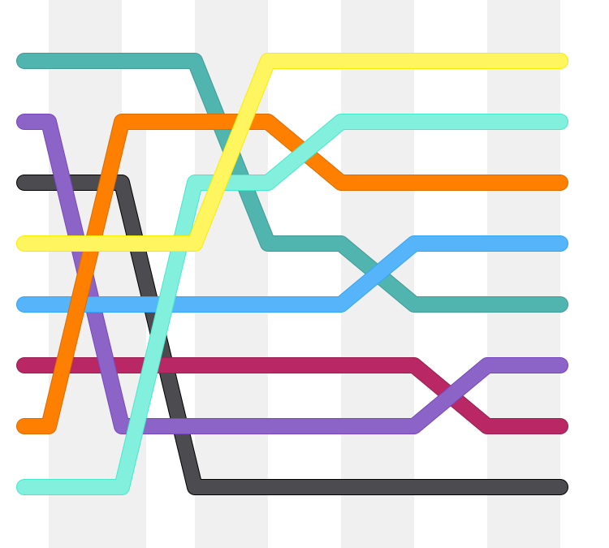

# 4.4 Tri par sélection

{: .center}

{: .center width=30%}


## 0. Préambule
Pourquoi étudier des algorithmes de tri ?  
Autant ne pas le cacher, ces algorithmes sont déjà implémentés (quelque soit le langage) dans des fonctions très performantes.  

En Python, on utilise la fonction `sort()` :


```python
>>> tab = [4, 8, 1, 2, 6]
>>> tab.sort()
>>> tab
[1, 2, 4, 6, 8]

```

{: .center width=30%}


Le meilleur de nos futurs algorithmes de tri sera moins efficace que celui de cette fonction `sort()`...  
Malgré cela, il est essentiel de se confronter à l'élaboration manuelle d'un algorithme de tri.  
Le tri par sélection est le premier des deux algorithmes de tri que nous allons étudier (nous étudierons aussi le tri par insertion).  
Ces deux algorithmes ont pour particularité de :

- ne pas nécessiter la création d'une nouvelle liste. Ils modifient la liste à trier **en place**.
- ne pas faire intervenir de fonctions complexes (comme la recherche d'un minimum par exemple)


## 0. Introduction
:arrow_right: [Activité d'introduction](../intro_cours/){. target="_blank"}


## 1. Animation
Considérons la liste `[5, 4, 2, 1]`  
Voici le fonctionnement de l'algorithme :  

<center>
<gif-player src="https://glassus.github.io/premiere_nsi/T4_Algorithmique/4.4_Tri_par_selection/data/selection.gif" speed="1" play></gif-player>
</center>


## 2. Principe

Comme dans tous les autres algorithmes de tri que nous allons étudier, nous allons travailler **en place**. Cela signifie que nous ne travaillons que sur la liste initiale, sans en créer de nouvelles. Le tri sera fait en permutant des éléments.

Très très grossièrement, l'idée de l'algorithme est la suivante :

- on cherche le minimum de toute la liste, et on le place au tout début de la liste.
- on cherche maintenant le minimum de toute la liste SAUF le 1er terme, et on le place en 2ème position.
- on continue ainsi jusqu'à la fin.


Pour réaliser ceci, le travail va se faire en manipulant les indices des éléments de la liste.

!!! note "Description de l'algorithme"
    Le travail se fait essentiellement sur les **indices**.
    
    - du premier élément jusqu'à l'avant-dernier :
        - on considère que cet élément est l'élément minimum, on stocke donc son indice dans une variable *indice du minimum*.
        - on parcourt les éléments suivants, et si on repère un élémént plus petit que notre mininum on met à jour notre *indice du minimum*.
        - une fois le parcours fini, on échange l'élément de travail avec l'élément minimum qui a été trouvé.
 


## 3. Implémentation de l'algorithme

!!! abstract "Tri par sélection :heart: :heart: :heart:"
    ```python
    def tri_selection(lst) :
        for i in range(len(lst)-1):
            indice_min = i
            for k in range(i+1, len(lst)) :
                if lst[k] < lst[indice_min]:
                    indice_min = k
            lst[i], lst[indice_min] = lst[indice_min], lst[i]
    ```

*Vérification :*

```python
>>> ma_liste = [7, 5, 2, 8, 1, 4]
>>> tri_selection(ma_liste)
>>> ma_liste
[1, 2, 4, 5, 7, 8]
```

    


## 4. Complexité de l'algorithme

### 4.0. De quoi parle-t-on ?
:arrow_right: [Cours sur la complexité](https://glassus.github.io/premiere_nsi/T4_Algorithmique/4.2_Complexite/cours/){. target="_blank"}
  
### 4.1. Calcul du nombre d'opérations
Dénombrons le nombre d'opérations, pour une liste de taille $n$.

- boucle `for` : elle s'exécute $n-1$ fois.
- deuxième boucle `for` imbriquée : elle exécute d'abord 1 opération, puis 2, puis 3... jusqu'à $n-1$. 

Or 
$1+2+3+\dots+n-1=\dfrac{n \times (n-1)}{2}= \dfrac{1}{2}n^2 - \dfrac{1}{2}n$

Dans cette expression, un terme joue un rôle fondamental : $n^2$. 
C'est le terme prépondérant (le terme de plus haut degré), qui va à lui seul caractériser la manière dont le nombre d'opérations évolue en fonction de $n$.


Ici, $n$ est élevé au carré, ce qui signifie que le nombre d'opérations va évoluer avec le carré du nombre de termes de la liste à trier.

!!! abstract "Complexité du tri par sélection :heart: :heart: :heart:"
    Le tri par sélection a une complexité **quadratique**.

## 4.2 Influence de la taille de la liste sur le temps d'exécution

Considérons qu'une liste de taille $n$ est triée par l'algorithme de tri par sélection en un temps $T$.
Le temps d'exécution dépendant du nombre d'opérations à traiter, il va évoluer avec le carré de la taille de la liste.


Voici donc un ordre de grandeur de ce que *devraient* être les temps nécessaires pour trier une liste de taille $2n$ ou $10n$.

| Taille de la liste| Temps|
|:---:|:---:|
|$n$|$T$|
|$2n$|$4T$|
|$10n$|$100T$|


## 4.3 Vérification expérimentale

!!! example "Exercice"
    === "Énoncé"
        Analyser le code suivant :
        ```python linenums='1'
        import time

        def tri_selection(lst):
            for i in range(len(lst)-1):
                i_min = i
                for k in range(i, len(lst)):
                    if lst[k] < lst[i_min]:
                        i_min = k
                lst[i_min], lst[i] = lst[i], lst[i_min]
            

        def mesures(n):
            total_temps = 0
            for _ in range(5):
                lst = list(range(n, 0, -1)) # (1)
                t0 = time.time()
                tri_selection(lst)
                delta_t = time.time() - t0
                total_temps += delta_t
                tps_moy = total_temps / 5
            print(f"temps moyen pour trier une liste de taille {n} : {tps_moy}")

        ```

        1. on se place ici dans le pire des cas : une liste initialement triée dans l'ordre décroissant. Attention, pour le tri par sélection, ces conditions initiales n'ont AUCUNE influence sur le nombre d'opérations : le temps mis sera toujours le même, quelque soit l'état initial de la liste.

        **Q1.** Essayer de confirmer les résultats théoriques du tableau précédent. On pourra travailler par exemple avec une liste initiale de taille 1000.

        **Q2.** Recommencer avec une liste déjà triée. Que constate-t-on ?


    === "Correction"

        **Q1.**
        ```python
        >>> mesures(10**3)
        temps moyen pour trier une liste de taille 1000 : 0.03579235076904297
        >>> mesures(2*10**3)
        temps moyen pour trier une liste de taille 2000 : 0.13821134567260743
        >>> mesures(10**4)
        temps moyen pour trier une liste de taille 10000 : 3.3528685569763184
        ```

        On retrouve (à peu près, mais plutôt bien) le facteur 4 quand la taille de la liste double, et le facteur 100 quand la taille de la liste est multipliée par 10.

        **Q2.** Changeons la ligne `lst = list(range(n, 0, -1))` en `lst = list(range(n))` :

        ```python
        >>> mesures(10**3)
        temps moyen pour trier une liste de taille 1000 : 0.038380765914916994
        >>> mesures(2*10**3)
        temps moyen pour trier une liste de taille 2000 : 0.13413033485412598
        >>> mesures(10**4)
        temps moyen pour trier une liste de taille 10000 : 3.213682508468628
        ```

        Les mesures sont identiques : l'état initial de la liste n'a pas d'influence.


## 5. Preuve de la terminaison de l'algorithme

**Est-on sûr que notre algorithme va s'arrêter ?**

À l'observation du programme, constitué de deux boucles `for` imbriquées, il n'y a pas d'ambiguïté : on ne peut pas rentrer dans une boucle infinie. Le programme s'arrête forcément au bout de d'un nombre fixe d'opérations. 
D'après nos calculs sur la complexité, ce nombre de tours de boucles est égal à $\dfrac{n \times (n-1)}{2}$.

Ceci prouve que l'algorithme se terminera.


## 6. Preuve de la correction de l'algorithme

**Est-on sûr que notre algorithme va bien trier notre liste ?**

Les preuves de correction sont des preuves théoriques. La preuve ici s'appuie sur le concept mathématique de **récurrence**. 
Principe du raisonnement par récurrence : 
une propriété $P(n)$ est vraie si :

- $P(0)$ (par exemple) est vraie
- Pour tout entier naturel $n$, si $P(n)$ est vraie alors $P(n+1)$ est vraie.

Ici, la propriété serait : « Quand $k$ varie entre 0 et `longueur(liste) -1`, la sous-liste de longueur $k$ est triée dans l'ordre croissant.» On appelle cette propriété un **invariant de boucle** (sous-entendu : elle est vraie pour chaque boucle)

- quand $k$ vaut 0, on place le minimum $m_0$ de la liste en position 0, la sous-liste [$m_0$] est donc triée.
-  si la sous-liste de $k$ éléments [$m_0, m_1, ..., m_{k-1}$] est triée, l'algorithme rajoute en dernière position de la liste le minimum de la sous-liste restante, dont tous les éléments sont supérieurs au maximum de la sous-liste de $k$ éléments. La sous-liste de $k+1$ éléments [$m_0, m_1, ..., m_{k-1}, m_k$] est donc elle aussi triée.

## 7. Bonus : comparaison des algorithmes de tri 


Une jolie animation permettant de comparer les tris :  
*(on peut y constater que le tri par sélection met toujours autant de temps pour trier la liste, quelque soit son état initial)*

{: .center}

Issue de ce [site](https://www.toptal.com/developers/sorting-algorithms){. target="_blank"}.

