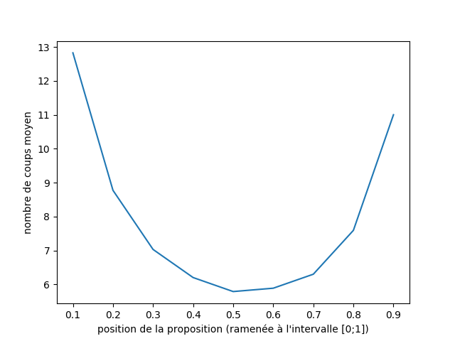
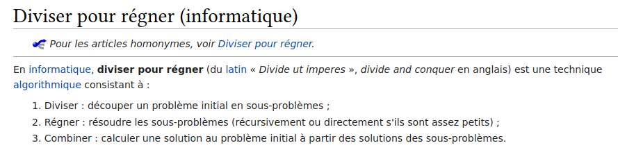
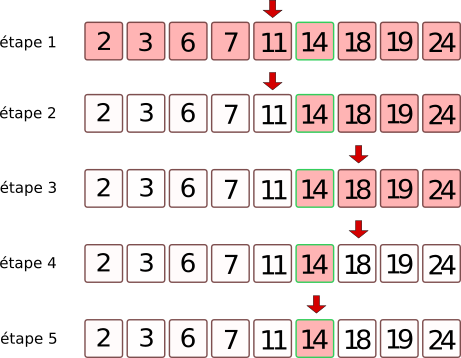
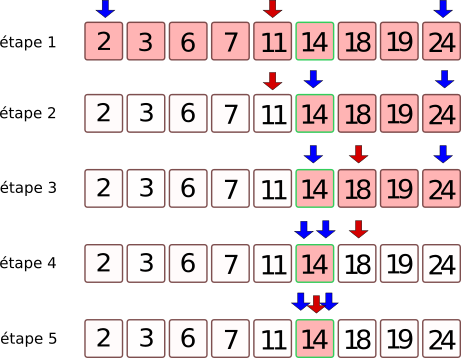
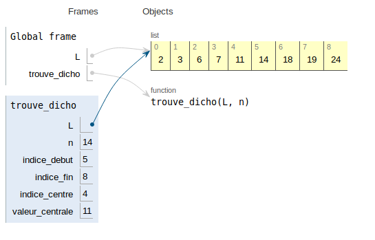

# 4.5 Dichotomie

*ou comment rechercher efficacement dans une liste triée ?*

{: .center}

{: .center}

«dichotomie» se dit en anglais *binary search*.


<!--
## Jeu du *"devine un nombre entre 1 et 100"*
Si je choisis un nombre entre 1 et 100, quelle est la stratégie optimale pour deviner ce nombre le plus vite possible ?  
(à chaque étape, une indication (trop grand, trop petit) permet d'affiner la proposition suivante)

**Réponse attendue :** la meilleure stratégie est de *couper en deux* à chaque fois l'intervalle d'étude. On démarre de 50, puis 75 ou 25, etc.


Il convient toute fois de remettre en question cette méthode qui paraît *naturellement* optimale : si je propose 90 comme nombre de départ, j'ai certes moins de chance que le nombre soit entre 90 et 100, mais s'il l'est, j'ai gagné un gros avantage car mon nouvel intervalle est très réduit.

On peut alors rappeler la notion d'**espérance probabiliste**.

Exemple : "On lance un dé, s'il tombe sur le 6 vous recevez 2 euros, sinon vous me donnez 1 euro. Voulez-vous jouer ?" 

**Retour sur le jeu du choix du nombre**

Le graphique ci-dessous représente le nombre de coups moyens (sur 10 000 parties simulées)



**Interprétations et remarques** 
- si le choix se porte *toujours* sur le nombre situé à la moitié de l'intervalle (0.5), le nombre de coups moyen avant la victoire (sur 10 000 parties) est environ 6.
- si le choix se porte *toujours* sur le nombre situé à 90 % de l'intervalle (0.9), le nombre de coups moyen avant la victoire (sur 10 000 parties) est environ 11.
- l'asymétrie de la courbe (qui devrait être symétrique) est due aux arrondis par défaut dans le cas de nombres non entiers.

## Conclusion générale de l'activité d'introduction
La stratégie optimale est de diviser en deux à chaque étape l'intervalle d'étude. On appelle cela une méthode par **dichotomie**, du grec ancien διχοτομία, dikhotomia (« division en deux parties »).

La méthode de dichotomie fait partie des méthodes dites *«diviser pour mieux régner»*. 

Extrait de [Wikipedia](https://fr.wikipedia.org/wiki/Diviser_pour_r%C3%A9gner_(informatique)) :



-->
##  1. Algorithmes de recherche d'une valeur dans une liste triée

**Préambule** : la méthode que nous allons utiliser implique que les valeurs ont été **triées** auparavant.

Si les valeurs ne sont pas triées (ou pas triables), cela peut vite être problématique.

**Exemple :** pouvez-vous deviner la couleur à laquelle je pense ?


```python
coul = ["bleu", "jaune", "rouge", "vert", "violet", "marron"]
```

*hormis le test de toutes les valeurs, aucune méthode efficace n'est possible.*

Dans toute la suite, nous rechercherons un élément dans une liste d'entiers **triée** dans l'ordre croissant. 

Considérons donc la liste L suivante : 

{: .center}


```python
L = [2, 3, 6, 7, 11, 14, 18, 19, 24]
```

L'objectif est de définir un algorithme de recherche efficace d'une valeur arbitraire présente dans cette liste.

### 1.1 Méthode naïve : recherche par balayage
C'est la méthode la plus intuitive : on essaie toutes les valeurs (par exemple, dans l'ordre croissant) jusqu'à trouver la bonne.

### Exercice 1  

!!! abstract "Exercice 1"
    === "Énoncé"
        Écrire un code permettant d'afficher l'indice de la valeur `14` dans la liste `lst = [2, 3, 6, 7, 11, 14, 18, 19, 24]`.
    === "Correction"
        ```python linenums='1'
        lst = [2, 3, 6, 7, 11, 14, 18, 19, 24]
        for k in range(len(L)):
            if L[k] ==  14 :
        return k
        ```


!!! abstract "Exercice 1"
    === "Énoncé"
        Écrire une fonction `trouve(lst, val)` qui renvoie l'indice d'une valeur `val` dans une liste `lst `. Si la valeur `val` n'est pas trouvée, on renverra `"non trouvé"`.
    === "Correction"
        ```python linenums='1'
        def trouve(val, lst) :
            for k in range(len(L)) :
                if L[k] == val:
                    return k
            return "non trouvé"

        ```


### 1.2 Complexité de la méthode

Le nombre (maximal) d'opérations nécessaires est proportionnel à la taille de la liste à étudier. Si on appelle $n$ la longueur de la liste, on dit que cet algorithme est **d'ordre $n$**, ou **linéaire**, ou en $O(n)$.

**Questions :** 

- La méthode utilisée nécessitait-elle que la liste soit triée ?
- Est-on sûr que cet algorithme s'arrête ? 


## 2. Méthode 2 : recherche dichotomique
Comment appliquer la méthode vue dans l'activité d'introduction ? 


Exemple d'algorithme :

- on se place *au milieu* de la liste.
- on regarde si on est inférieur ou supérieur à la valeur cherchée.
- on ne garde que la bonne moitié de la liste qui nous intéresse, et on recommence jusqu'à trouver la bonne valeur.


### 2.1 Illustration

Recherchons la valeur 14 dans notre liste `L`.

{: .center}


- étape 1 : toute la liste est à traiter. On se place sur l'élément central. Son indice est la partie entière de la moitié de la longueur de la liste. Ici il y a 9 éléments, donc on se place sur le 4ème, qui est 11.
- étape 2 : on compare 11 à la valeur cherchée (14). Il faut donc garder tout ce qui est supérieur à 11.
- étape 3 : on se place au milieu de la liste des valeurs qu'il reste à traiter. Ici il y a 4 valeurs, donc il n'y a pas de valeur centrale. On va donc se positionner sur la 2ème valeur, qui est 18.
- étape 4 : on compare la valeur 18 à la valeur cherchée : 14. Elle est supérieure, donc on garde ce qui est à gauche. Il n'y a plus qu'une valeur.
- étape 5 : on se place sur la valeur 14 et on compare avec 14. La valeur est trouvée.

### 2.2 Programmation de la méthode de dichotomie

Nous allons travailler avec deux variables `indice_debut` et `indice_fin` qui vont délimiter la liste à étudier. Ces indices sont représentés en bleu sur la figure ci-dessous. La valeur de l'`indice_central` (représenté en rouge) sera égale à `(indice_debut + indice_fin) // 2`
{: .center}

Le programme s'arrête lorsque la valeur cherchée a été trouvée, ou lorsque `indice_fin` devint inférieur à `indice_debut`.


```python
def trouve_dicho(L, n) :
    indice_debut = ...
    indice_fin = ...
    while indice_debut <= indice_fin :
        indice_centre = (... + ...) // 2     # on prend l'indice central
        valeur_centrale = L[...]             # on prend la valeur centrale 
        if valeur_centrale == ... :          # si la valeur centrale est la valeur cherchée...
            return indice_centre
        if valeur_centrale < ... :             # si la valeur centrale est trop petite...
            indice_debut = indice_centre + 1
        else :
            indice_fin = indice_centre - 1
    return None
        
```


```python
L = [2, 3, 6, 7, 11, 14, 18, 19, 24]
print(trouve_dicho(L,14))
print(trouve_dicho(L,2))
print(trouve_dicho(L,24))
print(trouve_dicho(L,1976))
```

    5
    0
    8
    None


Une visualisation de l'évolution des variables `indice_debut` et `indice_fin` est disponible sur le site pythontutor via [ce lien](http://pythontutor.com/visualize.html#code=L%20%3D%20%5B2,%203,%206,%207,%2011,%2014,%2018,%2019,%2024%5D%0A%0Adef%20trouve_dicho%28L,%20n%29%20%3A%0A%20%20%20%20indice_debut%20%3D%200%0A%20%20%20%20indice_fin%20%3D%20len%28L%29%20-%201%0A%20%20%20%20while%20indice_debut%20%3C%3D%20indice_fin%20%3A%0A%20%20%20%20%20%20%20%20indice_centre%20%3D%20%28indice_debut%20%2B%20indice_fin%29%20//%202%0A%20%20%20%20%20%20%20%20valeur_centrale%20%3D%20L%5Bindice_centre%5D%0A%20%20%20%20%20%20%20%20if%20valeur_centrale%20%3D%3D%20n%20%3A%0A%20%20%20%20%20%20%20%20%20%20%20%20return%20indice_centre%0A%20%20%20%20%20%20%20%20if%20valeur_centrale%20%3C%20n%20%3A%0A%20%20%20%20%20%20%20%20%20%20%20%20indice_debut%20%3D%20indice_centre%20%2B%201%0A%20%20%20%20%20%20%20%20else%20%3A%0A%20%20%20%20%20%20%20%20%20%20%20%20indice_fin%20%3D%20indice_centre%20-%201%0A%20%20%20%20return%20None%0A%0Aprint%28trouve_dicho%28L,14%29%29&cumulative=false&curInstr=0&heapPrimitives=nevernest&mode=display&origin=opt-frontend.js&py=3&rawInputLstJSON=%5B%5D&textReferences=false).

{: .center}


### 2.3 Terminaison de l'algorithme
Est-on sûr que l'algorithme va se terminer ?  
La boucle `while` qui est utilisée doit nous inciter à la prudence (voir [cours](https://github.com/glassus/nsi/blob/master/Premiere/Theme01_Bases_de_Python/02_Boucle_while/boucles_while.ipynb) sur la boucle While).  
Il y a en effet le risque de rentrer dans une boucle infinie.  
Pourquoi n'est-ce pas le cas ?

**Aide :** observer la position des deux flèches bleues lors de l'exécution de l'algorithme 
{: .center}


La condition de la boucle `while` est `indice_debut <= indice_fin `, qui pourrait aussi s'écrire `indice_fin >= indice_debut `.  
Au démarrage de la boucle, on a :


```python
    indice_debut = 0
    indice_fin = len(L) - 1
```

Ceci qui nous assure donc de bien rentrer dans la boucle. 

Ensuite, à chaque étape, les deux variables `indice_debut` et `indice_fin` vont se **rapprocher** jusqu'à ce que le programme rencontre un `return` ou bien jusqu'à ce que `indice_fin` devienne inférieur à `indice_debut`.  

Ceci nous assure donc que le programme va bien se terminer.

**Variant de boucle**  
On dit que la valeur `indice_fin - indice_debut ` représente le **variant de boucle** de cet algorithme. 
Ce variant est un nombre entier, d'abord strictement positif, puis qui va décroître jusqu'à la valeur 0.

### 2.4 Complexité de l'algorithme

Combien d'étapes (au maximum) sont-elles nécessaires pour arriver à la fin de l'algorithme ?  
Imaginons que la liste initiale possède 8 valeurs. 
Après une étape, il ne reste que 4 valeurs à traiter. 
Puis 2 valeurs.  
Puis une seule valeur.  
Il y a donc 3 étapes avant de trouver la valeur cherchée.

**Exercice :**  
1. Remplissez le tableau ci-dessous :

| taille de la liste | 1 | 2 | 4 | 8 | 16 | 32 | 64 | 128 | 256 |
| :----------------- |:-:|:-:|:-:|:-:|:-:|:-:|:-:|:-:|:-:|
| nombre d'étapes    | _ | _ |  _  |   3 |  _ | _   | _   | _   | _   |  _  |

2. Pouvez-vous deviner le nombre d'étapes nécessaires pour une liste de 4096 termes ?
3. Pour une liste de $2^n$ termes, quel est le nombre d'étapes ?

**Conclusion :** C'est le nombre de puissances de 2 que contient le nombre $N$ de termes de la liste qui est déterminant dans la complexité de l'algorithme. Ce nombre s'appelle le *logarithme de base 2* et se note $\log_2(N)$. On dit que l'algorithme de dichotomie a une **vitesse logarithmique**. On rencontrera parfois la notation $O(\log_2(n))$.

## 3. Expériences et comparaison des vitesses d'exécution

#### Avec une liste contenant 100 000 valeurs 


```python
# cette ligne de code permet de transformer le contenu du fichier input_centmille.txt
# en une liste L de 100 000 valeurs.

L = open("data/input_centmille.txt",'r').read().split('\n')

```

Mesurons le temps nécessaire pour trouver l'indice de la dernière valeur de la liste (qui est 299474) avec la méthode de balayage (méthode 1) :


```python
%timeit trouve(L, 299474)
```

    4.43 ms ± 86.1 µs per loop (mean ± std. dev. of 7 runs, 100 loops each)


Mesurons le temps nécessaire pour trouver l'indice de la dernière valeur de la liste (qui est 299474) avec la méthode par dichotomie (méthode 2) :


```python
%timeit trouve_dicho(L, 299474)
```

    3.21 µs ± 19.6 ns per loop (mean ± std. dev. of 7 runs, 100000 loops each)


**Comparaison des deux méthodes :** l'algorithme dichotomique est bien plus rapide que l'algorithme de balayage (la différence d'ordre de grandeur est de $10^3$, qui correspond bien à l'ordre de grandeur de $\frac{n}{\log(n)}$ lorsque $n$ vaut $10^5$).

#### Avec une liste contenant 1 000 000 valeurs (soit 10 fois plus que la liste précédente)


```python
# ce code permet de transformer le contenu du fichier million.txt en une liste L de 1 000 000 valeurs.
f = open("data/input_million.txt",'r')
l = f.readlines()
L = []
for k in l :
    L.append(int(k[:-1]))
```

Mesurons le temps nécessaire pour trouver l'indice de la dernière valeur de la liste (qui est 2999306) avec la méthode de balayage (méthode 1) :


```python
%timeit trouve(L, 2999306)
```

    46.9 ms ± 615 µs per loop (mean ± std. dev. of 7 runs, 10 loops each)


Mesurons le temps nécessaire pour trouver l'indice de la dernière valeur de la liste (qui est 2999306) avec la méthode par dichotomie (méthode 2) :


```python
%timeit trouve_dicho(L, 2999306)
```

    3.04 µs ± 39.4 ns per loop (mean ± std. dev. of 7 runs, 100000 loops each)


**Comparaison des deux méthodes :** l'algorithme dichotomique est toujours bien plus rapide que l'algorithme de balayage (la différence d'ordre de grandeur est de $10^4$, qui correspond bien à l'ordre de grandeur de $\frac{n}{\log(n)}$ lorsque $n$ vaut $10^6$).

### Influence de la taille de la liste sur la vitesse de chaque méthode :
- méthode 1: la recherche dans une liste 10 fois plus grand prend environ 10 fois plus de temps : la vitesse de l'algorithme est bien proportionnelle à la taille $n$ de la liste. $ \frac{10^6}{10^5} = 10$
- méthode 2: la recherche dans une liste 10 fois plus grand prend environ 1,2 fois plus de temps : la vitesse de l'algorithme est bien proportionnelle au **logarithme** de la taille $n$ de la liste.  $\frac{\log(1000000)}{\log(100000)} \approx 1,2$


**Remarque :** Il ne faut toutefois pas oublier que la méthode dichotomique, bien plus rapide, nécessite que la liste ait été auparavant triée. Ce qui rajoute du temps de calcul ! (cf [tri par insertion](https://github.com/glassus/nsi/blob/master/Premiere/Theme05_Algorithmique/03_Tri_par_insertion.ipynb) ou [tri par sélection](https://github.com/glassus/nsi/blob/master/Premiere/Theme05_Algorithmique/04_Tri_par_selection.ipynb) )


```python

```
