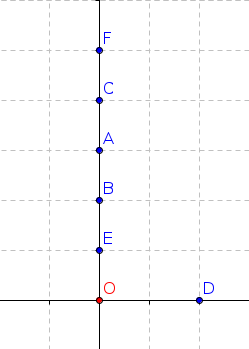
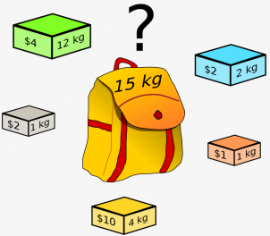

# 4.6 Algorithmes gloutons
en anglais : _greedy algorithms_

{: .center}


{: .center}


!!! abstract "Définition :heart:"
    Un algorithme est qualifié de **glouton** si le problème qu'il essaie de résoudre est décomposé en une succession de problèmes identiques pour lesquels l'algorithme va chercher une solution optimale.  

La question (presque philosophique) est : 

*Lorsqu'on fait à chaque étape le meilleur choix possible, est-ce que la solution finale à laquelle on arrive est la meilleure possible ?*

Formulé autrement :

*Est-ce que faire le meilleur choix à chaque étape nous assure le meilleur choix global ?*

## 1. Exemples d'algorithmes gloutons

### 1.1 Un plus court chemin ?


* Vous partez du point O. 
* Vous devez avoir atteint le plus rapidement possible tous les points A, B, C, D, E, F. 
* L'ordre de parcours des points n'est pas important.

{: .center}


La philosophie de l'algorithme glouton implique qu'à chaque étape, vous allez vous diriger vers le point le plus proche. 

Quel est alors le parcours final ?

??? tip "Réponse"
    Voilà ce que donnerait l'algorithme glouton :
    {: .center}

Ce chemin est-il optimal ?

??? tip "Réponse"
    Non ! Celui ci-dessous est meilleur :
    {: .center}

    Le fait d'avoir privilégié à chaque étape le meilleur choix local nous a empêché de voir le meilleur choix global.

### 1.2 Remplir un rectangle avec des carrés
*(d'après S.Tummarello et E.Buonocore)*

On considère un rectangle de dimension 11 sur 13 (figure 0). On veut remplir ce rectangle avec le minimum de carrés.

{: .center}

Un algorithme glouton va chercher à positionner d'abord le plus grand carré possible (figure 1). 

C'est une stratégie efficace (8 carrés nécessaires), mais qui n'est pas optimale : la figure 2 présente un pavage avec seulement 6 carrés.

Encore une fois, la solution gloutonne n'est pas la solution optimale.

Est-ce qu'un algorithme glouton va **toujours** passer à côté de la solution optimale ? 
Non ! Il arrive *aussi* qu'il donne la solution optimale. Changeons le rectangle initial en un rectangle de 10 sur 15 :

{: .center}

Dans cette situation, l'algorithme glouton nous amène à la solution optimale.

## Conclusion :


Un algorithme glouton est une méthode rapide et souvent efficace, mais qui ne garantit pas l'optimalité de la solution trouvée.

**La succession de meilleurs choix LOCAUX va nous amener à une *bonne* solution GLOBALE, mais ne nous garantit pas d'arriver à la solution optimale.**

##  2. Le problème du rendu de monnaie

Nous allons travailler avec des pièces (ou billets) de 1, 2, 5, 10, 20, 50, 100, 200 euros.

L'objectif est de créer un programme renvoyant, pour une somme ```somme_a_rendre``` entrée en paramètre, la combinaison utilisant un **minimum** de pièces ou de billets pour fabriquer la somme ```somme_a_rendre```. 

Par exemple, lorsque vous payez avec 20 € un objet coûtant 11 €, vous préférez qu'on vous rende vos 9 € de monnaie par $$ 9 = 5 + 2+2$$ plutôt que par $$ 9=2+2+2+1+1+1$$

La résolution de ce problème peut se faire de manière gloutonne : à chaque étape, vous allez essayer de rendre la plus grosse pièce (ou billet) possible.

### 2.1 Solution du problème

!!! note "Rendu de monnaie :heart: :heart: :heart:"
    ```python linenums='1'
    def rendu(somme_a_rendre):
        pieces = [200, 100, 50, 20, 10, 5, 2, 1]
        i =  0   # (1) 
        solution = []
        while somme_a_rendre > 0:
            if pieces[i] <= somme_a_rendre : # (2) 
                solution.append(pieces[i])   # (3) 
                somme_a_rendre = somme_a_rendre - pieces[i] # (4)
            else :
                i += 1   # (5) 
        return solution
    ```

    1. On part du 1er indice -> la plus grande pièce
    2. Est-ce que la pièce peut être rendue ?
    3. On garde la pièce dans la liste `solution`
    4. On met à jour la somme à rendre.
    5. La pièce était trop grosse, on avance dans la liste.


Utilisation : `rendu(13)` doit renvoyer `[10, 2, 1]`


```python
>>> rendu(13)
    [10, 2, 1]
>>> rendu(58)
    [50, 5, 2, 1]
```


### 2.2 Une solution optimale ?

Imaginons qu'il n'y ait plus de pièces de 10 et 5 euros. 
Faites fonctionner votre algorithme pour la somme de 63 euros.

<!-- 
```python
pieces  = [1, 2, 20, 50, 100, 200]

def rendu(somme_a_rendre):
    i =  len(pieces) - 1
    solution = []
    while somme_a_rendre > 0:
        if pieces[i] <= somme_a_rendre :
            solution.append(pieces[i])
            somme_a_rendre = somme_a_rendre - pieces[i]
        else :
            i -= 1
    return solution
```
-->

```python
>>> rendu(63)
   [50, 2, 2, 2, 2, 2, 2, 1]
```

Damned ! Mais ce n'est pas une solution optimale !  
`[20, 20, 20, 2, 1]` serait bien mieux.

**Moralité** : Lors d'un rendu de monnaie, l'algorithme glouton n'est optimal que _sous certaines conditions_, ce qui est un peu décevant. Un système de monnaie qui rend l'algorithme glouton est dit **canonique**. Il est difficile de caractériser mathématiquement si un système de monnaie est canonique ou pas.

## 3. Le problème du sac à dos _(Knapsack Problem)_

{: .center}


Le problème est celui-ci : vous disposez d'un sac d'une contenance limitée (sur le dessin ci-dessus, 15kg) et vous souhaitez maximiser la valeur totale des objets que vous mettez dans votre sac. Evidemment, la somme de leur masse ne doit pas dépasser 15 kg.

Ce problème (de la catégorie des problème dits d'_analyse combinatoire_) malgré sa simplicité est **un problème majeur** d'optimisation. 

Actuellement :


*   On sait trouver LA meilleure solution, mais en explorant toutes les combinaisons une par une. Cette méthode par **force brute** est inapplicable si beaucoup d'objets sont en jeu.
*   On sait facilement trouver une _bonne_ solution, mais pas forcément la meilleure, par exemple en adoptant une stratégie gloutonne.
* On ne sait pas trouver facilement (en temps polynomial) la meilleure solution. Si vous y arrivez, [1 Million de $](https://www.claymath.org/millennium-problems/p-vs-np-problem){. target="_blank"} sont pour vous.


### 3.1 Petite aide technique avant de commencer

Supposons qu'on dispose d'une liste  `mylist = [["A",3], ["B",2], ["C",8]]`. 

Comment classer les éléments de cette liste par leur deuxième élément ???

Nous allons procéder en 2 temps :

- création d'une fonction qui renvoie le deuxième élément d'un objet `liste`
- tri de la liste grâce à cette fonction


```python
>>> mylist = [["A",3], ["B",2], ["C",8]]
>>> def le_deuxieme(k) :
    return k[1]

>>> simpsons = ['Bart', 'Lisa', 'Maggie']
>>> le_deuxieme(simpsons)
  'Lisa'
>>> mynewlist = sorted(mylist, key = le_deuxieme, reverse = True)
>>> mynewlist
[['C', 8], ['A', 3], ['B', 2]]

```


### 3.2 Retour sur le problème du sac à dos
On considère un sac de 40 kg et les objets suivants :

| objet  |  A  |  B  |  C  |  D  |  E  |  F  |
|:------:|:---:|:---:|:---:|:---:|:---:|:---:|
|  masse |  13 |  12 |  8  |  10 |  14 |  18 |
| valeur | 700 | 500 | 200 | 300 | 600 | 800 |

Quels objets faut-il prendre ?

**Stratégie gloutonne :**

- on va classer les objets dans l'ordre décroissant de leur taux de valeur (taux de valeur = valeur / masse). Ainsi le premier élément de la liste sera celui ayant le meilleur rapport valeur/masse.
- on prend le premier élément de la liste, puis le deuxième, etc., tant que le sac peut encore les contenir.


```python
>>> objets = [["A", 13, 700], ["B", 12, 500], ["C", 8, 200], ["D", 10, 300], ["E", 14, 600], ["F", 18, 800]]
>>> poids_max = 40
>>> def ratio(objet):
        # renvoie le rapport prix/poids d'un objet
        return objet[2] / objet[1]

>>> objets_tries = sorted(objets, key = ratio, reverse = True)
>>> objets_tries
     [['A', 13, 700],
     ['F', 18, 800],
     ['E', 14, 600],
     ['B', 12, 500],
     ['D', 10, 300],
     ['C', 8, 200]]
```


**Calcul de la solution, par méthode gloutonne**


```python linenums='1'
objets  = [["A", 13, 700], ["B", 12, 500], ["C", 8, 200], ["D", 10, 300], ["E", 14, 600], ["F", 18, 800]]

def ratio(objet):
    # renvoie le rapport prix/poids d'un objet
    return objet[2] / objet[1]

objets_tries = sorted(objets, key = ratio, reverse = True)

poids_max = 40
poids_sac = 0

butin = []

for objet in objets_tries:
    poids_objet = objet[1]
    if poids_objet + poids_sac < poids_max :
        butin.append(objet[0])
        poids_sac += poids_objet

```

```python
>>> butin
    ['A', 'F', 'C']
```


Il faut donc choisir la combinaison A, F, C. Elle est bien valide (poids 39) et rapporte 1700.

**Question** (toujours la même) :  

L'algorithme glouton nous a-t-il donné la solution **optimale** ?  
Nous allons pour cela avoir recours à la force brute pour tester toutes les combinaisons possibles.

### 3.3 Force brute 

- Il faut créer une liste de mots binaires qui vont correspondre à chaque combinaison. Par exemple, '101001' signifiera qu'on prend les objets A, C et F.
Cette liste est de taille $2^n$, où $n$ est le nombre d'objets. C'est cela qui pose problème : avec 80 objets, on obtient une liste à traiter qui contient plus de $10^{24}$ objets, soit de l'ordre de grandeur du nombre d'étoiles dans l'Univers observable, ou de gouttes d'eau dans la mer, ou du nombre de grains de sables au Sahara... (voir [https://fr.wikipedia.org/wiki/Ordres_de_grandeur_de_nombres](https://fr.wikipedia.org/wiki/Ordres_de_grandeur_de_nombres) )
- Une fois cette liste établie, il suffit de parcourir chaque élément et de calculer le poids total et la valeur totale correspondante. Si le poids total dépasse le poids autorisé, on met la valeur à 0 car cette combinaison ne nous intéresse pas.
- Il ne reste qu'à chercher la valeur maximale et regarder la combinaison à laquelle elle correspond.


```python
objets  = [["A", 13, 700], ["B", 12, 500], ["C", 8, 200], ["D", 10, 300], ["E", 14, 600], ["F", 18, 800]]
poids_max = 40
```

#### 3.3.1 La liste de tous les mots possibles

```python
combinaisons = []
for i in range(2**len(objets)):
    k = bin(i)[2:]
    s = '0'*(len(objets)-len(k)) + k
    combinaisons.append(s)
```

La liste `combinaisons` contient bien les 64 mots possibles ($2^6=64$) :


```python
>>> combinaisons
    ['000000',
     '000001',
     '000010',
     '000011',
     '000100',
     '000101',
     '000110',
     '000111',
     '001000',
     '001001',
     '001010',
     '001011',
     '001100',
     '001101',
     '001110',
     '001111',
     '010000',
     '010001',
     '010010',
     '010011',
     '010100',
     '010101',
     '010110',
     '010111',
     '011000',
     '011001',
     '011010',
     '011011',
     '011100',
     '011101',
     '011110',
     '011111',
     '100000',
     '100001',
     '100010',
     '100011',
     '100100',
     '100101',
     '100110',
     '100111',
     '101000',
     '101001',
     '101010',
     '101011',
     '101100',
     '101101',
     '101110',
     '101111',
     '110000',
     '110001',
     '110010',
     '110011',
     '110100',
     '110101',
     '110110',
     '110111',
     '111000',
     '111001',
     '111010',
     '111011',
     '111100',
     '111101',
     '111110',
     '111111']

```


```python linenums='1'
valeurs = [] 
poids = []
for comb in combinaisons :
    poids_comb = 0
    valeur = 0
    for i in range(len(objets)): 
        if comb[i] == '1':
            poids_comb += objets[i][1]
            valeur += objets[i][2]
    if poids_comb > poids_max :
        valeur = 0
    valeurs.append(valeur)
    poids.append(poids_comb)

valeur_max = max(valeurs)
meilleure_comb = combinaisons[valeurs.index(valeur_max)]
poids_comb = poids[valeurs.index(valeur_max)]

mot_sol = ""
for k in range(len(meilleure_comb)) :
    if meilleure_comb[k] == '1' :
        mot_sol += objets[k][0]
    
```
```python
>>> mot_sol
  'ABE'
```

re-Damned ! La force brute a mis en évidence une combinaison **meilleure que celle donnée par l'algorithme glouton**. 

En effet la combinaison A-B-E est bien valide (poids total 39) et rapporte 1800, donc 100 de mieux que la solution gloutonne.

Par contre, la force brute est inenvisageable pour si le nombre d'objets est grand, alors que la stratégie gloutonne reste très rapide.

## Conclusion 

La stratégie gloutonne donne très rapidement des solutions **satisfaisantes** mais **pas forcément optimales**. Pour beaucoup de problèmes (dont le problème du sac à dos), la recherche d'une solution optimale sans passer par la force brute semble impossible (mais n'est pas démontrée).  
Dans ce cas-là, la stratégie gloutonne peut être employée pour avoir vite et bien une solution convenable, même si peut-être non optimale. On dit que la stratégie gloutonne est une **heuristique** de résolution. On sait que ce n'est pas forcément optimal, mais faute de mieux, on s'en contente...
