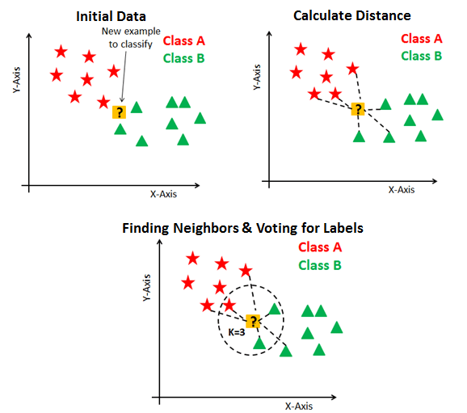
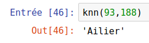

# Méthode du K-Nearest-Neighbours (KNN), aka les k-plus-proches-voisins
La méthode KNN est une méthode simple et efficace de classification. La classification est un enjeu majeur de l'Intelligence Artificielle :
- la caméra d'une voiture autonome perçoit un panneau, mais quel est ce panneau ?
- un grain de beauté est pris en photo par un dermatologue, ce grain de beauté est-il cancéreux ?
- ...

La méthode du KNN va trouver quels sont, dans une base de données déjà bien remplie et labellée, les k-objets (les 6 objets si $k=6$ par exemple) qui se rapprochent le plus de l'objet à classifier. En prenant ensuite la caractéristique la plus fréquente parmi ces 6 objets, on devine alors dans quelle catégorie notre objet doit se classer.




**Notre objectif :** 
Nous allons reprendre le jeu de données sur les joueurs du top14 utilisé ici https://github.com/glassus/nsi/blob/master/Premiere/Theme06_Traitement_de_donnees/03_Pandas_eleves.ipynb


**Question :** si on croise une personne nous disant qu'elle veut jouer en top14, et qu'elle nous donne son poids et sa taille, peut-on lui prédire à quel poste elle devrait jouer ?

Dans toute idée de classification il y a l'idée de **distance**. Il faut comprendre la distance comme une _mesure de la différence_. 

Comment mesurer la différence physique entre deux joueurs de rugby ? 


```python
import pandas as pd #import du module pandas, abrégé classiquement par "pd"
```


```python
df = pd.read_csv('data/top14.csv', encoding = 'utf-8')
```

### Résultat attendu :

Il faut créer une fonction `knn()` qui prend en argument `poids` et `taille` , sont les caractéristiques du nouveau joueur. La fonction doit renvoyer une chaîne de caractère correspondant au poste auquel elle est susceptible de jouer.

Exemple : 




```python
def knn(poids, taille):
  df['distance']=(df['Taille']-taille)**2+(df['Poids']-poids)**2
  newdf = df.sort_values(by='distance', ascending=True)
  newdftri = newdf.head(6) #on prend les 6 joueurs les plus proches physiquement
  sol = newdftri['Poste'].describe().top
  return sol
```


```python
knn(93,188)
```


    'Ailier'


## Influence du paramètre $k$

Dans le code précédent, on a travaillé avec $k=6$ et c'est le poste majoritaire parmi les 6 joueurs les plus proches qui a été donné par l'algorithme.  
Modifions légèrement la fonction `knn()` afin d'observer l'influence du paramètre $k$ sur la prédiction :


```python
def knn(poids, taille, k):
  df['distance']=(df['Taille']-taille)**2+(df['Poids']-poids)**2
  newdf = df.sort_values(by='distance', ascending=True)
  newdftri = newdf.head(k) #on prend les k joueurs les plus proches physiquement
  sol = newdftri['Poste'].describe().top
  return sol

for k in range(1,20):
    print(knn(93,188,k))
```

    Centre
    Ailier
    Ailier
    Ailier
    Ailier
    Ailier
    Ailier
    Ailier
    Ailier
    Ailier
    Ailier
    Ailier
    Ailier
    Ailier
    Ailier
    Ailier
    Ailier
    Ailier
    Ailier


On s'aperçoit que la prédiction est très stable... sauf si $k=1$ !  
Il se trouve qu'un joueur possède **exactement** ces caractéristiques physiques (Pierre-Louis BARASSI) et qu'il joue Centre :


```python
df['distance']=(df['Taille']-188)**2+(df['Poids']-93)**2
newdf = df.sort_values(by='distance', ascending=True)
newdf.head(10)
```


<div>
<style scoped>
    .dataframe tbody tr th:only-of-type {
        vertical-align: middle;
    }

    .dataframe tbody tr th {
        vertical-align: top;
    }

    .dataframe thead th {
        text-align: right;
    }
</style>
<table border="1" class="dataframe">
  <thead>
    <tr style="text-align: right;">
      <th></th>
      <th>Equipe</th>
      <th>Nom</th>
      <th>Poste</th>
      <th>Date de naissance</th>
      <th>Taille</th>
      <th>Poids</th>
      <th>distance</th>
    </tr>
  </thead>
  <tbody>
    <tr>
      <th>314</th>
      <td>Lyon</td>
      <td>Pierre-Louis BARASSI</td>
      <td>Centre</td>
      <td>22/04/1998</td>
      <td>188</td>
      <td>93</td>
      <td>0</td>
    </tr>
    <tr>
      <th>461</th>
      <td>Pau</td>
      <td>Vincent PINTO</td>
      <td>Ailier</td>
      <td>10/04/1999</td>
      <td>187</td>
      <td>93</td>
      <td>1</td>
    </tr>
    <tr>
      <th>527</th>
      <td>Toulon</td>
      <td>Stéphane ONAMBÉLÉ</td>
      <td>3ème ligne</td>
      <td>12/02/1993</td>
      <td>188</td>
      <td>94</td>
      <td>1</td>
    </tr>
    <tr>
      <th>202</th>
      <td>Castres</td>
      <td>Geoffrey PALIS</td>
      <td>Arrière</td>
      <td>08/07/1991</td>
      <td>189</td>
      <td>93</td>
      <td>1</td>
    </tr>
    <tr>
      <th>196</th>
      <td>Castres</td>
      <td>Armand BATLLE</td>
      <td>Ailier</td>
      <td>12/04/1987</td>
      <td>188</td>
      <td>92</td>
      <td>1</td>
    </tr>
    <tr>
      <th>585</th>
      <td>Toulouse</td>
      <td>Théo BELAN</td>
      <td>Centre</td>
      <td>15/11/1992</td>
      <td>187</td>
      <td>94</td>
      <td>2</td>
    </tr>
    <tr>
      <th>242</th>
      <td>Clermont</td>
      <td>Samuel EZEALA</td>
      <td>Ailier</td>
      <td>11/12/1999</td>
      <td>187</td>
      <td>94</td>
      <td>2</td>
    </tr>
    <tr>
      <th>502</th>
      <td>Racing92</td>
      <td>Simon ZEBO</td>
      <td>Ailier</td>
      <td>16/03/1990</td>
      <td>187</td>
      <td>94</td>
      <td>2</td>
    </tr>
    <tr>
      <th>133</th>
      <td>Brive</td>
      <td>Esteban ABADIE</td>
      <td>3ème ligne</td>
      <td>01/12/1997</td>
      <td>188</td>
      <td>95</td>
      <td>4</td>
    </tr>
    <tr>
      <th>369</th>
      <td>Montpellier</td>
      <td>Benjamin FALL</td>
      <td>Arrière</td>
      <td>03/03/1989</td>
      <td>186</td>
      <td>93</td>
      <td>4</td>
    </tr>
  </tbody>
</table>
</div>


On peut s'apercevoir aussi que jusqu'à $k=5$, aucun poste n'est majoritaire : la prédiction pourrait aussi bien renvoyer Centre, 3ème ligne, ou Arrière. Ce n'est que grâce à l'ordre alphabétique que la réponse renvoyée est «Ailier». Par contre, dès que $k \geqslant 5$, le poste d'Ailier est bien majoritaire parmi les $k$ plus proches voisins.


```python

```
