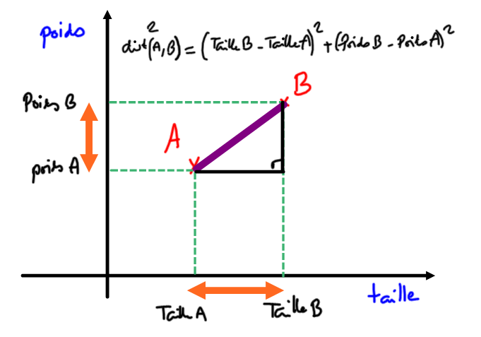

# 4.7 Algorithme des KNN

{: .center}

!!! abstract "Algorithme des K-Nearest-Neighbours (KNN), *aka les k-plus-proches-voisins* :heart:"
    La méthode KNN est une méthode simple et efficace de classification. La classification est un enjeu majeur de l'Intelligence Artificielle :

    - la caméra d'une voiture autonome perçoit un panneau, mais quel est ce panneau ?
    - un grain de beauté est pris en photo par un dermatologue, ce grain de beauté est-il cancéreux ?
    - ...

    La méthode du KNN va trouver quels sont, dans une base de données déjà bien remplie et labellée, les k-objets (les 6 objets si $k=6$ par exemple) qui se rapprochent le plus de l'objet à classifier. En prenant ensuite la caractéristique la plus fréquente parmi ces 6 objets, on devine alors dans quelle catégorie notre objet doit se classer.


    {: .center}

## 1. Objectif 
Nous allons reprendre le jeu de données sur les joueurs du Top14 utilisé [dans le cours «Trier des données»](https://glassus.github.io/premiere_nsi/T5_Traitement_de_donnees/5.2_Trier_des_donnees/cours/){. target="_blank"}

Nous souhaitons pouvoir répondre à cette question :

**Question :** si on croise une personne (qu'on appelera joueur X) nous disant qu'elle veut jouer en Top14, et qu'elle nous donne son poids et sa taille, peut-on lui prédire à quel poste elle devrait jouer ?

Nous devons créer une fonction `conseil_poste` qui prend en argument `poids` et `taille` , sont les caractéristiques du joueur X. La fonction doit renvoyer une chaîne de caractère correspondant au poste auquel on lui conseille de jouer.


Il va falloir pour cela classer tous les joueurs du Top14 suivant leur proximité morphologique avec notre joueur X, et prendre parmi les ```k``` premiers joueurs le poste majoritaire.


## 2. Fonction ```distance``` morphologique 

Dans toute idée de classification il y a l'idée de **distance**. Il faut comprendre la distance comme une _mesure de la différence_. 

Comment mesurer la différence physique entre deux joueurs de rugby ? 

{: .center}


```python linenums='1'
def distance(poids, taille, player):
    p = int(player['Poids'])
    t = int(player['Taille'])
    return (poids-p)**2+(taille-t)**2
```


## 3. Classement des joueurs suivant leur proximité morphologique

De la même manière qu'on avait [classé les joueurs suivant leur IMC](https://glassus.github.io/premiere_nsi/T5_Traitement_de_donnees/5.2_Trier_des_donnees/cours/#22-un-exemple-de-tri-de-dictionnaire){. target="_blank"}, on peut les classer suivant leur proximité morphologique avec le joueur X.