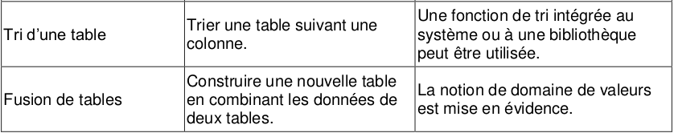

# 5.2 Trier des données

{: .center}


Nous reprenons notre fichier de joueurs de rugby du Top14. 


```python
import csv
f = open('top14.csv', "r", encoding = 'utf-8')
donnees = csv.DictReader(f)
joueurs = []
for ligne in donnees:
    joueurs.append(dict(ligne))
    
f.close()
```

## 1. Créer une fonction filtre
L'objectif est de créer une fonction `joueursEquipe(equipe)` qui renvoie une liste contentant tous les joueurs de l'équipe `equipe`. 
Le paramètre `equipe` sera donnée sous forme de chaîne de caractères. 
La valeur renvoyée sera de type liste.

??? tip "réponse"
    ```python
    def joueursEquipe(equipe):
        lst_joueurs = []
        for j in joueurs :
            if j['Equipe'] == equipe :
                lst_joueurs.append(j)
        
        return lst_joueurs

    ```


Définir de la même manière une fonction `joueursPoste(poste)`.


## 2. Utilisation d'une fonction de tri


### 2.1 Le problème
Comment classer les joueurs suivant leur taille ?
La fonction `sorted(liste)` est efficace sur les listes : elle renvoie une nouvelle liste triée dans l'ordre croissant.


```python
>>> mylist = [4,2,8,6]
>>> mynewlist = sorted(mylist)
>>> print(mynewlist)
  [2, 4, 6, 8]
```

  


Mais comment trier un dictionnaire ? 


```python
>>> test = sorted(joueurs)
```


    ---------------------------------------------------------------------------

    TypeError                                 Traceback (most recent call last)

    <ipython-input-14-de081d14a3da> in <module>
    ----> 1 test = sorted(joueurs)
    

    TypeError: '<' not supported between instances of 'dict' and 'dict'


Il est normal que cette tentative échoue : un dictionnaire possède plusieurs clés différentes.
Ici, plusieurs clés peuvent être des critères de tri : la taille, le poids.

### 2.2 Un exemple de tri de dictionnaire


```python
>>> Simpsons = [{"Prenom" : "Bart", "age estimé": "10"},
           {"Prenom" : "Lisa", "age estimé": "8"},
           {"Prenom" : "Maggie", "age estimé": "1"},
           {"Prenom" : "Homer", "age estimé": "38"},
           {"Prenom" : "Marge", "age estimé": "37"}]
```


```python
>>> def age(personnage):
        return int(personnage["age estimé"])
```


```python
>>> age(Simpsons[0])
   10
```


La création de cette fonction `age()` va nous permettre de spécifier une clé de tri, par le paramètre `key` :

!!! note "Tri d'un dictionnaire :heart:"
    ```python
    >>> triSimpsons = sorted(Simpsons, key = age)
    ```


```python
>>> triSimpsons
    [{'Prenom': 'Maggie', 'age estimé': '1'},
     {'Prenom': 'Lisa', 'age estimé': '8'},
     {'Prenom': 'Bart', 'age estimé': '10'},
     {'Prenom': 'Marge', 'age estimé': '37'},
     {'Prenom': 'Homer', 'age estimé': '38'}]

```


On peut aussi inverser l'ordre de tri :


```python
>>> triSimpsons = sorted(Simpsons, key = age, reverse = True)
>>> triSimpsons
    [{'Prenom': 'Homer', 'age estimé': '38'},
     {'Prenom': 'Marge', 'age estimé': '37'},
     {'Prenom': 'Bart', 'age estimé': '10'},
     {'Prenom': 'Lisa', 'age estimé': '8'},
     {'Prenom': 'Maggie', 'age estimé': '1'}]

```


!!! abstract "Exercice 1"
    === "Énoncé"
        Trier les joueurs du top14 par taille.
    === "Correction"
        ```python
        >>> def taillePlayer(player) :
                return int(player['Taille'])
        >>> joueurs_taille_croissant = sorted(joueurs, key = taillePlayer)
        ```

!!! abstract "Exercice 2"
    === "Énoncé"
        Trier les joueurs du top14 par poids.
    === "Correction"
        ```python
        >>> def poidsPlayer(player) :
                return int(player['Poids'])
        >>> joueurs_poids_croissant = sorted(joueurs, key = poidsPlayer)
        ```
!!! abstract "Exercice 3"
    === "Énoncé"
        Trier les joueurs de Bordeaux suivant leur Indice de Masse Corporelle ([IMC](https://fr.wikipedia.org/wiki/Indice_de_masse_corporelle) )
    === "Correction"
        ```python
        >>> def IMC(player):
                masse = int(player['Poids'])
                taille_m = int(player['Taille']) / 100
                return masse / taille_m**2
        >>> joueursUBB = [k for k in joueurs if k['Equipe'] == 'Bordeaux']
        >>> joueursUBB_tri = sorted(joueursUBB, key = IMC)
        ```


## 3. Recherche des joueurs de profil physique similaire

### 3.1 Distance entre deux joueurs
Construire une fonction `distance(joueur1,joueur2)` qui renvoie la somme des carrés des différences de tailles et de poids entre les joueurs `joueur1` et `joueur2` : 
$$ d = (p_1-p_2)^2 + (t_1-t_2)^2$$


??? tip "réponse"
    ```python
    def distance(joueur1,joueur2):
        p1 = int(joueur1['Poids'])
        p2 = int(joueur2['Poids'])
        t1 = int(joueur1['Taille'])
        t2 = int(joueur2['Taille'])
        return (p1-p2)**2+(t1-t2)**2
    ```

### 3.2 Distance des joueurs avec Baptiste Serin

Retrouvons d'abord le numéro de Baptiste Serin dans notre classement de joueurs :


```python
>>>  for k in range(len(joueurs)) :
        if joueurs[k]['Nom'] == 'Baptiste SERIN' :
            print(k)
530
```


```python
>>> joueurs[530]
    {'Equipe': 'Toulon',
     'Nom': 'Baptiste SERIN',
     'Poste': 'Mêlée',
     'Date de naissance': '20/06/1994',
     'Taille': '180',
     'Poids': '79'}
```


Nous pouvons maintenant classer les joueurs suivant leur distance morphologique à Baptiste  SERIN :


```python
>>> def distanceSerin(joueur2):
        return distance(joueurs[530],joueur2)
```


```python
>>> distanceSerin(joueurs[530])
 0
```


```python
>>> joueurs_VS_Serin = sorted(joueurs, key = distanceSerin)
```


```python
>>> joueurs_VS_Serin
```

