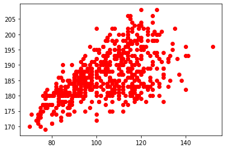
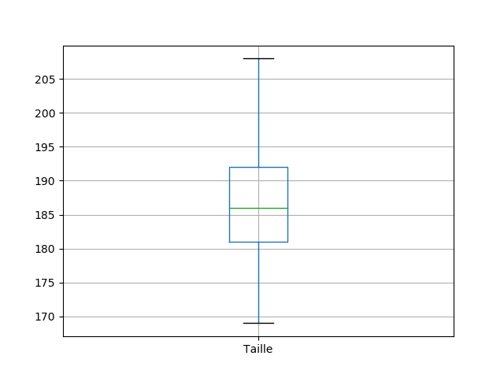
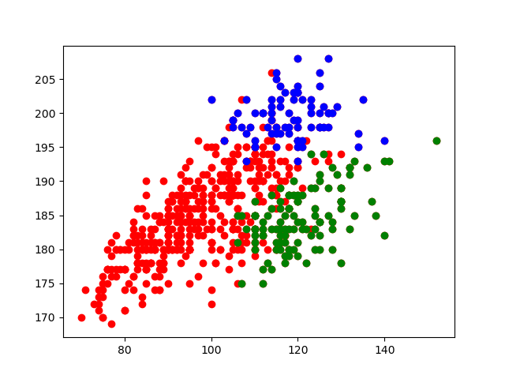

# 5.3 Utilisation du module Pandas


## 1. Introduction et première dataframe

Le module `csv` utilisé précédemment se contente de lire les données structurées. Il ne fait aucun effort particulier pour analyser les données. Nous nous en sommes aperçus lorsqu'il a fallu convertir par `int()` toutes les valeurs numériques, qui étaient interprétées comme des chaînes de caractères.  
La bibliothèque [pandas](https://pandas.pydata.org/){. target="_blank"}  est par contre spécialement conçue pour l'analyse des données (*data analysis*) : elle est donc naturellement bien plus performante.


!!! note "Importation du module ```pandas``` :heart:"
    L'import se fait classiquement par :
    ```python 
    import pandas as pd 
    ```

Le type de variable dans lequel ```pandas``` va stocker les données s'appelle une **dataframe**, qui sera souvent abrégée par ```df```.

Nous allons retravailler avec le fichier [`top14.csv ` :arrow_down:](../data/top14.csv).


!!! note "Première dataframe :heart:"
    Nos données seront ensuite importées dans la dataframe ```df``` par l'instruction :
    ```python 
    df = pd.read_csv('top14.csv', encoding = 'utf-8') 
    ```


```python
>>> type(df)
<class 'pandas.core.frame.DataFrame'>
```


## 2. Observation des données

Que contient la variable `df` ?


```python
>>> df
       Equipe                 Nom    Poste Date de naissance  Taille  Poids
0        Agen  Anton PEIKRISHVILI   Pilier        18/09/1987     183    122
1        Agen           Dave RYAN   Pilier        21/04/1986     183    116
2        Agen  Giorgi TETRASHVILI   Pilier        31/08/1993     177    112
3        Agen    Kamaliele TUFELE   Pilier        11/10/1995     182    123
4        Agen        Malino VANAÏ   Pilier        04/05/1993     183    119
..        ...                 ...      ...               ...     ...    ...
590  Toulouse          Werner KOK   Ailier        27/01/1993     177     78
591  Toulouse         Yoann HUGET   Ailier        02/06/1987     190     97
592  Toulouse       Matthis LEBEL  Arrière        25/03/1999     185     91
593  Toulouse       Maxime MÉDARD  Arrière        16/11/1986     180     85
594  Toulouse        Thomas RAMOS  Arrière        23/07/1995     178     86

[595 rows x 6 columns]
```


Les données sont présentées dans l'ordre originel du fichier. 


### 2.1 Structure globale des données

!!! abstract "La structure des données : ```info``` :heart:"
    ```python
    >>> df.info()
    <class 'pandas.core.frame.DataFrame'>
    RangeIndex: 595 entries, 0 to 594
    Data columns (total 6 columns):
     #   Column             Non-Null Count  Dtype 
    ---  ------             --------------  ----- 
     0   Equipe             595 non-null    object
     1   Nom                595 non-null    object
     2   Poste              595 non-null    object
     3   Date de naissance  595 non-null    object
     4   Taille             595 non-null    int64 
     5   Poids              595 non-null    int64 
    dtypes: int64(2), object(4)
    memory usage: 28.0+ KB
    ```

On peut y constater une très bonne nouvelle : les données numériques sont reconnues comme telles (type ```int64``` ).


### 2.2 Accès à une fiche particulière

D'après la commande précédente, il y a 595 entrées dans notre fichier de données. L'accès à une fiche particulière se fera avec la commande ```loc```.

!!! abstract "Accès à une fiche : ```loc``` :heart:"
    ```python
    >>> df.loc[312]
    Equipe                         Lyon
    Nom                  Charlie NGATAI
    Poste                        Centre
    Date de naissance        17/08/1990
    Taille                          188
    Poids                           103
    Name: 312, dtype: object
    ```    


### 2.3 Premières et dernières lignes


Il est toutefois possible d'avoir uniquement les premières lignes du fichier avec la commande `head()` et les dernières du fichier avec la commande `tail()`. Ces commandes peuvent recevoir en paramètre un nombre entier :

!!! abstract "Les premières lignes du fichier : ```head``` :heart:"
    ```python
    >>> df.head()
      Equipe                 Nom   Poste Date de naissance  Taille  Poids
    0   Agen  Anton PEIKRISHVILI  Pilier        18/09/1987     183    122
    1   Agen           Dave RYAN  Pilier        21/04/1986     183    116
    2   Agen  Giorgi TETRASHVILI  Pilier        31/08/1993     177    112
    3   Agen    Kamaliele TUFELE  Pilier        11/10/1995     182    123
    4   Agen        Malino VANAÏ  Pilier        04/05/1993     183    119

    >>> df.head(2)
      Equipe                 Nom   Poste Date de naissance  Taille  Poids
    0   Agen  Anton PEIKRISHVILI  Pilier        18/09/1987     183    122
    1   Agen           Dave RYAN  Pilier        21/04/1986     183    116
    ```


!!! abstract "Les dernières lignes du fichier : ```tail``` :heart:"
    ```python
    >>> df.tail()
           Equipe            Nom    Poste Date de naissance  Taille  Poids
    590  Toulouse     Werner KOK   Ailier        27/01/1993     177     78
    591  Toulouse    Yoann HUGET   Ailier        02/06/1987     190     97
    592  Toulouse  Matthis LEBEL  Arrière        25/03/1999     185     91
    593  Toulouse  Maxime MÉDARD  Arrière        16/11/1986     180     85
    594  Toulouse   Thomas RAMOS  Arrière        23/07/1995     178     86

    >>> df.tail(3)
           Equipe            Nom    Poste Date de naissance  Taille  Poids
    592  Toulouse  Matthis LEBEL  Arrière        25/03/1999     185     91
    593  Toulouse  Maxime MÉDARD  Arrière        16/11/1986     180     85
    594  Toulouse   Thomas RAMOS  Arrière        23/07/1995     178     86
    ```


## 3. Analyse automatique et filtrage

### 3.1 Extraction d'une colonne

L'idée générale est que l'on va créer de nouveaux objets contenant uniquement les renseignements qui nous intéressent.


!!! abstract "Extraction d'une colonne : ```df[colonne]```  :heart:"
    Pour créer une liste contenant uniquement les données numériques de la colonne `poids`, il suffit d'écrire :
    ```python
    poids = df['Poids']
    ```

La variable ```poids``` est un objet de type ```Series``` (assimilable à une liste)  qui va pouvoir être exploitée très facilement.

On peut d'ailleurs accéder à un élément particulier de cette variable :

```python
>>> poids[15]
114
```

On confirme donc une excellente nouvelle : les poids sont bien considérés nativement comme des nombres. On peut donc se servir de manière très intuitive de cette fonctionnalité pour faire des graphiques très facilement, sans conversion comme dans le module ```csv``` ! 


Pour trouver le poids minimal de cette série, on utilisera naturellement la fonction ```min``` :

```python
>>> min(poids)
70
```


Pour tracer notre nuage de points poids-taille, le code sera donc simplement :


```python
import matplotlib.pyplot as plt
X = df['Poids']
Y = df['Taille']
plt.plot(X, Y, 'ro')
plt.show()
```


    
{: .center}
    
### 3.2 Tri et Analyse automatique des données


L'interprétation numérique permet à `pandas` d'analyser automatiquement les données, avec notamment la fonction `describe()`.


!!! abstract "Résumé des données numériques : ```describe```  :heart: "
    ```python
    >>> df['Taille'].describe()
    count    595.000000
    mean     186.559664
    std        7.572615
    min      169.000000
    25%      181.000000
    50%      186.000000
    75%      192.000000
    max      208.000000
    Name: Taille, dtype: float64
    ```


On voit donc que les principaux indicateurs statistiques sont proposés. 

D'ailleurs, on peut très facilement tracer des boites à moustaches avec la fonction `boxplot()`.


```python
graph_taille = df.boxplot("Taille")
graph_taille.plot()
plt.show()
```


{: .center}


Pour les données non-numériques, la commande `describe()` n'est que peu d'utilité. Elle renseigne toutefois la valeur la plus fréquente (en statistiques, le *mode* ou *valeur modale*) grâce à ```describe().top```.

!!! abstract "Valeur modale de données non-numériques : ```describe().top```  :heart: "
    ```python
    >>> df['Poste'].describe().top
    '3ème ligne'
    ```

{: .center width=40%}


Pour avoir un détail plus précis de la répartition des données, on peut utiliser ```value_counts``` :


!!! abstract "Répartition des valeurs : ```value_counts```  :heart: "
    ```python
    >>> df['Poste'].value_counts()
    3ème ligne    111
    Pilier        110
    2ème ligne     74
    Centre         71
    Ailier         64
    Talonneur      50
    Mêlée          42
    Ouverture      38
    Arrière        35
    Name: Poste, dtype: int64
    ```

Il est possible aussi de trier la dataframe en lui indiquant la colonne de tri :

!!! abstract "Trier les données : ```sort_values```  :heart: "
    ```python
    >>> classement_par_taille = df.sort_values(by='Taille', ascending = True)
    ```


## 4. Filtres et recherches

Le principe du filtrage va être de créer une nouvelle *dataframe* ne contenant que des lignes correspondant à un certain critère.


!!! abstract "Filtrage des lignes : ```df[booléen]```  :heart: "
    Comment créer une *dataframe* ne contenant que les joueurs de l'UBB ?  
    L'idée syntaxique est d'écrire à l'intérieur de `df[]` le **test** qui permettra le filtrage.
    ```python
    >>> UBB = df[df['Equipe'] == 'Bordeaux']
    ```
    Le booléen ```df['Equipe'] == 'Bordeaux'``` doit se comprendre ainsi : on ne veut garder que les joueurs dont le champ ```Equipe``` est égal à ```'Bordeaux'```.


```python
>>> UBB
     Equipe                  Nom       Poste Date de naissance  Taille  Poids
80   Bordeaux     Jefferson POIROT      Pilier        01/11/1992     181    117
81   Bordeaux        Lasha TABIDZE      Pilier        04/07/1997     185    117
82   Bordeaux   Laurent DELBOULBÈS      Pilier        17/11/1986     181    106
83   Bordeaux    Lekso KAULASHVILI      Pilier        27/08/1992     187    120
84   Bordeaux           Peni RAVAI      Pilier        16/06/1990     185    119
...
```


{{ initexo(0) }}

!!! example "{{ exercice() }}"
    Créer une dataframe ```grands``` qui contient tous les joueurs mesurant plus de 2 mètres (inclus).

        
    ??? tip "Correction "
        ```python
        >>> grands = df[df['Taille'] >= 200]
        ```
    

Pour effectuer des opérations sur les booléens, on utilisera le symbole ```&``` pour le ET et ```|``` pour le OU.


!!! example "{{ exercice() }}"
     Créer une dataframe ```grands_et_gros``` qui contient tous les joueurs mesurant plus de 2 mètres (inclus) et pesant plus de 120 kg (inclus).

       
    ??? tip "Correction"
        ```python
        >>> grands_gros = df[(df['Taille'] >= 200) & (df['Poids'] >= 120)]
        ```

        Autre solution, en utilisant la datadframe ```grands``` de l'exercice 1 :
        ```python
        >>> grands_gros = grands[grands['Poids'] >= 120]
        ```
    

!!! example "{{ exercice() }}"
    Trouver en une seule ligne le joueur le plus léger du Top14.

      
    ??? tip "Correction"
        ```python
        >>> df[df['Poids'] == min(df['Poids'])]
               Equipe             Nom  Poste Date de naissance  Taille  Poids
        491  Racing92  Teddy IRIBAREN  Mêlée        25/09/1990     170     70
        ```

        ou bien
        ```python
        >>> df.sort_values(by='Poids', ascending=True).head(1)
        ```
    

!!! example "{{ exercice() }}"
    Tracer le nuage de point poids-taille comme précédemment, mais en marquant d'un point bleu les 2èmes ligne et d'un point rouge les piliers.

        
    ??? tip "Correction"
        ```python linenums='1'
        import pandas as pd
        import matplotlib.pyplot as plt

        df = pd.read_csv('top14.csv', encoding = 'utf-8') 

        X = df['Poids']
        Y = df['Taille']
        plt.plot(X, Y, 'ro')


        X = df[df['Poste'] == '2ème ligne']['Poids']
        Y = df[df['Poste'] == '2ème ligne']['Taille']
        plt.plot(X, Y, 'bo')


        X = df[df['Poste'] == 'Pilier']['Poids']
        Y = df[df['Poste'] == 'Pilier']['Taille']
        plt.plot(X, Y, 'go')
        ```

        {: .center}
     


## 5. Modification de la structure : rajout d'une colonne

Afin de pouvoir trier les joueurs suivant de nouveaux critères, nous allons rajouter un champ pour chaque joueur.
Prenons un exemple stupide : fabriquons un nouveau champ `'Poids après les vacances'` qui contiendra le poids des joueurs augmenté de 8 kg. 
Ceci se fera simplement par :

!!! abstract "Rajout d'une colonne  :heart: "
    ```python
    >>> df['Poids après les vacances'] = df['Poids'] + 8
    ```

On voit apparaitre dans la dataframe ```df``` une nouvelle colonne
```python
>>> df.head()
  Equipe                 Nom   Poste  ... Taille  Poids  Poids après les vacances
0   Agen  Anton PEIKRISHVILI  Pilier  ...    183    122                       130
1   Agen           Dave RYAN  Pilier  ...    183    116                       124
2   Agen  Giorgi TETRASHVILI  Pilier  ...    177    112                       120
3   Agen    Kamaliele TUFELE  Pilier  ...    182    123                       131
4   Agen        Malino VANAÏ  Pilier  ...    183    119                       127

[5 rows x 7 columns]
```

Pour supprimer cette colonne sans intérêt, il suffit de faire :
```python
del df['Poids après les vacances'] 
```


!!! example "{{ exercice() }}"
    **Q1.** Créer une colonne contenant l'IMC de chaque joueur.

    {# 
    ??? tip "Correction Q1"
        ```python
        >>> df['IMC'] = df['Poids'] / (df['Taille']/100)**2
        ```
    #}


    **Q2.** Créer une nouvelle dataframe contenant tous les joueurs du Top14 classés par ordre d'IMC croissant.
    
    {#
    ??? tip "Correction Q2"
        ```python
        >>> df_imc = df.sort_values(by='IMC', ascending = True)
        ```
    #}

## 6. Retour sur le KNN

Comme dans [ce cours](https://glassus.github.io/premiere_nsi/T4_Algorithmique/4.7_Algorithme_KNN/cours/){. target="_blank"}, nous allons construire une fonction  ```conseil_poste``` recevant en paramètres :

- ```df``` : la dataframe contenant nos données
- ```poids```  : le poids du joueur X
- ```taille``` : la taille du joueur X
- ```k``` : le nombre de joueurs les plus proches sur lequel on se base pour faire la prédiction

qui renvoie le poste le plus compatible avec la morphologie de X.

Il est maintenant possible de coder cette fonction beaucoup plus simplement (mais alors VRAIMENT beaucoup) qu'avec le module ```csv```. 

Il va nous suffir de :

- créer une nouvelle colonne contenant la [distance](https://glassus.github.io/premiere_nsi/T4_Algorithmique/4.7_Algorithme_KNN/cours/#2-fonction-distance-morphologique){. target="_blank"}  de chaque joueur avec le joueur X.
- classer la dataframe suivant cette nouvelle colonne.
- ne garder que les ```k``` premiers éléments.
- renvoyer le poste le plus fréquent parmi ces ```k``` premiers élements.


!!! abstract "Algorithme KNN  :heart: "

    ```python linenums='1'
    import pandas as pd

    df = pd.read_csv('top14.csv', encoding = 'utf-8') 

    def conseil_poste(df, poids, taille, k):
        ...
        ...
        ...
        ...
    ```

    {#
    ```python linenums='1'
    import pandas as pd

    df = pd.read_csv('top14.csv', encoding = 'utf-8') 

    def conseil_poste(df, poids, taille, k):
        df['distance'] = (df['Poids']-poids)**2 + (df['Taille']-taille)**2
        df = df.sort_values(by = 'distance', ascending=True)
        df = df.head(k)
        return df['Poste'].describe().top 
    ```
    #}


```python
>>> conseil_poste(df, 70, 160, 10)
'Mêlée'
>>> conseil_poste(df, 130, 160, 10)
'Pilier'
```
