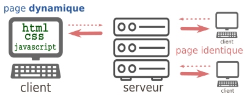
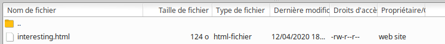
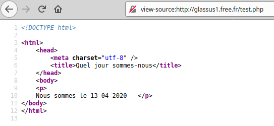
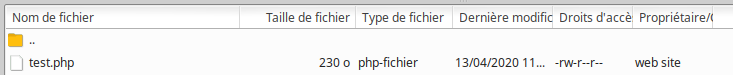

# 6.1 Pages web et interactions

{: .center}


{: .center}


## 1. Le cas le plus simple : la même page pour tout le monde

{: .center}

Nous allons tout d'abord considérer le cas où le serveur renvoie une page unique, identique pour tous les utilisateurs. De plus, l'utilisateur ne pourra pas agir sur sa page : il n'y a aucune interactivité.

Exemple de page statique côté serveur et côté utilisateur :

- cette [merveille](http://glassus1.free.fr/interesting.html){:target="_blank"} de page web.
- plus complète, mais tout aussi statique : cette page [Wikipedia](https://fr.wikipedia.org/wiki/John_Horton_Conway){:target="_blank"} consacrée à John Conway.

### 1.1 ```html```  pur

Lorsque le client demande au serveur le contenu d'une page web, celui-ci lui renvoie, dans le cas le plus simple, une simple page ```html```.  
```html``` est un langage dit « à balises ».  Ce n'est pas à proprement parler un langage de programmation, mais plutôt un langage de description de contenu. 
Il a été inventé en 1992 par [Tim Berners-Lee](https://fr.wikipedia.org/wiki/Tim_Berners-Lee){:target="_blank"}. La version actuellement utilisée est le ```html5```.


!!! abstract "Exemple de page web minimale"
    ```html
    <!DOCTYPE html>
    <html lang='fr'>
        <head>
            <meta charset="utf-8">
            <title>Un titre très original</title>
        </head>

        <body>
            <p>Ceci est le texte introductif de ma page.</p>
            <p>
              <h1>  Ceci est un titre de niveau 1 </h1>
              Mais sans rien d'intéressant.
              <h2>  Ceci est un titre de niveau 2 </h2>
                  <ul>
                      <li> le début d'une liste indentée </li>
                      <li> la suite ... </li>
                  </ul>  
            Pour apprendre le fonctionnement des balises, voir <a href="https://developer.mozilla.org/fr/docs/Apprendre/HTML/Introduction_%C3%A0_HTML/Getting_started"> ici</a> par exemple !
            </p>
        </body>
    </html>

    ```

Vous pouvez contempler [ici](https://exemplehtmlpur--g-lassus.repl.co){:target="_blank"} le rendu de cette magnifique page.

{{ initexo(0)}}
!!! example "{{ exercice() }}"
    === "Énoncé"
      - Créez un dossier contenant un fichier ```mapage.html```.
      - Créez une page contenant une image et un lien vers le site du lycée.
      - Vous pouvez utiliser le logiciel Geany, installé sur notre Debian.
      - Vous pouvez aussi utiliser un éditeur en ligne avec rendu instantané, du type [https://www.w3schools.com/tryit/](https://www.w3schools.com/tryit/){:target="_blank"}
       


### 1.2 ```html``` + ```css``` 

L'acronyme ```css```  signifie _Cascading Style Sheets_. L'idée est de regrouper dans un seul fichier toutes les informations relatives à la mise en forme des éléments de la page html. 
De manière très simplifiée, on peut dire que le fichier ```html``` s'occupe _du fond_ tandis que le fichier ```css``` s'occupe de la _forme_.

Le fichier ```css``` (souvent nommé ```style.css``` et appelé **feuille de style**) doit être référencé au début du fichier ```html``` , au sein de la balise ```<head>```.


!!! abstract "Exemple de couple ```html``` / ```css``` minimal"

    - fichier ```index.html``` : 
    ```html
    <!DOCTYPE html>
    <html>
      <head>
        <meta charset="utf-8">
        <title>page test</title>
        <link href="style.css" rel="stylesheet" type="text/css" />
      </head>
        <body>
            <p>
              <h1>  Ceci est un titre de niveau 1 </h1>
              Mais sans rien d'intéressant.
              <h2>  Ceci est un titre de niveau 2 </h2>
            </p>
        </body>
    </html>
    ```

    - fichier ```style.css``` :

    ```css
    html {
        font-size: 15px;
        font-family:  sans-serif;
        background-color: lightgray; 
      }

    h1 {
      color: red;
    }
    ```

Vous pouvez contempler [ici](https://exemplehtmlcss--g-lassus.repl.co){:target="_blank"} le nouveau rendu de cette encore plus magnifique page.

**En savoir plus** 

- le cours d'OpenClassrooms : [https://openclassrooms.com/fr/courses/1603881-apprenez-a-creer-votre-site-web-avec-html5-et-css3](https://openclassrooms.com/fr/courses/1603881-apprenez-a-creer-votre-site-web-avec-html5-et-css3){:target="_blank"}


!!! note "Exercice 2"
    Reprenez votre page de l'exercice 1 et rajoutez une feuille de style.

!!! note "Exercice 3"
    - Allez sur le site [http://sudouest.fr](http://sudouest.fr){:target="_blank"}, et affichez l'inspecteur d'élement de votre navigateur (généralement accessible en appuyant sur ```F12``` )
    - Modifiez le plus possible les attributs de style de la page.


## 2. Quand le client peut agir sur sa page : exemple avec JavaScript
{: .center}

Jusqu'à présent, la page web envoyée par le serveur est :

1. identique quel que soit le client.
2. statique après réception sur l'ordinateur du client.

Le JavaScript va venir régler le problème n°2 : il est possible de fabriquer une page sur laquelle le client va pouvoir agir **localement**, sans avoir à redemander une nouvelle page au serveur.

Inventé en 1995 par [Brendan Eich](https://fr.wikipedia.org/wiki/Brendan_Eich){:target="_blank"} pour le navigateur Netscape, le langage JavaScript s'est imposé comme la norme auprès de tous les navigateurs pour apporter de l'interactivité aux pages web.

!!! abstract "Exemple de couple ```html``` / ```javascript``` minimal"
    Notre fichier ```index.html``` fait référence, au sein d'une balise ```<script>```, à un fichier externe ```script.js``` qui contiendra notre code JavaScript.   

    - fichier ```index.html``` : 
    ```html
    <!DOCTYPE html>
    <html>
      <head>
        <meta charset="utf-8">
        <title>un peu d'action</title>
        <link href="style.css" rel="stylesheet" type="text/css" />
      </head>
      <body>
        <script src="script.js"></script>
        <p>
        <h2>Une page web extrêmement dynamique</h2>
        </p>
        <div>

            <label>Changez la couleur d'arrière-plan:</label>

            <button type="button" onclick="choix('yellow');">jaune</button>

            <button type="button" onclick="choix('green');">vert</button>

            <button type="button" onclick="choix('purple');">violet</button> 
        </div>
        <div>
          <p>
          En JavaScript, le nom de la couleur choisie est :
          </p>
          <p id="resultat"></p>
        </div>
      </body>
    </html>
    ```


    - fichier ```script.js``` :
    ```javascript
    function choix(color){
        document.body.style.background = color;
        document.getElementById("resultat").innerHTML=color;
    }
    ```


Le résultat de cette page peut être consulté [ici](https://exemplejs.g-lassus.repl.co){:target="_blank"}. *(oui, j'ai confondu le jaune et le rose)*

**Commentaires**

- Au sein du bouton déclaré par la balise ```button```, l'attribut  ```onclick``` reçoit le nom d'une fonction déclarée à l'intérieur du fichier ```script.js```, ici la fonction ```choix()```.
- Cette fonction nous permet de modifier à la fois l'aspect esthétique de la page (changement de la couleur de background) mais aussi le contenu de cette page, en faisant afficher le nom de la couleur.

La puissance du JavaScript permet de réaliser aujourd'hui des interfaces utilisateurs très complexes au sein d'un navigateur, équivalentes à celles produites par des logiciels externes (pensez à Discord, par ex.). Bien sûr, dans ces cas complexes, le serveur est aussi sollicité pour modifier la page, comme nous le verrons en partie 3.


**En savoir plus**

- le guide JavaScript de la fondation Mozilla : [https://developer.mozilla.org/fr/docs/Web/JavaScript/Guide](https://developer.mozilla.org/fr/docs/Web/JavaScript/Guide){:target="_blank"}
- le cours d'OpenClassrooms : [https://openclassrooms.com/fr/courses/2984401-apprenez-a-coder-avec-javascript](https://openclassrooms.com/fr/courses/2984401-apprenez-a-coder-avec-javascript){:target="_blank"}


!!! note "Exercice 4"
    - Reprenez votre page créée aux exercices précédents et rajoutez du JavaScript pour la rendre dynamique. Vous êtes libres !


## 3. Quand la page est fabriquée à la demande pour le client : exemple avec PHP


{: .center}

Rappelons que toutes les pages que nous avons créées jusqu'à présent sont uniformément envoyées par le serveur au client. Aucune «préparation» de la page en amont n'a lieu sur le serveur, aucun dialogue n'a lieu avec le serveur une fois que la page a été livrée. 
Évidemment, si le web était comme ceci, il ne serait qu'une gigantesque bibliothèque en consultation seule (ce fut le cas pendant longtemps, et ce qui n'était déjà pas si mal).

Les langages serveurs, parmi lesquels PHP (présent sur environ 80% des serveurs), Python (via le framework Django), Java, Ruby, C#, permettent de rajouter de l'interactivité côté serveur.

**Il convient de rappeler la différence fondamentale entre une page statique (côté serveur) et une page dynamique (côté serveur) :**

### 3.1 Page statique (côté serveur) : 
Lors d'une requête d'un client vers un serveur, si le client demande la page ```index.html```, une **copie exacte** du fichier ```index.html``` est transmise au client sur sa machine.  

**Exemple :** la page [http://glassus1.free.fr/interesting.html](http://glassus1.free.fr/interesting.html){:target="_blank"} que vous avez déjà consultée se trouve **telle quelle** sur le serveur mis à disposition par Free pour l'hébergement des pages personnelles :

{: .center}

Depuis votre navigateur, l'affichage du code-source (par Ctrl-U) vous donnera le fichier html tel qu'il était stocké sur le serveur.

### 3.2  Page dynamique (côté serveur) :
Lors d'une requête d'un client vers un serveur, si le client demande la page ```test.php```, un code html est généré à partir  du fichier ```test.php```  puis est transmise au client sur sa machine. Le fichier transmis ne contient plus de balises ```php```, il ne comporte que des balises ```html``` classiques.  

**Exemple :** la consultation de la page [http://glassus1.free.fr/test.php](http://glassus1.free.fr/test.php){:target="_blank"} va renvoyer la page suivante :

{: .center}

dont le code-source est :

{: .center}

Notez bien que ce code-source ne contient que du ```html```.

Allons regarder cette page **du côté du serveur** :

{: .center}
 
Le contenu de cette page est :

```php
<!DOCTYPE html>
<html>
    <head>
        <meta charset="utf-8" />
        <title>Quel jour sommes-nous</title>
    </head>
    <body>
	<p>
	<?php
	$date = date("d-m-Y");
	Print("Nous sommes le $date");
	?>
	</p>
</body>
</html>
```

On y repère la balise ```<?php>``` :
```php
	<?php
	$date = date("d-m-Y");
	Print("Nous sommes le $date");
	?>
```
Ce code ```php``` a donc généré, lors de l'appel au serveur, le code ```html``` :

```html
Nous sommes le 13-04-2020
```

Vous pouvez tester du code PHP et la page générée par exemple sur [ce site](https://www.w3schools.com/php/phptryit.asp?filename=tryphp_compiler){. target="_blank"}.

Voilà comment un serveur peut adapter la page qu'il renvoie, suivant l'utilisateur qui la demande. Nous verrons prochainement comment par des requêtes le client peut envoyer des paramètres au serveur, et comment celui-ci modifie sa réponse en conséquence.

**En savoir plus :** [https://www.php.net/manual/fr/tutorial.firstpage.php](https://www.php.net/manual/fr/tutorial.firstpage.php){:target="_blank"}


