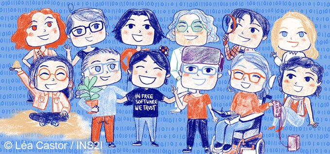

# Décodeuses du numérique

{: .center}

La BD en ligne est disponible [ici](https://www.calameo.com/read/006841715804996467dcf?authid=cG5djzzVzuiW).

Les portraits sont accessibles [ici](https://www.ins2i.cnrs.fr/fr/les-decodeuses-du-numerique).

!!! note "Affectation des présentations"
    - Alissa : Anne-Cécile Orgerie
    - Ahmed : Magalie Ochs
    - Antoine : Claire Mathieu
    - Louka : Emmanuelle Kristensen
    - Tristan : Caroline Fontaine
    - Candice : Elsa Cazelles
    - Elouo : Lucile Sassatelli
    - Louan : Sarah Cohen-Boulakia
    - Hugo : Nina Amini
    - Emma : Françoise Conil
    - Emmy : Marie-Christine Rousset
    - Vincent : Pauline Maurice
    - Mathias : Anne-Cécile Orgerie
