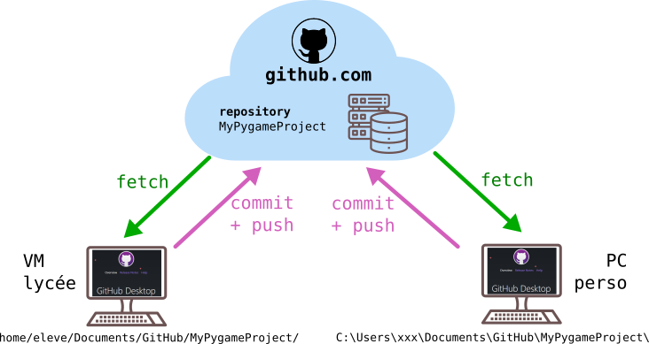

# Mise en place de GitHub
{: .center}


Afin de travailler efficacement entre votre ordinateur personnel et votre VM du lycée, nous utiliser la solution [GitHub](https://fr.wikipedia.org/wiki/GitHub){. target="_blank"}.

## Étape 0 : créer un compte GitHub

Cela se passe [ici](https://github.com/signup){. target="_blank"}

## Étape 1 : créer un premier dépôt (*repository*)
Une fois terminée la création de compte, GitHub vous proposera de créer votre premier dépôt (on dira aussi *repository*, ou *repo*). Vous pourrez avoir autant de dépôts que vous voulez : à chaque nouveau projet doit correspondre un nouveau dépôt.

Créez donc un dépôt ```Projet Pygame``` (ou comme vous voulez).

## Étape 2 : installer GitHub Desktop

GitHub Desktop est un logiciel qui devra être installé sur nos VMs (c'est fait) mais aussi sur votre ordinateur personnel de travail. Vous trouverez les liens de téléchargement [ici](https://desktop.github.com/).

Le rôle de GitHub Desktop va être de synchroniser vos fichiers locaux avec le serveur distant de github.com («le cloud»). Contrairement à une solution automatique (type Dropbox ou Google Drive), la synchronisation n'est pas automatique mais manuelle. C'est à vous d'aller uploader vos fichiers (*push*) ou bien de les télécharger (*fetch*).


{: .center}

## Étape 3 : configurer GitHub Desktop

Il va falloir préciser à GitHub que nous avons déjà un compte, et un dépôt que nous avons créé plus haut.
Vous pouvez vous laisser guider ou suivre [ce tutoriel](https://devstory.net/10283/utiliser-github-avec-github-desktop){.target="_blank"}