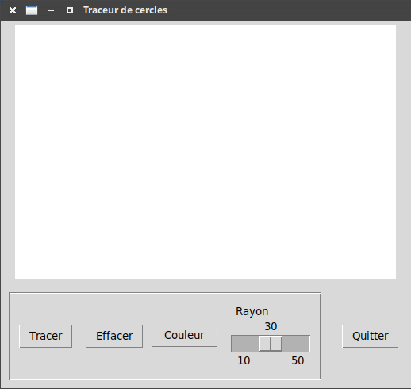
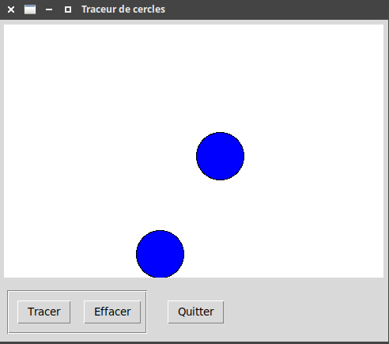
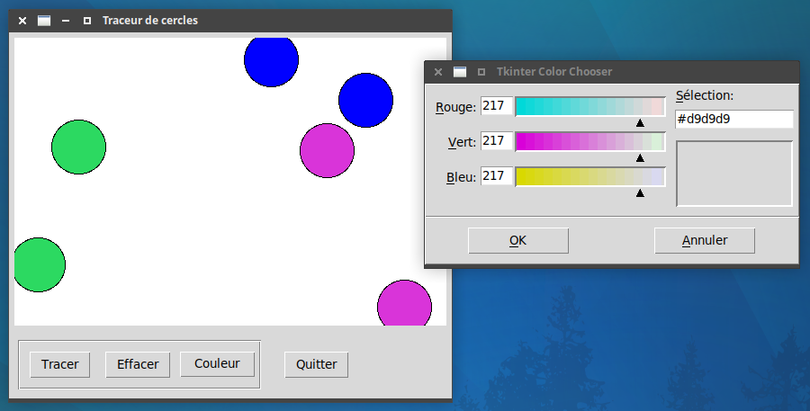
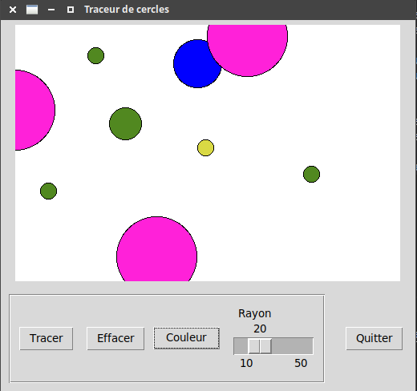
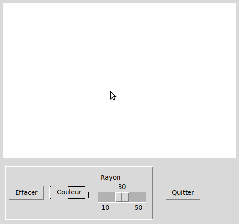

# Introduction à Tkinter

{: .center width=20%}

```Tkinter``` est un module de Python permettant la création d'interfaces graphiques.

## 0. Site de présentation de Tkinter
Vous pouvez suivre pas à pas l'excellent travail de Fabrice Sincère, disponible à cette page :

:arrow_right: [http://f.sincere.free.fr/isn/python/cours_python_tkinter.php](http://f.sincere.free.fr/isn/python/cours_python_tkinter.php){. target="_blank"}


Vous pouvez aussi poser des questions à [https://www.perplexity.ai/]( https://www.perplexity.ai/){. target="_blank"} ou une autre IA.

## 1. Objectif final

{: .center}


## 2. Étape 1

{: .center}

*Instructions :*

- ```Tracer``` doit tracer un cercle bleu (avec une bordure noire) de taille fixe (30 px).
- Les boutons ```Tracer``` et ```Effacer``` sont dans une frame particulière.
- La zone de dessin mesure 480x320. 

*Aide :*

- Exemple 6 de [http://f.sincere.free.fr/isn/python/cours_python_tkinter.php](http://f.sincere.free.fr/isn/python/cours_python_tkinter.php){. target="_blank"}


{{
correction(True,
"""
??? success \"Correction\" 
    ```python linenums='1'
    from tkinter import *
    import random


    def cercle():
        x = random.randint(0, largeur)
        y = random.randint(0, hauteur)
        r = 30
        zone_dessin.create_oval(x-r, y-r, x+r, y+r, outline='black', fill='blue')


    def effacer():
        zone_dessin.delete(ALL)

    ma_fenetre = Tk()
    ma_fenetre.title('Traceur de cercles')


    largeur = 480
    hauteur = 320
    zone_dessin = Canvas(ma_fenetre, width=largeur, height=hauteur, bg='white')
    zone_dessin.pack(padx=5, pady=5)

    frame1 = Frame(ma_fenetre, borderwidth=2, relief=GROOVE)
    frame1.pack(side=LEFT, padx=10, pady=10)

    frame2 = Frame(ma_fenetre, relief=GROOVE)
    frame2.pack(side=LEFT, padx=10, pady=10)

    bouton_Tracer = Button(frame1, text='Tracer', command=cercle)
    bouton_Tracer.pack(side=LEFT, padx=10, pady=10)

    bouton_Effacer = Button(frame1, text='Effacer', command=effacer)
    bouton_Effacer.pack(side=LEFT, padx=5, pady=5)

    bouton_Quitter = Button(frame2, text='Quitter', command=ma_fenetre.destroy)
    bouton_Quitter.pack(side=LEFT, padx=5, pady=5)

    ma_fenetre.mainloop()


    ```
"""
)
}}

## 3. Étape 2

{: .center}

*Instructions :*

- ```Couleur``` doit ouvrir une boite de dialogue pour changer la couleur de remplissage.


#### 1. Variable `couleur`
Pour commencer, il faut créer une variable dynamique ```couleur``` qui sera plus tard modifiée par la boite de dialogue :

```python
couleur = StringVar()  # on crée la variable
couleur.set('blue')    # on l'initialise à 'blue' 
```

Pour accéder au contenu de la variable ```couleur```, on utilise l'instruction ```couleur.get()```.

:arrow_right: Modifier la fonction ```cercle``` pour que la couleur de remplissage soit ```couleur```. 


#### 2. Bouton `Couleur`

:arrow_right: Créer et placer un bouton ```Couleur``` qui déclenchera  une fonction ```change_color``` que nous écrirons plus tard.


#### 3. Fonction ```change_color``` et boite de dialogue

Pour intégrer la boite de dialogue de choix de couleur, il faut commencer par appeler deux fonctions / modules supplémentaires :

```python
from tkinter import ttk
from tkinter.colorchooser import askcolor
```

La fonction ```change_color``` s'écrira comme ceci :

```python
def change_color():
    colors = askcolor(title="Tkinter Color Chooser")
    couleur.set(...)
```

Pour savoir ce qu'il faut écrire à la place des pointillés, faites des tests (avec un ```print```, par exemple) pour savoir à quoi ressemble la variable ```colors``` qui est renvoyée par la fonction ```askcolor```. 

Souvenez-vous ensuite que ```Tkinter``` travaille avec les couleurs en écriture hexadécimale et non pas RGB...

{{
correction(False,
"""
??? success \"Correction\" 
    ```python linenums='1'
    from tkinter import *
    from tkinter import ttk
    from tkinter.colorchooser import askcolor
    import random


    def cercle():
        x = random.randint(0, largeur)
        y = random.randint(0, hauteur)
        r = 30
        zone_dessin.create_oval(x-r, y-r, x+r, y+r, outline='black', fill=couleur.get())


    def effacer():
        zone_dessin.delete(ALL)


    def change_color():
        colors = askcolor(title='Tkinter Color Chooser')
        couleur.set(colors[1])


    ma_fenetre = Tk()
    ma_fenetre.title('Traceur de cercles')

    couleur = StringVar()
    couleur.set('blue')


    largeur = 480
    hauteur = 320
    zone_dessin = Canvas(ma_fenetre, width=largeur, height=hauteur, bg='white')
    zone_dessin.pack(padx=5, pady=5)

    frame1 = Frame(ma_fenetre, borderwidth=2, relief=GROOVE)
    frame1.pack(side=LEFT, padx=10, pady=10)

    frame2 = Frame(ma_fenetre, relief=GROOVE)
    frame2.pack(side=LEFT, padx=10, pady=10)

    bouton_Tracer = Button(frame1, text='Tracer', command=cercle)
    bouton_Tracer.pack(side=LEFT, padx=10, pady=10)


    bouton_Effacer = Button(frame1, text='Effacer', command=effacer)
    bouton_Effacer.pack(side=LEFT, padx=5, pady=5)

    bouton_Couleur = ttk.Button(frame1, text='Couleur', command=change_color)
    bouton_Couleur.pack(side=LEFT, padx=5, pady=5)


    bouton_Quitter = Button(frame2, text='Quitter', command=ma_fenetre.destroy)
    bouton_Quitter.pack(side=LEFT, padx=5, pady=5)

    ma_fenetre.mainloop()
    ```


"""
)
}}


## 4. Étape 3

{: .center}

*Instructions :*

- Un curseur doit permettre de modifier le rayon du cercle.


Il faut procéder de la même manière que pour la couleur.

Pensez à utiliser ```IntVar``` plutôt que ```StringVar```, car le rayon est un nombre entier.

Des indications pour l'intégration du curseur sont à retrouver dans l'**exemple 5** du site [http://f.sincere.free.fr/isn/python/cours_python_tkinter.php](http://f.sincere.free.fr/isn/python/cours_python_tkinter.php){. target="_blank"}


{{
correction(False,
"""
??? success \"Correction\" 
    ```python linenums='1'
    from tkinter import *
    from tkinter import ttk
    from tkinter.colorchooser import askcolor
    import random


    def cercle():
        x = random.randint(0, largeur)
        y = random.randint(0, hauteur)
        r = rayon.get()
        zone_dessin.create_oval(x-r, y-r, x+r, y+r, outline='black', fill=couleur.get())


    def effacer():
        zone_dessin.delete(ALL)


    def change_color():
        colors = askcolor(title='Tkinter Color Chooser')
        couleur.set(colors[1])


    ma_fenetre = Tk()
    ma_fenetre.title('Traceur de cercles')

    couleur = StringVar()
    couleur.set('blue')

    rayon = IntVar()
    rayon.set(30)


    largeur = 480
    hauteur = 320
    zone_dessin = Canvas(ma_fenetre, width=largeur, height=hauteur, bg='white')
    zone_dessin.pack(padx=5, pady=5)

    frame1 = Frame(ma_fenetre, borderwidth=2, relief=GROOVE)
    frame1.pack(side=LEFT, padx=10, pady=10)

    frame2 = Frame(ma_fenetre, relief=GROOVE)
    frame2.pack(side=LEFT, padx=10, pady=10)

    bouton_Tracer = Button(frame1, text='Tracer', command=cercle)
    bouton_Tracer.pack(side=LEFT, padx=10, pady=10)


    bouton_Effacer = Button(frame1, text='Effacer', command=effacer)
    bouton_Effacer.pack(side=LEFT, padx=5, pady=5)

    bouton_Couleur = ttk.Button(frame1, text='Couleur', command=change_color)
    bouton_Couleur.pack(side=LEFT, padx=5, pady=5)

    curseur = Scale(frame1, from_=10, to=50, resolution=10, orient=HORIZONTAL,
            length=100, width=20, label='Rayon', tickinterval=40, variable=rayon)
    curseur.pack(side=LEFT, padx=10, pady=10)

    bouton_Quitter = Button(frame2, text='Quitter', command=ma_fenetre.destroy)
    bouton_Quitter.pack(side=LEFT, padx=5, pady=5)

    ma_fenetre.mainloop()


    ```
"""
)
}}


## 5. Bonus

{: .center}

Remplacer le placement aléatoire par un placement au clic de souris.

{{
correction(False,
"""
??? success \"Correction\" 
    ```python linenums='1'
    from tkinter import *
    from tkinter import ttk
    from tkinter.colorchooser import askcolor

    def cercle(x, y):
        r = rayon.get()
        zone_dessin.create_oval(x-r, y-r, x+r, y+r, outline='black', fill=couleur.get())


    def clic(event):
        x = event.x
        y = event.y
        cercle(x, y)

    def effacer():
        zone_dessin.delete(ALL)


    def change_color():
        colors = askcolor(title='Tkinter Color Chooser')
        couleur.set(colors[1])


    ma_fenetre = Tk()
    ma_fenetre.title('Traceur de cercles')

    couleur = StringVar()
    couleur.set('blue')

    rayon = IntVar()
    rayon.set(30)


    largeur = 480
    hauteur = 320
    x, y = largeur//2, hauteur//2

    zone_dessin = Canvas(ma_fenetre, width=largeur, height=hauteur, bg='white')
    zone_dessin.bind('<Button-1>', clic)
    zone_dessin.pack(padx=5, pady=5)

    frame1 = Frame(ma_fenetre, borderwidth=2, relief=GROOVE)
    frame1.pack(side=LEFT, padx=10, pady=10)

    frame2 = Frame(ma_fenetre, relief=GROOVE)
    frame2.pack(side=LEFT, padx=10, pady=10)


    bouton_Effacer = Button(frame1, text='Effacer', command=effacer)
    bouton_Effacer.pack(side=LEFT, padx=5, pady=5)

    bouton_Couleur = ttk.Button(frame1, text='Couleur', command=change_color)
    bouton_Couleur.pack(side=LEFT, padx=5, pady=5)

    curseur = Scale(frame1, from_=10, to=50, resolution=10, orient=HORIZONTAL,
            length=100, width=20, label='Rayon', tickinterval=40, variable=rayon)
    curseur.pack(side=LEFT, padx=10, pady=10)

    bouton_Quitter = Button(frame2, text='Quitter', command=ma_fenetre.destroy)
    bouton_Quitter.pack(side=LEFT, padx=5, pady=5)

    ma_fenetre.mainloop()


    ```
"""
)
}}
