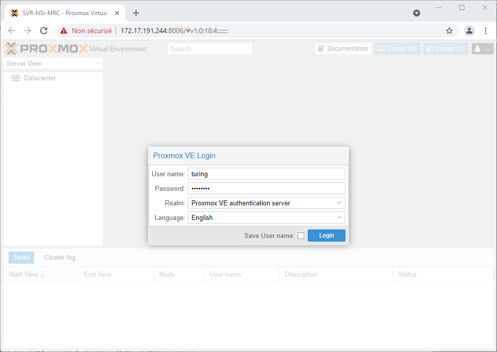
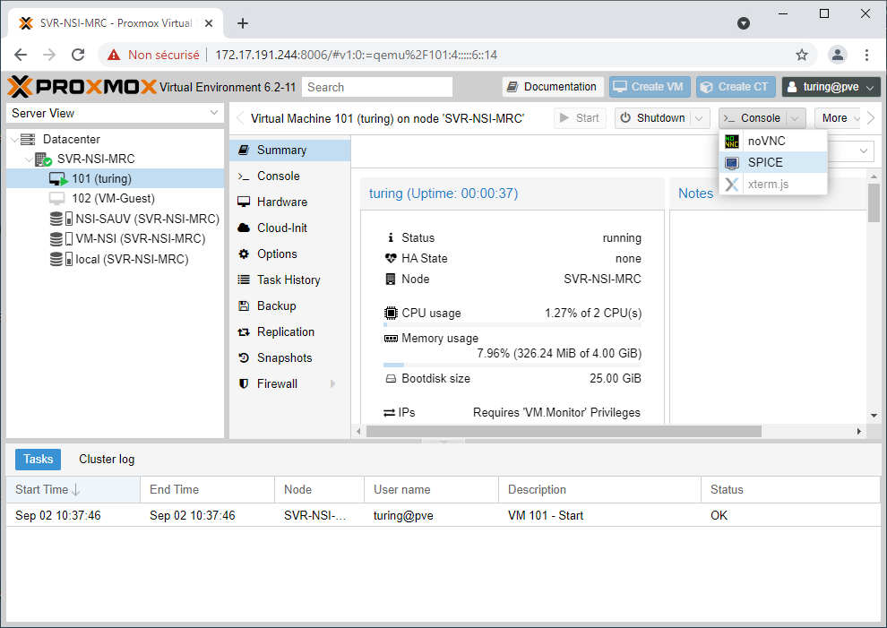
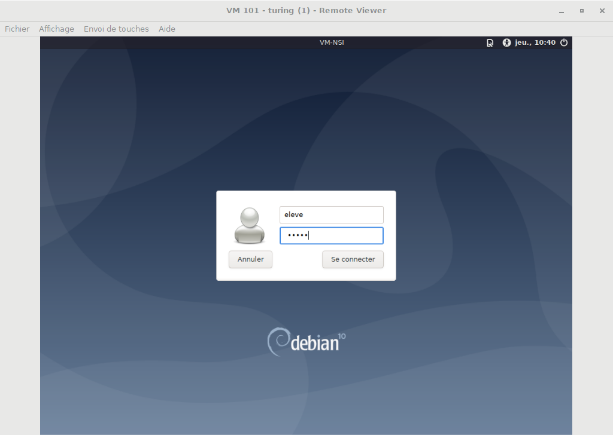
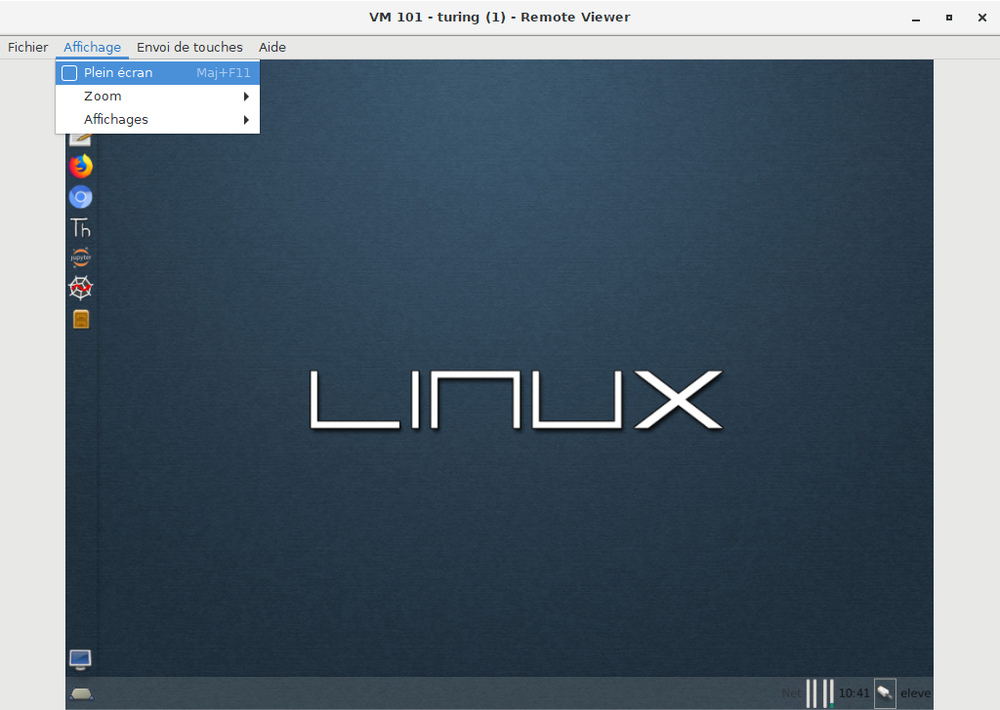
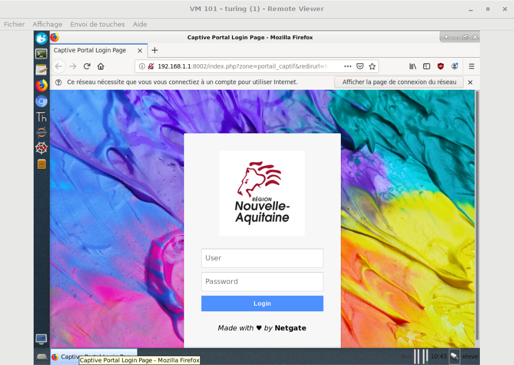

# Utilisation des VMs au lycée

1. Sur le bureau Windows, ouvrir le dossier ```Programmation```.
2. Cliquer sur ```Proxmox NSI```. 
3. Un navigateur s'ouvre, mais une alerte de sécurité apparaît. Cliquer sur ```Paramètres avancés```  puis sur ```Continuer vers le site 172.17.191.244``` 
4. Sur la fenêtre de connexion ```Proxmox VE Login```, renseigner ses identifiants et sélectionnez ```Realm Proxmox VE authentication server```.
{: .center}
5. Un messade d'avertissement apparaît. Cliquer ```ok``` pour l'ignorer.
6. Sélectionner sa machine virtuelle (VM) dans la colonne de gauche.
7. Cliquer sur ```Start``` pour démarrer la VM.
8. Cliquer sur le bouton ```Console``` et choisir ```Spice```.
{: .center}
9. Clqiuer sur le fichier ```telechargement.vv``` apparu en bas à gauche.
10. Attendre (un peu).
11. Si rien ne se passe au bout d'une dizaine de secondes, fermer la fenêtre et cliquer de nouveau sur Spice pour retélécharger un nouveau fichier.
12. Remplir ses identifiants dans la fenêtre de connexion :
    - login : eleve 
    - mdp : *donné à l'oral*
    {: .center}

13. Basculer l'affichage en plein écran
{: .center}
14. Au premier lancement d'un navigateur, remplir ses identifiants Scribe, permettant à internet.
{: .center}

