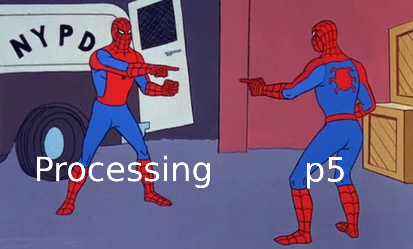
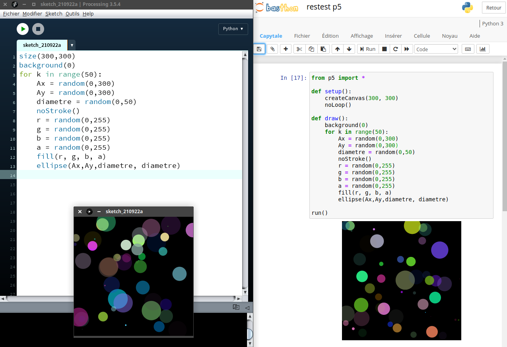
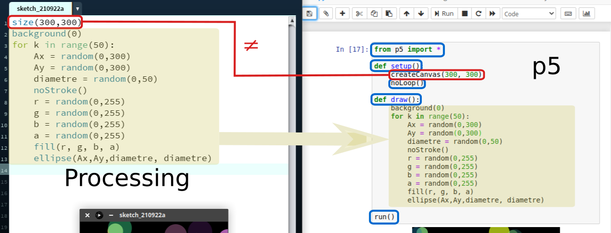

# Processing au lycée ⇔ p5 sur Capytale

{: .center width=60%}

## 1. Explication du problème
Pour réaliser facilement de jolis graphiques, nous utilisons sur les ordinateurs du lycée le logiciel [Processing](../4_Processing/cours).
Celui-ci permet d'écrire du code Python et d'avoir un rendu immédiat dans une fenêtre séparée.

Pour le travail à la maison, nous utilisons le service Capytale. 

**Problème**, il n'est pas possible d'écrire du code Processing dans Capytale.


## 2. Une solution : la librairie p5
Si Processing n'existe pas dans Capytale, une solution **très similaire** est disponible : la librairie [p5](https://p5.readthedocs.io/).


{: .center width=70%}

!!! warning  "Remarque"
    La librairie ```p5``` incluse dans Capytale est légèrement différente de la libraire ```p5``` utilisable dans Thonny (ou tout autre IDE). En effet, pour pouvoir fonctionner sur Capytale, elle a été en partie ré-écrite par un des développeurs de Capytale, Romain Casati.


## 3. Structure commune des codes Processing et p5

Les codes Processing que nous avons écrits jusqu'à présent sont des codes statiques. Mais l'architecture naturelle d'un code Processing ou p5 est en réalité articulée autour de deux fonctions : la fonction ```setup()``` et la fonction ```draw()```.

### 3.1 La fonction ```setup()```
Comme son nom l'indique, elle va procéder à tous les réglages initiaux avant de commencer le dessin : taille de la fenêtre, (éventuellement couleur d'arrière-plan), autres réglages. 

Elle n'est exécutée **qu'une seule fois**.

### 3.2 La fonction ```draw()```
C'est dans cette fonction que toutes les instructions de dessin seront données.

**Très important :** cette fonction est une boucle infinie. Elle est donc répétée (à une certaine cadence qui est réglable) jusqu'à ce que (par exemple) l'utilisateur ferme la fenêtre.

Des instructions écrites dans la fonction ```setup()``` peuvent influer sur cette boucle infinie  ```draw()``` : notamment l'instruction ```noLoop()``` qui permet de n'exécuter la fonction ```draw()``` **qu'une seule fois**.


## 4. Passer d'un code Processing à un code p5

### 4.1 Seulement en p5 : l'instruction ```run()```
Un code p5 devra forcément se terminer par l'instruction ```run()```
### 4.2 Une différence de syntaxe : ```createCanvas()``` vs ```size()```
Pour créer une zone de dessin de 300 pixels sur 300 pixels :

- **Processing** : ```size(300,300)```
- **p5** : ```createCanvas(300,300)```  

### 4.3 Cas particulier des dessins statiques

Nos premiers codes en Processing actuellement sont statiques : ils n'ont pas d'animation. Processing accepte alors que le code ne comporte ni fonction ```setup()``` ni fonction ```draw()```.

Par contre, pour faire un code statique en p5, il faudra quand même que les fonctions ```setup()``` et```draw()``` soient présentes. On indiquera l'instruction ```noLoop()``` dans le ```setup()``` pour que le ```draw()``` ne soit executé qu'une fois.

**Exemple de passage d'un code statique en Processing à un code statique en p5 :**

- en bleu : les instructions à rajouter
- en rouge : les instructions à modifier (il n'y en a qu'une)
- sur fond jaune : le code à conserver

{: .center width=100%}

Vous pouvez aussi comparer des codes statiques Processing avec leur équivalent en p5 dans la [feuille d'exercices sur Processing](../../../T1_Demarrer_en_Python/1.2_Boucle_for/exos_processing/).