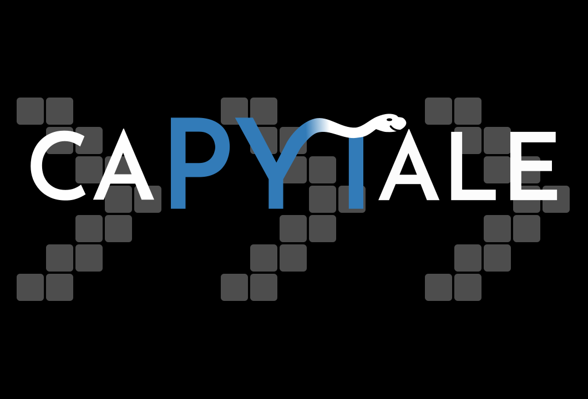

# Utilisation du service Capytale

{: .center}

Capytale est accessible via Lycéeconnecté, il faut donc avoir ses identifiants Educonnect.

## Activité-test : 
1. Connectez-vous à LycéeConnecté grâce à vos identifiants Educonnect.
2. Cliquez sur [https://capytale2.ac-paris.fr/web/c/797d-639207](https://capytale2.ac-paris.fr/web/c/797d-639207){. target="_blank"}
3. Dans la liste des ENT, choisir LycéeConnecté.
4. Capytale apparait avec le code de l'activité pré-rempli, cliquez sur `Go !`.