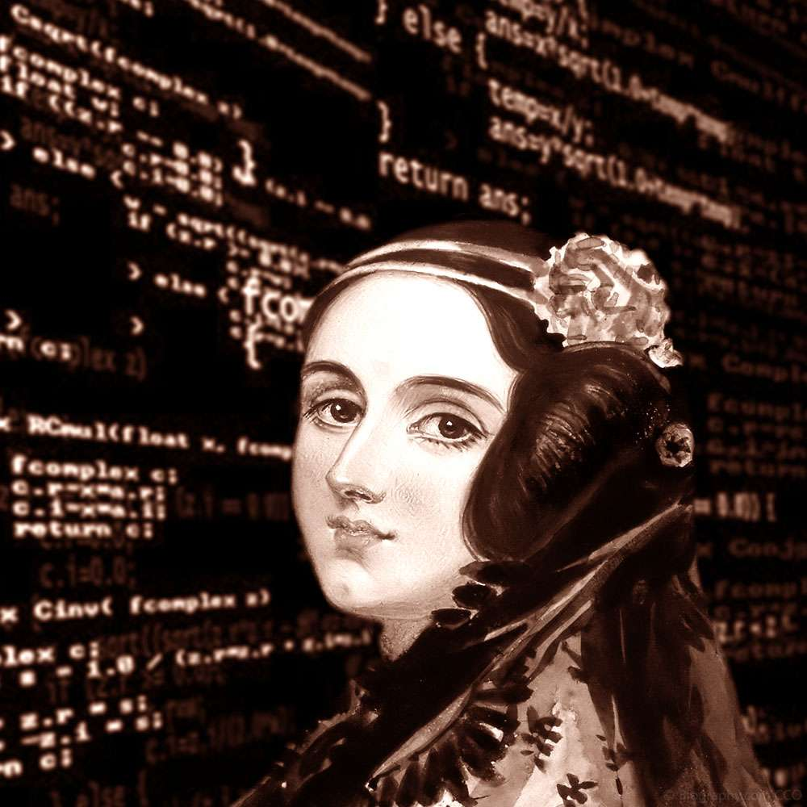
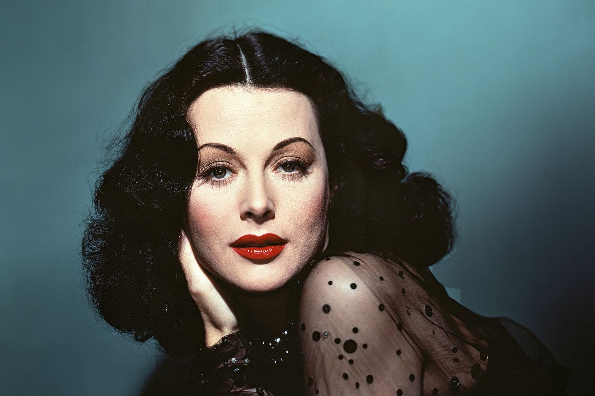
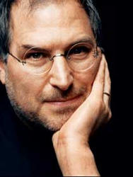
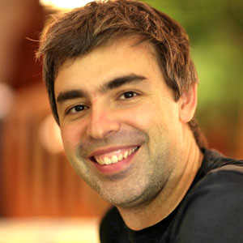
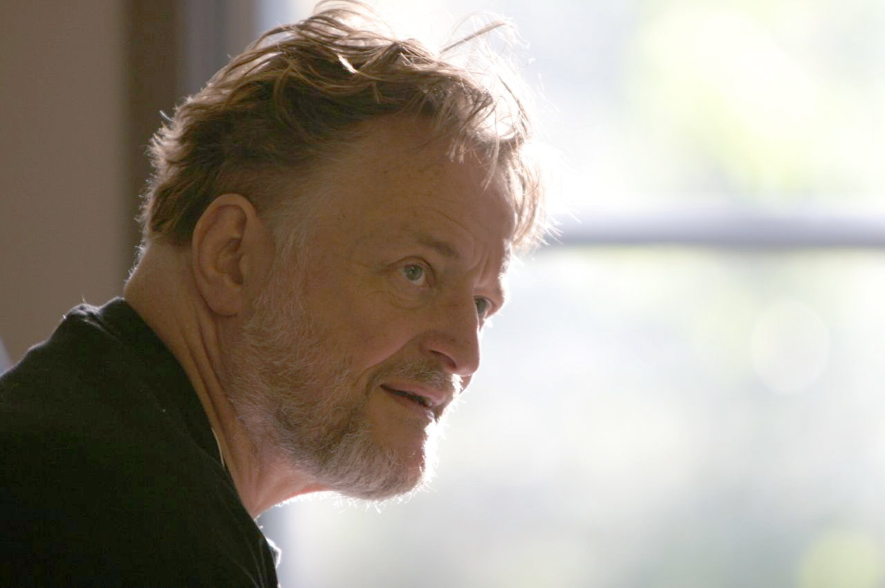

# Figures de l'informatique

## Ada Lovelace
{: .center width=30%}

## Alan Turing
{: .center width=30%}

## Donald Knuth
{: .center width=30%}

## Bill Gates
{: .center width=30%}

## Heidi Lamar
{: .center width=30%}

## Steve Jobs
{: .center width=30%}

## Aaron Swartz
{: .center width=30%}

## Grace Hopper
{: .center width=30%}

## Linus Torvalds
{: .center width=30%}

## Margaret Hamilton
{: .center width=30%}

## Sergueï Brin
{: .center width=30%}

## Larry Page
{: .center width=30%}

## Richard Stallman
{: .center width=30%}

## Guido Van Rossum
{: .center width=30%}

## Dennis Ritchie
{: .center width=30%}

## John Conway
{: .center width=30%}